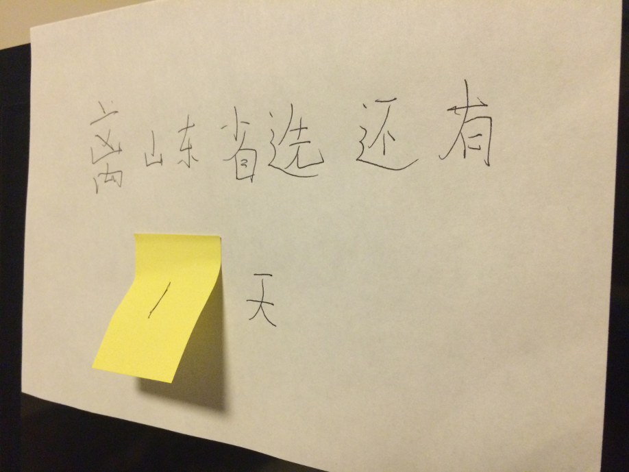

title: 写在安徽集训之后 ……
categories: 
  - Diary
  - OI
tags: 
  - 游记
  - 安徽集训
permalink: after-ah-studying
date: 2016-04-07 17:28:56
---

现在是四月七日的下午，安徽集训刚刚结束，离 SDOI2016 R1 报道时间还有恰好一天。来这里的时间不短了，从最早在他们小机房里做题，到后来和很多学校一起在大教室听课，在大机房考试；从 3.16 来到，到今天结束，时间刚好 22 天。

<!-- more -->

如果要说学习效率，想必也不算太高。开始的几天，有些比较简单的题目还算可以，每天能订正出一两题；但后来的讲课，也便只能听懂不到五分之一了 —— 自己还有太多东西没有学，一时间要全部掌握，想想也是不可能的。对比一下我和其他人的水平，和我一样是高一的，有些已经刷完了 BZOJ 的第一版；还有一位同学才初三，却已经在 WC2016 拿到了三等奖。能感觉到自己正落后于别人，就要全力去追赶吧。

想起差不多半年前的清北学堂培训，那是我第一次外出学习，当时听课的感受和现在差不多，能听懂的题目也是寥寥无几；后来还是在停课备战 NOIP 的时候，ljz 学长给我讲了一些算法和题目。现在想想看，那时算是我学习状态最好的时候了吧 …… 好像从未为一等奖而担心过什么。之后，ljz 的 NOIP 成绩很差，也便没有要参加省选，也就是从那时起，我开始自学。再后来去了冬令营，学到了不少东西，也长了不少见识，但那时终究还是没有现在的心情的 —— 那时的我从没有感觉到省选的紧张，也从没想过自己能不能进队的问题。而现在，我开始为自己而感到担忧 —— 我清楚自己与其他人的差距，更害怕失败。

还有一件很重要的事，那就是在这里认识了三个河南的小伙伴 —— gcx、pyf、cxc，每天晚上和他们一起学习~~一起玩~~。在交流中，我感受到了『强省弱校』与『弱省强校』的差距。他们也给我讲了很多题，像那时的 ljz 一样。现在想想，有学长（学姐）给我讲题也是一件幸福的事吧 ……

看着这些天做过的题，不禁有一种成就感，虽然做出来的题并不多，但能感觉到，自己确是在进步。总感到遥遥无期的省选，转眼间却近在眼前。如果努力了却没有成功，至少也不会有太大的遗憾，也许，这会是一个不一样的故事吧。

SDOI bless all.

