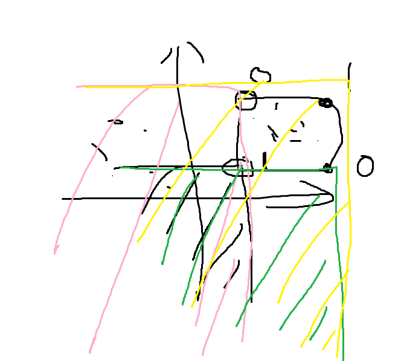

title: 「BZOJ 2683」简单题 - CDQ
categories: OI
tags: 
  - BZOJ
  - CDQ
  - 树状数组
  - 高级数据结构
  - 数据结构
permalink: bzoj-2683
id: 43
updated: '2016-02-05 22:46:27'
date: 2016-02-05 22:42:35
---

有一个$N*N$的棋盘，每个格子内有一个整数，初始时的时候全部为 0，现在需要维护两种操作：

1. 将格子$(x,y)$里的数字加上$A$；
2. 输出$(x1,y1)(x2,y2)$这个矩形内的数字和。

<!-- more -->

### 题目链接
[BZOJ 2683](http://www.lydsy.com/JudgeOnline/problem.php?id=2683)

### 解题思路
离线，按照 X 轴排序，将其转化为时间 …… 然后 CDQ 之！

进行 CDQ 时，用一个树状数组维护 Y 轴的信息，把 ID 小于等于 `mid` 的一半中的修改操作产生的影响加到 ID 大于 `mid` 的另一半的查询结果中。

因为统计的是矩形区域的数字总和，所以要把一次询问转化为四次，用下图所示的方法求出答案（图片来自 WC2016 李建老师的课件）：



### AC代码
<!-- c++ -->
```
#include <cstdio>
#include <cstring>
#include <vector>
#include <algorithm>

const int MAXN = 500000;
const int MAXM = 200000 * 4;

enum OperateType {
	Update = 1, Query = 2
};

struct Operate {
	OperateType type;
	int id, x, y, *ans, num;

	Operate(OperateType type, int id, int x, int y, int num, int *ans = NULL) : type(type), id(id), x(x), y(y), ans(ans), num(num) {}
	Operate() {}

	bool operator<(const Operate &other) const {
		if (x < other.x) return true;
		else if (x == other.x && y < other.y) return true;
		else if (x == other.x && y == other.y && id < other.id) return true;
		return false;
	}
};

std::vector<Operate> v;
int n, ans[MAXM];

struct BitIndexedTree {
	int a[MAXN];

	static int lowbit(int x) {
		return x & (-x);
	}

	void update(int pos, int x) {
		for (int i = pos; i <= n; i += lowbit(i)) {
			a[i - 1] += x;
		}
	}

	int query(int pos) {
		int ans = 0;
		for (int i = pos; i > 0; i -= lowbit(i)) {
			ans += a[i - 1];
		}

		return ans;
	}
} bit;

void cdq(int l, int r) {
	if (l >= r) return;

	int mid = l + ((r - l) >> 1);

	for (int i = l; i <= r; i++) {
		const Operate &o = v[i - 1];
		if (o.id <= mid && o.type == Update) bit.update(o.y, o.num);
		else if (o.id > mid && o.type == Query) *o.ans += bit.query(o.y) * o.num;
	}

	for (int i = l; i <= r; i++) {
		const Operate &o = v[i - 1];
		if (o.id <= mid && o.type == Update) bit.update(o.y, -o.num);
	}

	static Operate a[MAXM];
	int L = l, R = mid + 1;
	for (int i = l; i <= r; i++) {
		if (v[i - 1].id <= mid) a[L++ - 1] = v[i - 1];
		else a[R++ - 1] = v[i - 1];
	}
	memcpy(&v[l - 1], &a[l - 1], sizeof(Operate) * (r - l + 1));

	cdq(l, mid), cdq(mid + 1, r);
}

int main() {
	scanf("%d", &n);

	int m = 0, queryCount = 0;
	while (20000528) {
		int type;
		scanf("%d", &type);

		if (type == 1) {
			int x, y, num;
			scanf("%d %d %d", &x, &y, &num);
			v.push_back(Operate(Update, ++m, x, y, num));
		} else if (type == 2) {
			int x1, y1, x2, y2;
			scanf("%d %d %d %d", &x1, &y1, &x2, &y2);
			v.push_back(Operate(Query, ++m, x1 - 1, y1 - 1, 1, &ans[queryCount]));
			v.push_back(Operate(Query, ++m, x1 - 1, y2, -1, &ans[queryCount]));
			v.push_back(Operate(Query, ++m, x2, y1 - 1, -1, &ans[queryCount]));
			v.push_back(Operate(Query, ++m, x2, y2, 1, &ans[queryCount]));
			queryCount++;
		} else break;
	}

	std::sort(v.begin(), v.end());
	cdq(1, m);

	for (int i = 0; i < queryCount; i++) printf("%d\n", ans[i]);

	return 0;
}
```
