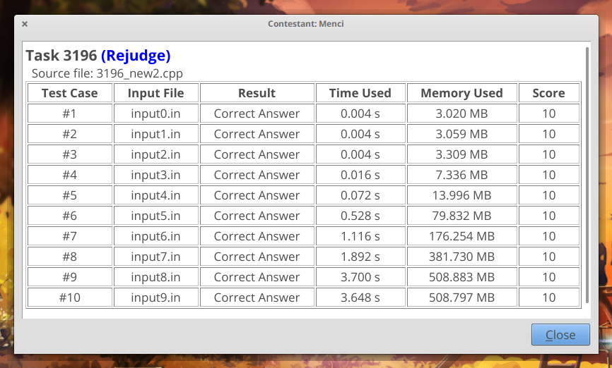

title: 「BZOJ 3196」二逼平衡树 - 树套树
categories:
  - OI
tags:
  - BZOJ
  - Splay
  - 平衡树
  - 数据结构
  - 线段树
permalink: bzoj-3196
date: '2016-06-19 09:37:00'
---

您需要写一种数据结构（可参考题目标题），来维护一个有序数列，其中需要提供以下操作：

1. 查询 $ k $ 在区间内的排名；
2. 查询区间内排名为 $ k $ 的值；
3. 修改某一位值上的数值；
4. 查询 $ k $ 在区间内的前驱（前驱定义为小于 $ x $，且最大的数）；
5. 查询 $ k $ 在区间内的后继（后继定义为大于 $ x $，且最小的数）。

<!-- more -->

### 链接

[BZOJ 3196](http://www.lydsy.com/JudgeOnline/problem.php?id=3196)

### 题解

对于没有区间限制的查询，我们可以使用平衡树维护，有了区间的限制，可以在外层套上一层线段树。

对序列建立线段树，在每个线段树节点中建立平衡树。考虑到序列中的每个数最多会出现在线段树上的 $ O(\log n) $ 个节点中，总空间复杂度为 $ O(n \log n) $。可以在 $ O(n \log ^ 2 n) $ 的时间内完成建树。

#### 排名

在该区间对应在线段树上的 $ O(\log n) $ 个节点中的平衡树上查询该数的排名，累加得到区间内公有多少数比该数小即可；

#### 根据排名选择

枚举答案，并查询所枚举的答案的排名，显然这里的答案是单调的，可以使用二分。

二分 $ x $，如果 $ x $ 的排名大于 $ k $，则它不可能成为答案，但这时我们可以将右边界置为 $ x $；反之它可以被置为左边界。最终二分区间内只剩下两个数时，判断较大的数是否合法即可。

对数据进行离散化可以加速二分。

#### 修改

转化为一次删除一次插入即可。

#### 前驱（后继）

在该区间对应在线段树上的 $ O(\log n) $ 个节点中的平衡树上查询该数前驱（后继），取最大（小）值即可。

总时间复杂度为 $ O(n \log ^ 3 n) $，但 Splay 常数巨大，在 BZOJ 可以卡着时限通过。

另一种方法是将内层的平衡树换为带垃圾回收的动态开点的权值线段树，空间复杂度为 $ O(n \log ^ 2 n) $，需要 512M 内存。



正解分块，时间复杂度为 $ O(n \sqrt n \log n) $，我没写。

### 代码

线段树套 Splay，RP 不好的时候会 TLE。

```cpp
#include <cstdio>
#include <climits>
#include <cassert>
#include <algorithm>

const int MAXN = 50000;
const int MAXM = 50000;

int n, m, a[MAXN];

struct Splay {
    enum Relation {
        L = 0, R = 1
    };

    struct Node {
        Node *c[2], *p, **r;
        int size, cnt, val;

        Node(Node *p, const int val, Node **r) : p(p), r(r), size(1), cnt(1), val(val) {
            c[L] = c[R] = NULL;
        }

        ~Node() {
            if (c[L]) delete c[L];
            if (c[R]) delete c[R];
        }

        void maintain() {
            size = cnt;
            if (c[L]) size += c[L]->size;
            if (c[R]) size += c[R]->size;
        }

        Relation relatain() const {
            return this == p->c[L] ? L : R;
        }

        void rotate() {
            Relation x = relatain();
            Node *o = p;

            p = o->p;
            if (o->p) o->p->c[o->relatain()] = this;

            o->c[x] = c[x ^ 1];
            if (c[x ^ 1]) c[x ^ 1]->p = o;

            c[x ^ 1] = o;
            o->p = this;

            o->maintain(), maintain();

            if (!p) *r = this;
        }

        Node *splay(Node *targetParent = NULL) {
            while (p != targetParent) {
                if (p->p == targetParent) rotate();
                else if (p->relatain() == relatain()) p->rotate(), rotate();
                else rotate(), rotate();
            }
            return this;
        }

        Node *prec() {
            splay();
            Node *v = c[L];
            while (v->c[R]) v = v->c[R];
            return v->splay();
        }

        Node *succ() {
            splay();
            Node *v = c[R];
            while (v->c[L]) v = v->c[L];
            return v->splay();
        }

        int left() const { return c[L] ? c[L]->size : 0; }

#ifdef DBG
        void validate() {
            int size = 0;
            if (c[L]) c[L]->validate(), assert(this->val > c[L]->val), size += c[L]->size;
            if (c[R]) c[R]->validate(), assert(this->val < c[R]->val), size += c[R]->size;
            assert(this->size == size + cnt);
        }

        void print(const int depth = 0);
#endif
    } *r;
#ifdef DBG
    int id;
#endif

    Splay(const int *a, const int n) : r(NULL) {
        insert(INT_MAX), insert(INT_MIN);
#ifdef DBG
        static int time = 0;
        time++;
        id = time;
        printf("build(%d): ", id);
        for (int i = 0; i < n; i++) printf("%d%c", a[i], i == n - 1 ? '\n' : ' ');
#endif
        for (int i = 0; i < n; i++) insert(a[i]);
    }

    ~Splay() { delete r; }

    Node *find(const int x) {
        Node *v = r;
        while (v && x != v->val) {
            if (x < v->val) v = v->c[L];
            else v = v->c[R];
        }
        return v ? v->splay() : NULL;
    }

    Node *insert(const int x) {
        Node *v = find(x);
        if (v) {
            v->cnt++, v->size++;
            return v;
        }

        Node **target = &r, *p = NULL;
        while (*target) {
            p = *target;
            p->size++;
            if (x< p->val) target = &p->c[L];
            else target = &p->c[R];
        }

        return (*target = new Node(p, x, &r))->splay();
    }

    int rank(const int x) {
        Node *v = find(x);
        int res;
        if (v) res = v->left();
        else {
            v = insert(x);
            res = v->left();
            erase(v);
        }
#ifdef DBG
        printf("rank(%d) in (%d) = %d\n", x, id, res);
#endif
        return res;
    }

    Node *select(const int k) {
        int x = k + 1;
        Node *v = r;
        while (!(x >= v->left() + 1 && x <= v->left() + v->cnt)) {
            if (x < v->left() + 1) v = v->c[L];
            else x -= v->left() + v->cnt, v = v->c[R];
        }
        return v->splay();
    }

    void erase(Node *v) {
        if (v->cnt != 1) {
            v->cnt--, v->size--;
            return;
        }

        Node *prec = v->prec(), *succ = v->succ();

        prec->splay();
        succ->splay(prec);

        delete succ->c[L];
        succ->c[L] = NULL;

        succ->maintain(), prec->maintain();
    }

    void erase(const int x) {
        Node *v = find(x);
        erase(v);
    }

    int prec(const int x) {
        Node *v = find(x);
        if (v) return v->prec()->val;
        else {
            v = insert(x);
            int res = v->prec()->val;
            erase(v);
            return res;
        }
    }

    int succ(const int x) {
        Node *v = find(x);
        if (v) return v->succ()->val;
        else {
            v = insert(x);
            int res = v->succ()->val;
            erase(v);
            return res;
        }
    }

#ifdef DBG
    void validate() {
        r->validate();
    }
#endif
};

#ifdef DBG
void Splay::Node::print(const int depth) {
    if (c[L]) c[L]->print(depth + 1);
    for (int i = 0; i < depth; i++) putchar(' '), putchar(' ');
    printf("%d\n", val);
    if (c[R]) c[R]->print(depth + 1);
}
#endif

int map[MAXM + MAXN], max;

struct SegmentTree {
    SegmentTree *lc, *rc;
    int l, r;
    Splay s;

    SegmentTree(const int l, const int r, SegmentTree *lc, SegmentTree *rc, int *a) : lc(lc), rc(rc), l(l), r(r), s(a, r - l + 1) {
#ifdef DBG
        printf(" [%d, %d]\n", l, r);
        validate();
#endif
    }

    ~SegmentTree() {
        if (lc) delete lc;
        if (rc) delete rc;
    }

    static SegmentTree *build(const int l, const int r, int *a) {
        if (l > r) return NULL;
        else if (l == r) return new SegmentTree(l, r, NULL, NULL, a);
        else {
            int m = l + (r - l) / 2;
            return new SegmentTree(l, r, build(l, m, a), build(m + 1, r, a + (m - l) + 1), a);
        }
    }

    void update(const int pos, const int old, const int curr) {
        if (pos > this->r || pos < this->l);
        else if (pos >= this->l && pos <= this->r) {
            s.erase(old);
            s.insert(curr);
            if (pos != this->l || pos != this->r) lc->update(pos, old, curr), rc->update(pos, old, curr);
        }
    }

    int rank(const int l, const int r, const int k) {
        if (l > this->r || r < this->l) return 1;
        else if (l <= this->l && r >= this->r) return s.rank(k);
        else return (lc->rank(l, r, k) - 1) + (rc->rank(l, r, k) - 1) + 1;
    }

    int prec(const int l, const int r, const int k) {
        if (l > this->r || r < this->l) return INT_MIN;
        else if (l <= this->l && r >= this->r) return s.prec(k);
        else return std::max(lc->prec(l, r, k), rc->prec(l, r, k));
    }

    int succ(const int l, const int r, const int k) {
        if (l > this->r || r < this->l) return INT_MAX;
        else if (l <= this->l && r >= this->r) return s.succ(k);
        else return std::min(lc->succ(l, r, k), rc->succ(l, r, k));
    }

    int select(const int l, const int r, const int k) {
        int L = 0, R = max;
        while (L + 1 < R) {
            int m = L + (R - L) / 2;
            if (rank(l, r, m) > k) R = m;
            else L = m;
        }
        if (rank(l, r, R) == k) return R;
        else return L;
    }

#ifdef DBG
    void validate() {
        assert(s.r->size == r - l + 1 + 2);
        s.validate();
        if (lc) lc->validate();
        if (rc) rc->validate();
    }
#endif
} *segment;

struct Query {
    int opt, l, r, pos, k;
} Q[MAXM];

int main() {
    scanf("%d %d", &n, &m);
    for (int i = 0; i < n; i++) scanf("%d", &a[i]);

    int cnt = 0;
    for (int i = 0; i < m; i++) {
        Query &q = Q[i];
        scanf("%d", &q.opt);
        if (q.opt == 3) {
            scanf("%d %d", &q.pos, &q.k);
        } else {
            scanf("%d %d %d", &q.l, &q.r, &q.k);
        }

        if (q.opt != 2) {
            map[cnt++] = q.k;
        }
    }

    for (int i = 0; i < n; i++) map[cnt++] = a[i];

    std::sort(map, map + cnt);
    int *end = std::unique(map, map + cnt);
    for (int i = 0; i < n; i++) a[i] = std::lower_bound(map, end, a[i]) - map;
    for (int i = 0; i < m; i++) if (Q[i].opt != 2) Q[i].k = std::lower_bound(map, end, Q[i].k) - map;
    max = end - map - 1;

    segment = SegmentTree::build(1, n, a);

    for (int i = 0; i < m; i++) {
        Query &q = Q[i];
        if (q.opt == 1) {
            printf("%d\n", segment->rank(q.l, q.r, q.k));
        } else if (q.opt == 2) {
            printf("%d\n", map[segment->select(q.l, q.r, q.k)]);
        } else if (q.opt == 3) {
            segment->update(q.pos, a[q.pos - 1], q.k);
            a[q.pos - 1] = q.k;
        } else if (q.opt == 4) {
            printf("%d\n", map[segment->prec(q.l, q.r, q.k)]);
        } else if (q.opt == 5) {
            printf("%d\n", map[segment->succ(q.l, q.r, q.k)]);
        }

#ifdef DBG
        segment->validate();
#endif
    }

    return 0;
}
```

线段树套带垃圾回收的动态开点的权值线段树，MLE。

```cpp
#include <cstdio>
#include <climits>
#include <cassert>
#include <algorithm>

const int MAXN = 50000;
const int MAXM = 50000;

int n, m, a[MAXN];
int map[MAXM + MAXN], max;

struct WeightSegmentTree {
    int l, r, mid;
    WeightSegmentTree *lc, *rc;
    int min, max, cnt;

    WeightSegmentTree(const int l, const int r)
        : l(l), r(r), mid(l + (r - l) / 2),
          lc(NULL), rc(NULL),
          min(INT_MAX), max(INT_MIN), cnt(0)
    {}

    WeightSegmentTree(const int *a, const int n)
        : l(0), r(::max - 1), mid((max - 1) / 2),
          lc(NULL), rc(NULL),
          min(INT_MAX), max(INT_MIN), cnt(0)
    {
        for (int i = 0; i < n; i++) insert(a[i]);
    }

    ~WeightSegmentTree() {
        if (lc) delete lc;
        if (rc) delete rc;
    }

    void maintain() {
        min = INT_MAX;
        if (lc) min = std::min(min, lc->min);
        if (rc) min = std::min(min, rc->min);

        max = INT_MIN;
        if (lc) max = std::max(max, lc->max);
        if (rc) max = std::max(max, rc->max);

        cnt = 0;
        if (lc) cnt += lc->cnt;
        if (rc) cnt += rc->cnt;
    }

    void insert(const int x) {
        if (x > r || x < l);
        else if (x == l && x == r) {
            if (!cnt++) min = max = x;
        } else {
            if (x <= mid) {
                if (!lc) lc = new WeightSegmentTree(l, mid);
                lc->insert(x);
            } else {
                if (!rc) rc = new WeightSegmentTree(mid + 1, r);
                rc->insert(x);
            }
            maintain();
        }
    }

    void erase(const int x) {
        if (x > r || x < l);
        else if (x == l && x == r) {
            if (!--cnt) min = INT_MAX, max = INT_MIN;
        } else {
            if (x <= mid) lc->erase(x);
            else rc->erase(x);
            maintain();
            if (x <= mid && lc->cnt == 0) delete lc, lc = NULL;
            else if (x > mid && rc->cnt == 0) delete rc, rc = NULL;
        }
    }

    int prec(const int x) {
        return queryMax(0, x - 1);
    }

    int succ(const int x) {
        return queryMin(x + 1, ::max);
    }

    int rank(const int x) {
        return queryCnt(0, x - 1) + 1;
    }

    int select(const int k) {
        int x = k;
        WeightSegmentTree *v = this;
        while (v->l != v->r) {
            if (!v->lc) v = v->rc;
            else if (x <= v->lc->cnt) v = v->lc;
            else x -= v->lc->cnt, v = v->rc;
        }
        return v->mid;
    }

    int queryMin(const int l, const int r) {
        if (l > this->r || r < this->l) return INT_MAX;
        else if (l <= this->l && r >= this->r) return min;
        else {
            int res = INT_MAX;
            if (lc) res = lc->queryMin(l, r);
            if (res == INT_MAX && rc) return rc->queryMin(l, r);
            return res;
        }
    }

    int queryMax(const int l, const int r) {
        if (l > this->r || r < this->l) return INT_MIN;
        else if (l <= this->l && r >= this->r) return max;
        else {
            int res = INT_MIN;
            if (rc) res = rc->queryMax(l, r);
            if (res == INT_MIN && lc) return lc->queryMax(l, r);
            return res;
        }
    }

    int queryCnt(const int l, const int r) {
        if (l > this->r || r < this->l) return 0;
        else if (l <= this->l && r >= this->r) return cnt;
        else {
            int res = 0;
            if (lc) res += lc->queryCnt(l, r);
            if (rc) res += rc->queryCnt(l, r);
            return res;
        }
    }
};

struct SegmentTree {
    SegmentTree *lc, *rc;
    int l, r;
    WeightSegmentTree s;

    SegmentTree(const int l, const int r, SegmentTree *lc, SegmentTree *rc, int *a) : lc(lc), rc(rc), l(l), r(r), s(a, r - l + 1) {
#ifdef DBG
        printf(" [%d, %d]\n", l, r);
        validate();
#endif
    }

    ~SegmentTree() {
        if (lc) delete lc;
        if (rc) delete rc;
    }

    static SegmentTree *build(const int l, const int r, int *a) {
        if (l > r) return NULL;
        else if (l == r) return new SegmentTree(l, r, NULL, NULL, a);
        else {
            int m = l + (r - l) / 2;
            return new SegmentTree(l, r, build(l, m, a), build(m + 1, r, a + (m - l) + 1), a);
        }
    }

    void update(const int pos, const int old, const int curr) {
        if (pos > this->r || pos < this->l);
        else if (pos >= this->l && pos <= this->r) {
            s.erase(old);
            s.insert(curr);
            if (pos != this->l || pos != this->r) lc->update(pos, old, curr), rc->update(pos, old, curr);
        }
    }

    int rank(const int l, const int r, const int k) {
        if (l > this->r || r < this->l) return 1;
        else if (l <= this->l && r >= this->r) return s.rank(k);
        else return (lc->rank(l, r, k) - 1) + (rc->rank(l, r, k) - 1) + 1;
    }

    int prec(const int l, const int r, const int k) {
        if (l > this->r || r < this->l) return INT_MIN;
        else if (l <= this->l && r >= this->r) return s.prec(k);
        else return std::max(lc->prec(l, r, k), rc->prec(l, r, k));
    }

    int succ(const int l, const int r, const int k) {
        if (l > this->r || r < this->l) return INT_MAX;
        else if (l <= this->l && r >= this->r) return s.succ(k);
        else return std::min(lc->succ(l, r, k), rc->succ(l, r, k));
    }

    int select(const int l, const int r, const int k) {
        int L = 0, R = max;
        while (L + 1 < R) {
            int m = L + (R - L) / 2;
            if (rank(l, r, m) > k) R = m;
            else L = m;
        }
        if (rank(l, r, R) == k) return R;
        else return L;
    }

#ifdef DBG
    void validate() {
        assert(s.r->size == r - l + 1 + 2);
        s.validate();
        if (lc) lc->validate();
        if (rc) rc->validate();
    }
#endif
} *segment;

struct Query {
    int opt, l, r, pos, k;
} Q[MAXM];

int main() {
    scanf("%d %d", &n, &m);
    for (int i = 0; i < n; i++) scanf("%d", &a[i]);

    int cnt = 0;
    for (int i = 0; i < m; i++) {
        Query &q = Q[i];
        scanf("%d", &q.opt);
        if (q.opt == 3) {
            scanf("%d %d", &q.pos, &q.k);
        } else {
            scanf("%d %d %d", &q.l, &q.r, &q.k);
        }

        if (q.opt != 2) {
            map[cnt++] = q.k;
        }
    }

    for (int i = 0; i < n; i++) map[cnt++] = a[i];

    std::sort(map, map + cnt);
    int *end = std::unique(map, map + cnt);
    for (int i = 0; i < n; i++) a[i] = std::lower_bound(map, end, a[i]) - map;
    for (int i = 0; i < m; i++) if (Q[i].opt != 2) Q[i].k = std::lower_bound(map, end, Q[i].k) - map;
    max = end - map - 1;

    segment = SegmentTree::build(1, n, a);

    for (int i = 0; i < m; i++) {
        Query &q = Q[i];
        if (q.opt == 1) {
            printf("%d\n", segment->rank(q.l, q.r, q.k));
        } else if (q.opt == 2) {
            printf("%d\n", map[segment->select(q.l, q.r, q.k)]);
        } else if (q.opt == 3) {
            segment->update(q.pos, a[q.pos - 1], q.k);
            a[q.pos - 1] = q.k;
        } else if (q.opt == 4) {
            printf("%d\n", map[segment->prec(q.l, q.r, q.k)]);
        } else if (q.opt == 5) {
            printf("%d\n", map[segment->succ(q.l, q.r, q.k)]);
        }

#ifdef DBG
        segment->validate();
#endif
    }

    return 0;
}
```