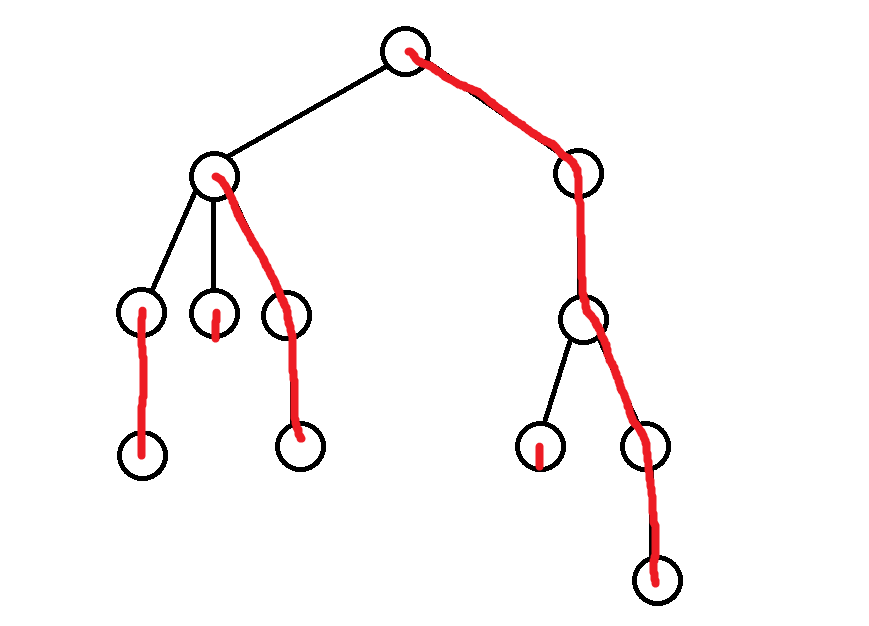

title: 树链剖分学习笔记
categories: OI
tags: 
  - BZOJ
  - CodeVS
  - 数据结构
  - 树链剖分
  - 高级数据结构
permalink: cut-tree-notes
id: 9
updated: '2016-01-19 21:07:07'
date: 2015-12-27 22:48:11
---

树链剖分，就是把一棵树咔嚓咔嚓剖成一堆不相交的链，然后在链上结合搞基数据结构进行各种查询或者修改操作。

<!-- more -->

### 题目：树的统计
[CodeVS 2460](http://codevs.cn/problem/2460/)  
[BZOJ 1036](http://www.lydsy.com/JudgeOnline/problem.php?id=1036)  

给出一棵树，每个点有一个可修改的点权，每次查询两点之间**所有点**的点权和或点权最大值。

### 基本思想


把整棵树划分成许多条**链**，使每个节点都在唯一的链上，对每一条链维护一棵**线段树**，把在树上的操作转移到线段树上。

具体剖的话，这里采用**轻重边路径剖分**的方式，剖最大子树，这样可以保证整棵树上的轻边和链的数量都不超过 $O({\log}n)$。

### 定义
```c++
struct Tree {
	struct Path *path;
	Tree *parent, *children, *maxSizeChild, *next;
	uint size, depth, maxDepth, pos;
	int w;

	bool visited;

	Tree() {}
	Tree(Tree *parent) : parent(parent), depth(!parent ? 0 : parent->depth + 1), next(!parent ? NULL : parent->children), path(NULL), w(0), children(NULL), maxSizeChild(NULL) {}
} treeNodes[MAXN], *root;

struct Path {
	SegmentTree *segmentTree;
	Tree *top;

	Path(struct Tree *top, uint count) : top(top), segmentTree(new SegmentTree(0, count - 1)) {}
};
```

对于每个节点，`depth` 表示这个节点的深度（即到整棵树的根的距离），`size` 表示以这个节点为根的树的大小（即节点总数），`maxSizeChild` 表示该节点的最大子树，`maxDepth` 表示自当前节点向下沿着 `maxSizeChild` 走，走到的最大深度，即链的最底端节点的深度。

每个节点都在一条链上，我们把这些链叫做路径（Path），每条路径的最顶端点（深度最小的）称为链顶节点 `top`，并且为路径上的所有节点维护一棵线段树，而每个节点的 `pos` 表示自己在自己的路径上的编号。

### 剖分
剖分的过程主要由两次搜索组成，首先，我们来一遍 `DFS`，求出每个节点的 `maxSizeChild` 和 `maxDepth`。

```c++
stack<Tree *> s;

s.push(root);
while (!s.empty()) {
	Tree *tree = s.top();
	if (tree->visited) {
		tree->size = 1;
		tree->maxDepth = tree->depth;
		for (Tree *child = tree->children; child; child = child->next) {
			tree->size += child->size;
			if (tree->maxSizeChild == NULL || tree->maxSizeChild->size < child->size) {
				tree->maxSizeChild = child;
				tree->maxDepth = child->maxDepth;
			}
		}

		s.pop();
	} else {
		for (Tree *child = tree->children; child; child = child->next) {
			s.push(child);
		}

		tree->visited = true;
	}
}
```

然后，我们用第二遍搜索来把每一条链连接起来，`DFS` 和 `BFS` 都可以，因为 `BFS` 好写就用 `BFS` 吧 ……

对于每个节点，如果它是根或它不是父节点的 `maxDepthChild`，则我们创建一条从该节点开始的链，否则该节点所在链即为父节点所在链。

```c++
queue<Tree *> q;

q.push(root);
while (!q.empty()) {
	Tree *tree = q.front();
	q.pop();

	if (tree == root || tree != tree->parent->maxSizeChild) {
		tree->path = new Path(tree, tree->maxDepth - tree->depth + 1);
		tree->pos = 0;
	} else {
		tree->path = tree->parent->path;
		tree->pos = tree->parent->pos + 1;
	}

	for (Tree *child = tree->children; child; child = child->next) {
		q.push(child);
	}
}
```

最后，在线段树上更新每个点的权值：

```c++
for (uint i = 0; i < n; i++) {
	treeNodes[i].path->segmentTree->update(treeNodes[i].pos, treeNodes[i].w);
}
```

### 修改
修改某个点的权值，只需要在该节点所在链上的线段树中更新即可。

```c++
inline void update(uint x, uint w) {
	treeNodes[x].path->segmentTree->update(treeNodes[x].pos, w);
}
```

### 查询
查询两个点 `[u, v]` 之间的点权和（或点权极值）的思路如下：

1. 如果 `u` 与 `v` 不同一条链上，则使二者中**所在链链顶节点**深度最小的一个跳到**所在链链顶节点**的父节点位置，继续回到 1；
2. 如果 `u` 与 `v` 在同一条链上，则直接从线段树中查询。

```c++
inline int querySum(uint u, uint v) {
	int result = 0;
	Tree *a = &treeNodes[u], *b = &treeNodes[v];
	while (a->path != b->path) {
		if (a->path->top->depth < b->path->top->depth) {
			swap(a, b);
		}

		result += a->path->segmentTree->querySum(0, a->pos);
		a = a->path->top->parent;
	}

	if (a->pos > b->pos) {
		swap(a, b);
	}

	result += a->path->segmentTree->querySum(a->pos, b->pos);
	return result;
}
```

### 附：无根树转有根树
为了剖分时更容易一些，我们可以把读入的无根树转化成有根树，这样搜索的时候方便点，当然常数也会大一些 ……

```c++
inline void convert() {
	queue<Node *> q;
	root = &treeNodes[0];
	new (root) Tree(NULL);

	q.push(&nodes[0]);
	while (!q.empty()) {
		Node *node = q.front();
		q.pop();

		node->visited = true;

		for (Edge *edge = node->edges; edge; edge = edge->next) {
			if (!edge->to->visited) {
				treeNodes[node->id].children = new (&treeNodes[edge->to->id]) Tree(&treeNodes[node->id]);
				q.push(edge->to);
			}
		}
	}
}
```

### 附：线段树
我们使用线段树来维护每一条链，这里只用到了单点修改，也可以换成树状数组或者 zkw 线段树。

```c++
struct SegmentTree {
	struct Node {
		struct Node *lchild, *rchild;
		uint l, r;
		int sum, max;

		Node(uint l, uint r, Node *lchild, Node *rchild) : l(l), r(r), lchild(lchild), rchild(rchild), sum(0), max(0) {}

		void update(uint x, int value) {
			if (x > r || x < l) {
				return;
			}

			if (x == l && x == r) {
				sum = max = value;
			} else {
				max = INT_MIN, sum = 0;

				if (lchild) {
					lchild->update(x, value);
					max = std::max(max, lchild->max);
					sum += lchild->sum;
				}

				if (rchild) {
					rchild->update(x, value);
					max = std::max(max, rchild->max);
					sum += rchild->sum;
				}
			}
		}

		int querySum(uint l, uint r) {
			if (l > this->r || r < this->l) {
				return 0;
			}

			if (l <= this->l && r >= this->r) {
				return sum;
			} else {
				int result = 0;

				if (lchild) {
					result += lchild->querySum(l, r);
				}

				if (rchild) {
					result += rchild->querySum(l, r);
				}

				return result;
			}
		}

		int queryMax(uint l, uint r) {
			if (l > this->r || r < this->l) {
				return INT_MIN;
			}

			if (l <= this->l && r >= this->r) {
				return max;
			} else {
				int result = INT_MIN;

				if (lchild) {
					result = std::max(result, lchild->queryMax(l, r));
				}

				if (rchild) {
					result = std::max(result, rchild->queryMax(l, r));
				}

				return result;
			}
		}
	} *root;

	SegmentTree(uint l, uint r) {
		root = build(l, r);
	}

	Node *build(uint l, uint r) {
		if (r < l) {
			return NULL;
		} else if (r == l) {
			return new Node(l, r, NULL, NULL);
		} else {
			uint mid = (l + ((r - l) >> 1));
			return new Node(l, r, build(l, mid), build(mid + 1, r));
		}
	}

	void update(uint x, int value) {
		root->update(x, value);
	}

	int querySum(uint l, uint r) {
		return root->querySum(l, r);
	}

	int queryMax(uint l, uint r) {
		return root->queryMax(l, r);
	}
};
```
### 完整代码
```c++
#include <cstdio>
#include <climits>
#include <queue>
#include <stack>
#include <algorithm>

using std::queue;
using std::stack;
using std::swap;

typedef unsigned int uint;

const uint MAXN = 30000;

struct Node {
	struct Edge *edges;
	uint id;
	bool visited;
} nodes[MAXN];

struct Edge {
	Node *from, *to;
	Edge *next;

	Edge(Node *from, Node *to, Edge *next) : from(from), to(to), next(next) {}
};

struct SegmentTree {
	struct Node {
		struct Node *lchild, *rchild;
		uint l, r;
		int sum, max;

		Node(uint l, uint r, Node *lchild, Node *rchild) : l(l), r(r), lchild(lchild), rchild(rchild), sum(0), max(0) {}

		void update(uint x, int value) {
			if (x > r || x < l) {
				return;
			}

			if (x == l && x == r) {
				sum = max = value;
			} else {
				max = INT_MIN, sum = 0;

				if (lchild) {
					lchild->update(x, value);
					max = std::max(max, lchild->max);
					sum += lchild->sum;
				}

				if (rchild) {
					rchild->update(x, value);
					max = std::max(max, rchild->max);
					sum += rchild->sum;
				}
			}
		}

		int querySum(uint l, uint r) {
			if (l > this->r || r < this->l) {
				return 0;
			}

			if (l <= this->l && r >= this->r) {
				return sum;
			} else {
				int result = 0;

				if (lchild) {
					result += lchild->querySum(l, r);
				}

				if (rchild) {
					result += rchild->querySum(l, r);
				}

				return result;
			}
		}

		int queryMax(uint l, uint r) {
			if (l > this->r || r < this->l) {
				return INT_MIN;
			}

			if (l <= this->l && r >= this->r) {
				return max;
			} else {
				int result = INT_MIN;

				if (lchild) {
					result = std::max(result, lchild->queryMax(l, r));
				}

				if (rchild) {
					result = std::max(result, rchild->queryMax(l, r));
				}

				return result;
			}
		}
	} *root;

	SegmentTree(uint l, uint r) {
		root = build(l, r);
	}

	Node *build(uint l, uint r) {
		if (r < l) {
			return NULL;
		} else if (r == l) {
			return new Node(l, r, NULL, NULL);
		} else {
			uint mid = (l + ((r - l) >> 1));
			return new Node(l, r, build(l, mid), build(mid + 1, r));
		}
	}

	void update(uint x, int value) {
		root->update(x, value);
	}

	int querySum(uint l, uint r) {
		return root->querySum(l, r);
	}

	int queryMax(uint l, uint r) {
		return root->queryMax(l, r);
	}
};

struct Tree {
	struct Path *path;
	Tree *parent, *children, *maxSizeChild, *next;
	uint size, depth, maxDepth, pos;
	int w;

	bool visited;

	Tree() {}
	Tree(Tree *parent) : parent(parent), depth(!parent ? 0 : parent->depth + 1), next(!parent ? NULL : parent->children), path(NULL), w(0), children(NULL), maxSizeChild(NULL) {}
} treeNodes[MAXN], *root;

struct Path {
	SegmentTree *segmentTree;
	Tree *top;

	Path(struct Tree *top, uint count) : top(top), segmentTree(new SegmentTree(0, count - 1)) {}
};

uint n, q;

inline void addEdge(uint a, uint b) {
	nodes[a].edges = new Edge(&nodes[a], &nodes[b], nodes[a].edges);
	nodes[b].edges = new Edge(&nodes[b], &nodes[a], nodes[b].edges);
}

inline void convert() {
	queue<Node *> q;
	root = &treeNodes[0];
	new (root) Tree(NULL);

	q.push(&nodes[0]);
	while (!q.empty()) {
		Node *node = q.front();
		q.pop();

		node->visited = true;

		for (Edge *edge = node->edges; edge; edge = edge->next) {
			if (!edge->to->visited) {
				treeNodes[node->id].children = new (&treeNodes[edge->to->id]) Tree(&treeNodes[node->id]);
				q.push(edge->to);
			}
		}
	}
}

inline void cut() {
	stack<Tree *> s;

	s.push(root);
	while (!s.empty()) {
		Tree *tree = s.top();
		if (tree->visited) {
			tree->size = 1;
			tree->maxDepth = tree->depth;
			for (Tree *child = tree->children; child; child = child->next) {
				tree->size += child->size;
				if (tree->maxSizeChild == NULL || tree->maxSizeChild->size < child->size) {
					tree->maxSizeChild = child;
					tree->maxDepth = child->maxDepth;
				}
			}

			s.pop();
		} else {
			for (Tree *child = tree->children; child; child = child->next) {
				s.push(child);
			}

			tree->visited = true;
		}
	}

queue<Tree *> q;

q.push(root);
while (!q.empty()) {
	Tree *tree = q.front();
	q.pop();

	if (tree == root || tree != tree->parent->maxSizeChild) {
		tree->path = new Path(tree, tree->maxDepth - tree->depth + 1);
		tree->pos = 0;
	} else {
		tree->path = tree->parent->path;
		tree->pos = tree->parent->pos + 1;
	}

	for (Tree *child = tree->children; child; child = child->next) {
		q.push(child);
	}
}

	for (uint i = 0; i < n; i++) {
		treeNodes[i].path->segmentTree->update(treeNodes[i].pos, treeNodes[i].w);
	}
}

inline void update(uint x, uint w) {
	treeNodes[x].w = w;
	treeNodes[x].path->segmentTree->update(treeNodes[x].pos, w);
}

inline int querySum(uint u, uint v) {
	int result = 0;
	Tree *a = &treeNodes[u], *b = &treeNodes[v];
	while (a->path != b->path) {
		if (a->path->top->depth < b->path->top->depth) {
			swap(a, b);
		}

		result += a->path->segmentTree->querySum(0, a->pos);
		a = a->path->top->parent;
	}

	if (a->pos > b->pos) {
		swap(a, b);
	}

	result += a->path->segmentTree->querySum(a->pos, b->pos);
	return result;
}

inline int queryMax(uint u, uint v) {
	int result = INT_MIN;
	Tree *a = &treeNodes[u], *b = &treeNodes[v];
	while (a->path != b->path) {
		if (a->path->top->depth < b->path->top->depth) {
			swap(a, b);
		}

		result = std::max(result, a->path->segmentTree->queryMax(0, a->pos));
		a = a->path->top->parent;
	}

	if (a->pos > b->pos) {
		swap(a, b);
	}

	result = std::max(result, a->path->segmentTree->queryMax(a->pos, b->pos));
	return result;
}

int main() {
	scanf("%u", &n);

	for (uint i = 0; i < n; i++) {
		nodes[i].id = i;
	}

	for (uint i = 0; i < n - 1; i++) {
		uint a, b;
		scanf("%u %u", &a, &b);
		a--, b--;

		addEdge(a, b);
	}

	convert();

	for (uint i = 0; i < n; i++) {
		uint w;
		scanf("%u", &w);
		treeNodes[i].w = w;
	}

	cut();

	scanf("%u", &q);

	for (uint i = 0; i < q; i++) {
		char command[6 + 1];
		scanf("%s", command);
		if (command[1] == 'H') { // CHANGE
			uint x;
			int w;
			scanf("%u %d", &x, &w);
			x--;

			update(x, w);
		} else {
			uint u, v;
			scanf("%u %u", &u, &v);
			u--, v--;

			if (command[1] == 'M') { // QMAX
				printf("%d\n", queryMax(u, v));
			} else { // QSUM
				printf("%d\n", querySum(u, v));
			}
		}
	}

	return 0;
}
```
