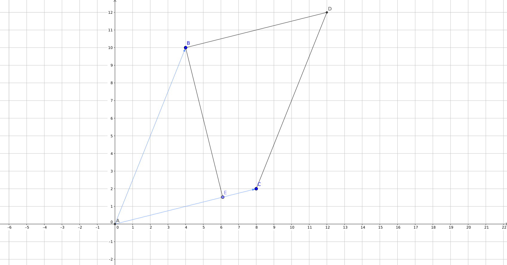
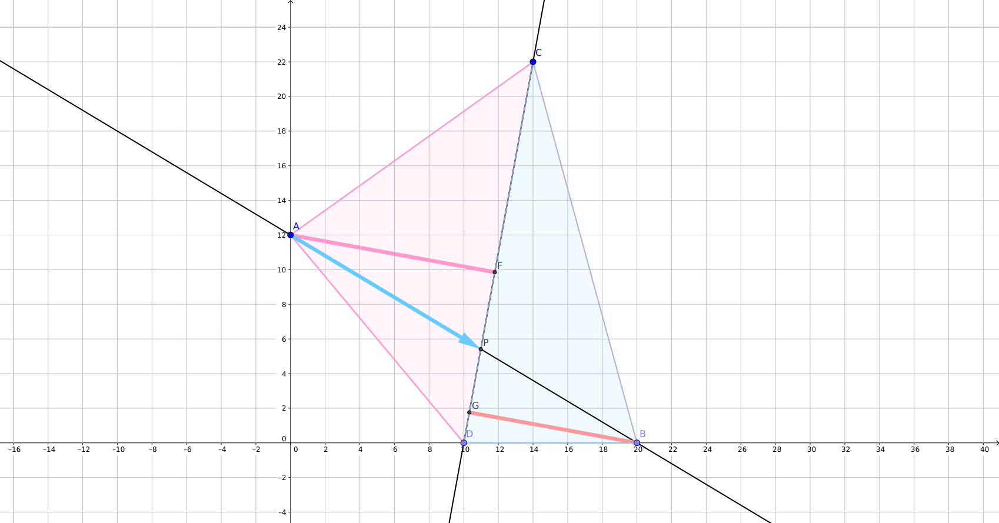
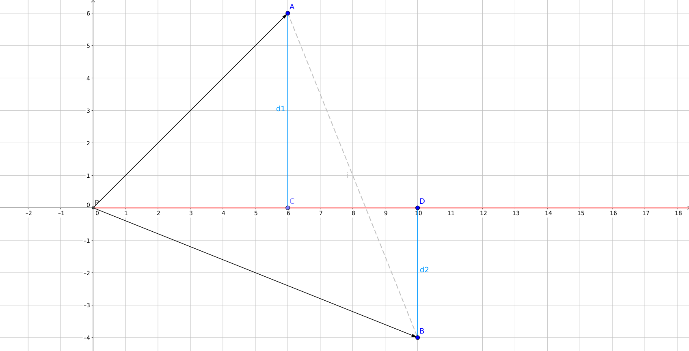
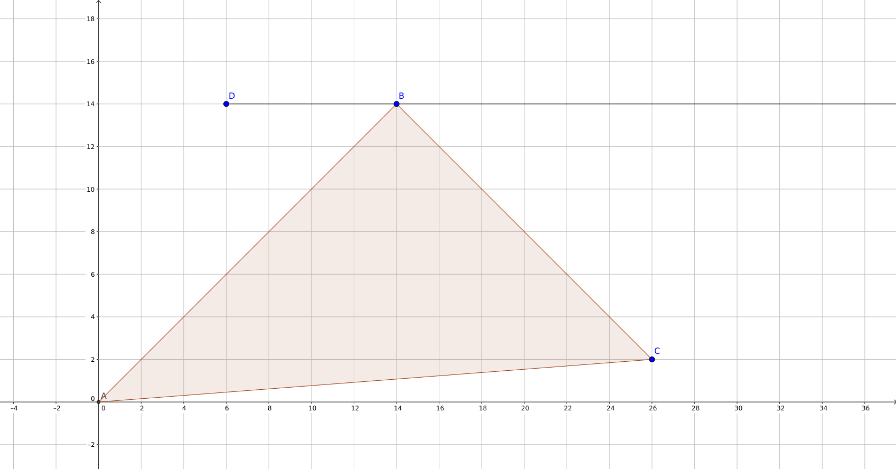
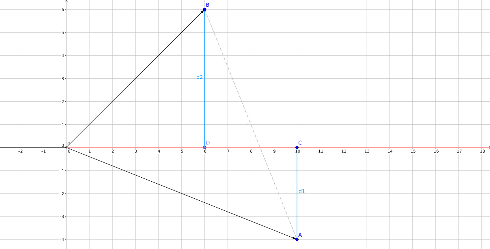
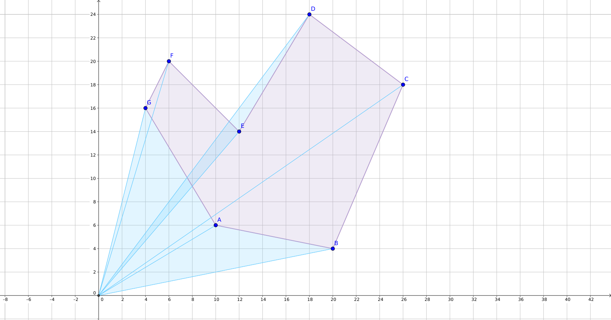
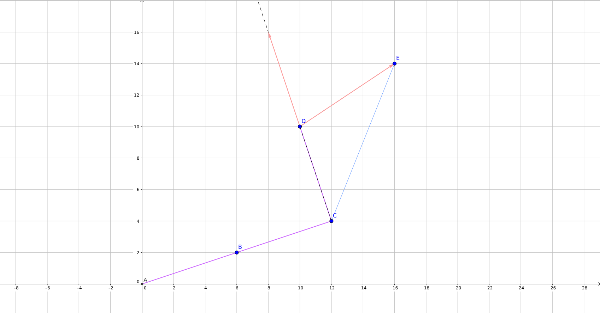

title: 计算几何学习笔记
categories:
  - OI
tags:
  - 学习笔记
  - 数学
  - 算法模板
  - 计算几何
permalink: geometry-notes
date: '2017-01-06 16:30:00'
---

计算几何（Computational Geometry），是一系列使用计算机解决几何问题的算法。与解析几何相比，计算几何更适合计算机运算，精度较高，运算速度较快，并且易于编写。

本文只包含二维计算几何在 OI 中的部分应用。

<!-- more -->

### 浮点误差

程序设计中，考虑到浮点数 `double` 有精度误差，在比较时，通常允许一定的误差，即对于两个数 $ a $、$ b $，如果 $ | a - b | \leq d $，则认为 $ a = b $。一般根据题目要求，$ d $（代码中命名为 `EPS`）取一个较小值，如 $ 10 ^ {-8} $。

```cpp
const double EPS = 1e-8;

// 带误差比较，返回 x 是否等于 y
inline bool dcmp(double x, double y = 0)
{
    return fabs(x - y) <= EPS;
}
```

### 向量

向量（vector）是一个有大小和方向的量，在几何中，它被表示为带箭头的线段。向量可以用**起点**和**终点**的坐标来表示 —— 从点 $ A $ 到点 $ B $ 的向量表示为 $ \overrightarrow{AB} $。

向量的书写，两个大写字母上加一个箭头（表示方向）$ \overrightarrow{AB} $，或者加粗的小写字母 $ \boldsymbol{a} $。

向量没有位置，即向量可以在平面内任意平移而保持其本身的性质不变 —— 所以我们可以将向量平移至其起点与原点 $ (0, 0) $ 重合，用终点坐标表示这个向量，下文称此方法为**坐标表示法**，除特殊说明外，下文表示向量均使用此方法。

两个向量的夹角 $ \langle \boldsymbol{a}, \boldsymbol{b} \rangle $ 定义为从 $ \boldsymbol{a} $ 旋转到 $ \boldsymbol{b} $ 所经过的角度，逆时针为正，顺时针为负。

向量范数（norm），这里简单定义向量 $ \overrightarrow{AB} = (x, y) $ 的范数为 $ x ^ 2 + y ^ 2 $，即长度的平方 $ | \overrightarrow{AB} | ^ 2 $。这样定义的好处是，可以方便地比较两个向量的长度，而不需要开平方。

与向量相对的概念是**标量**（scalar），标量只有大小没有方向。

### 向量的基本运算

两个向量相加，遵循平行四边形定则（或三角形定则），$ (x_1, y_1) + (x_2, y_2) = (x_1 + x_2, y_1 + y_2) $。

两个向量相减与相加类似，除此之外，点可以加减一个向量，表示将点按照向量所指向的方向进行平移。

向量的数乘，将一个向量乘或除以 $ k $，表示将向量所对应的有向线段长度变为原来的 $ k $ 倍或 $ k $ 分之一。

可以发现，向量和点的运算是相似的，在程序中，可以使用同一种类型来表示向量和点：

```cpp
/* 
 * 向量（Vector）或点
 *
 * 使用原点到一个点 (x, y) 的有向线段表示向量
 * 从点 A 到点 B 的向量表示为 A - B
 */
typedef struct Vec
{
    double x, y;

    Vec(double x = 0, double y = 0) : x(x), y(y) {}

    // 相加
    Vec operator+(const Vec &v) const
    {
        return Vec(x + v.x, y + v.y);
    }

    // 相减
    Vec operator-(const Vec &v) const
    {
        return Vec(x - v.x, y - v.y);
    }

    // 数乘（伸长、缩短）
    Vec operator*(double d) const
    {
        return Vec(x * d, y * d);
    }

    Vec operator/(const double d) const
    {
        return Vec(x / d, y / d);
    }

    // 范数，用来比较长度，等于长度的平方
    double norm() const
    {
        return x * x + y * y;
    }
} Pt;
```

为了方便阅读，我们定义类型点 `Pt` 为向量 `Vec` 的别名，在代码中区别「点」和「向量」。同时，应记住点与向量的运算中的类型：

* 向量 $ + $ 向量 $ = $ 向量
* 点 $ + $ 向量 $ = $ 点
* 向量 $ \times $ 数 $ = $ 向量

### 向量乘法

向量的乘法分为两种 —— 点乘（Dot）和叉乘（Cross）。

#### 点乘

向量的点乘表示为 $ \boldsymbol{a} \cdot \boldsymbol{b} $，设 $ \boldsymbol{a} = (x_1, y_1), \boldsymbol{b} = (x_2, y_2) $，则

$$ \boldsymbol{a} \cdot \boldsymbol{b} = x_1x_2 + y_1y_2 $$

点乘的结果是一个标量，它表示 $ \boldsymbol{a} $ 在 $ \boldsymbol{b} $ 所在直线上的投影长度与 $ \boldsymbol{b} $ 长度的乘积，即

$$ \boldsymbol{a} \cdot \boldsymbol{b} = |\boldsymbol{a}| |\boldsymbol{b}| \cos \langle \boldsymbol{a}, \boldsymbol{b} \rangle $$

从上式中可以看出，因为 $ \cos-\alpha = \cos \alpha $，所以 $ \cos \langle \boldsymbol{a}, \boldsymbol{b} \rangle = \cos \langle \boldsymbol{b}, \boldsymbol{a} \rangle $，即点乘**满足交换律**。

#### 叉乘

向量的叉乘表示为 $ \boldsymbol{a} \times \boldsymbol{b} $，设 $ \boldsymbol{a} = (x_1, y_1), \boldsymbol{b} = (x_2, y_2) $，则

$$ \boldsymbol{a} \times \boldsymbol{b} = x_1y_2 - x_2y_1 $$

叉乘的结果是一个标量，它表示以 $ \boldsymbol{a} $ 与 $ \boldsymbol{b} $ 为邻边的平行四边形的（有向）面积，即

$$ \boldsymbol{a} \cdot \boldsymbol{b} = |\boldsymbol{a}| |\boldsymbol{b}| \sin \langle \boldsymbol{a}, \boldsymbol{b} \rangle $$



这个平行四边形可以以 $ \boldsymbol{b} $ 为底，底边上的高即为 $ \sin \langle \boldsymbol{a}, \boldsymbol{b} \rangle $。

结果的符号与 $ \sin \langle \boldsymbol{a}, \boldsymbol{b} \rangle $ 相同，即当 $ \boldsymbol{b} $ 在 $ \boldsymbol{a} $ 逆时针方向时，结果为正。

如果需要求以两向量为两边的三角形面积，可以求出平行四边形面积后除以二。

#### 代码实现

```cpp
// 点乘
double dot(const Vec &a, const Vec &b)
{
    return a.x * b.x + a.y * b.y;
}

// 叉乘
double cross(const Vec &a, const Vec &b)
{
    return a.x * b.y - a.y * b.x;
}
```

### 直线与线段

用直线上的两个点表示直线，用线段的两端点表示线段。

直线上的两个点组成的向量，被称为这条直线的一个**方向向量**。

#### 点在直线上的判定

如果点 $ P $ 在直线上，则以 $ \overrightarrow{PA} $、$ \overrightarrow{PB} $ 为邻边的平行四边形不存在（面积为零），即 $ \overrightarrow{PA} \times \overrightarrow{PB} = 0 $。

```cpp
bool include(const Pt &p) const
{
    return dcmp(cross(a - p, b - p));
}
```

#### 判断两直线关系

* 如果一条直线上的两个点都在另一条实现上，则两条直线重合；
* 如果不重合的两条直线的方向向量叉乘得零（无法组成平行四边形），则两条直线平行。

```cpp
// 两直线关系（交点个数）
// 0 表示平行（无交点）
// 1 表示相交（一个交点）
// -1 表示重合（无数个交点）
static int relation(const Line &a, const Line &b)
{
    if (a.include(b.a) && a.include(b.b)) return -1;
    else if (dcmp(cross(a.b - a.a, b.b - b.a))) return 0;
    else return 1;
}
```

#### 求两直线交点

在判断相交后，可以求两直线 $ AB $、$ CD $ 的交点。设其交点为 $ P $，分别过点 $ A $、$ B $ 作 $ CD $ 的垂线，连接 $ AB $、$ BC $、$ CD $、$ DA $。作向量 $ \overrightarrow{AP} $，只需要求出 $ \overrightarrow{AP} $，即可得到 $ P = A + \overrightarrow{AP} $。



因为 $ \angle AFP = \angle BGP = 90 ^\circ, \angle APF = \angle BPG $  
所以 $ \triangle AFP \sim \triangle BGP $  
所以 $ \frac{\overrightarrow{AP}}{\overrightarrow{PB}} = \frac{|AF|}{|BG|} = \frac{S_{\triangle ACD}}{S_{\triangle BCD}} $  
即 $ \frac{\overrightarrow{AP}}{\overrightarrow{AB}} = \frac{\overrightarrow{AP}}{\overrightarrow{AP} + \overrightarrow{PB}} = \frac{S_{\triangle ACD}}{S_{\triangle ACD} + S_{\triangle BCD}} = \frac{2S_{\triangle ACD}}{2S_{\triangle ACD} + 2S_{\triangle BCD}} $

用叉乘计算面积，求出向量 $ \overrightarrow{AP} $ 即可，注意计算面积时的方向。

```cpp
// 求两直线交点（需要保证两直线有交点）
static Pt intersect(const Line &a, const Line &b)
{
    double s1 = cross(b.a - a.a, b.b - a.a), s2 = cross(b.b - a.b, b.a - a.b);
    return a.a + (a.b - a.a) * s1 / (s1 + s2);
}
```

#### 点在线段上的判定

如果点 $ P $ 在线段 $ AB $ 所在的直线上，则以 $ \overrightarrow{PA} $、$ \overrightarrow{PB} $ 为邻边的平行四边形不存在（面积为零），即 $ \overrightarrow{PA} \times \overrightarrow{PB} = 0 $。

此时还需判断 $ P $ 是否在 $ A $ 与 $ B $ 之间。

* 如果 $ \overrightarrow{PA} \cdot \overrightarrow{PB} > 0 $，则表示 $ \langle \overrightarrow{PA}, \overrightarrow{PB} \rangle = 0 ^\circ $（$ \cos 0 ^\circ = 1 > 0 $）；
* 如果 $ \overrightarrow{PA} \cdot \overrightarrow{PB} < 0 $，则表示 $ \langle \overrightarrow{PA}, \overrightarrow{PB} \rangle = \pm180 ^\circ $（$ \cos \pm180 ^\circ = -1 $）；
* 如果 $ \overrightarrow{PA} \cdot \overrightarrow{PB} = 0 $，则表示 $ \overrightarrow{PA} = 0 $ 或 $ \overrightarrow{PB} = 0 $，即 $ P $ 与 $ A $ 或 $ B $ 重合。

后两种情况表明点 $ P $ 在 $ AB $ 上。

```cpp
// 线段包含点（点在线段上）
bool include(const Pt &p) const
{
    // PA × PB = 0：PA 与 PB 共线，即点在线段所在的直线上
    // PA · PB < 0：PA 与 PB 方向不同（A 和 B 分别在 P 的两边），如果 PA · PB = 0 则 P = A 或 P = B
    return dcmp(cross(a - p, b - p)) && dot(a - p, b - p) <= 0;
}
```

#### 线段相交 / 求交点

求对应所在直线的交点，判断是否在线段上即可。

### 多边形

多边形（polygon）通常用顺时针或逆时针排列的顶点来表示。

```cpp
struct Poly
{
    std::vector<Pt> pts;
};
```

#### 点在多边形内的判定

判断点是否在多边形内部，常使用**射线法**，即从该点引一条平行于 $ x $ 轴的射线，如果它与多边形有奇数个交点，则该点在多边形内，否则在多边形外。

考虑相邻两个顶点 $ A $ 与 $ B $，判断由 $ P $ 引出的水平向右的射线有没有与线段 $ AB $ 相交。作向量 $ \overrightarrow{PA}, \overrightarrow{PB} $，分别过 $ A $、$ B $ 作 $ x $ 轴的垂线，垂足分别为 $ C $、$ D $，设 $ \overrightarrow{CA} = d_1, \overrightarrow{DB} = d_2 $

如果 $ \overrightarrow{PB} $ 在 $ \overrightarrow{PA} $ 的顺时针方向上，即 $ \overrightarrow{PA} \times \overrightarrow{PB} < 0 $，则需要 $ A $ 在 $ C $ 上方，$ B $ 在 $ D $ 下方，即 $ d_1 \leq 0, d_2 > 0 $



注意到 $ d_1 $ 可以为 $ 0 $，即射线穿过 $ A $ 被认为与当前边相交，因为可能会有这种情况



此时不应认为 $ D $ 在多边形内，如果因为 $ B $ 被认为被射线穿过了一次，则会误判。解决方案是对于每一条边，只将射线穿过上方点（也可以取下方点）的情况下认为射线与边相交，这样 $ B $ 会被统计两次（或零次），不会影响判断。

如果 $ \overrightarrow{PB} $ 在 $ \overrightarrow{PA} $ 的逆时针方向上，即 $ \overrightarrow{PA} \times \overrightarrow{PB} > 0 $，则需要 $ A $ 在 $ C $ 下方，$ B $ 在 $ D $ 上方，即 $ d_1 < 0, d_2 \geq 0 $。



##### 代码实现

```cpp
struct Poly
{
    std::vector<Pt> pts;

    bool include(const Pt &p) const
    {
        int cnt = 0;
        // 判断与每条边有没有交点
        for (size_t i = 0; i < pts.size(); i++)
        {
            // 枚举相邻的每两个点
            const Pt &a = pts[i], &b = pts[(i + 1) % pts.size()];

            // 如果点 P 在边 AB 上
            if (Seg(a, b).include(p)) return true;

            // 详见图
            double d1 = a.y - p.y, d2 = b.y - p.y, tmp = cross(a - p, b - p);
            if ((tmp >= 0 && d1 >= 0 && d2 < 0) || (tmp <= 0 && d1 < 0 && d2 >= 0)) cnt++;
        }

        // 奇数的交点
        return cnt % 2 == 1;
    }
};
```

#### 多边形面积

按顺序枚举每两个相邻的顶点，将每两个相邻的顶点与原点围成的三角形面积累加起来。因为所有不包含在多边形内的区域都被一正一负计算了偶数次，所以最终结果只包含多边形内的部分。



如图，浅蓝色部分被计算了两次，点 $ E $ 左下深色部分，在多边形内的部分被计算了三次，不在多边形内的部分被计算了四次，其它在多边形内部的部分被计算了一次。

如果按照逆时针顺序枚举，则结果为正，否则结果为负。

```cpp
// 多边形面积（有向面积）
double area() const
{
    double res = 0;
    for (size_t i = 0; i < pts.size(); i++)
    {
        // 枚举每两个点
        const Pt &a = pts[i], &b = pts[(i + 1) % pts.size()];
        res += cross(a, b);
    }
    return res / 2;
}
```

### 凸包

在平面内，对于给定的一些点，包含这些点的最小凸多边形被称为**凸包**（Convex Hull）。

求凸包的一种方法是 Graham's Scan，算法的流程为：

1. 选出横坐标最小（横坐标相同时纵座标最小）的点，作为极点，该点一定在凸包上；
2. 对其它点按照与极点的极角排序，极角相同的按照与极点的距离排序；
3. 用栈维护当前在凸包上的点，按顺序考虑每一个点是否可以替换栈顶的点。

这里极角是指，过极点 $ P $ 作水平向右的向量 $ \boldsymbol{a} $，则点 $ A $ 的极角为 $ \langle \boldsymbol{a}, \overrightarrow{PA} \rangle $。比较两个点 $ A $、$ B $ 的极角，如果 $ \overrightarrow{PA} $ 经过逆时针旋转到 $ \overrightarrow{PB} $，即 $ \overrightarrow{PA} \times \overrightarrow{PB} > 0 $，则 $ A $ 极角序较小。

枚举每一个点，考虑新加入一个点的影响：



当前已被加入到凸包中的点为 $ A $（极点）、$ B $、$ C $、$ D $，考虑新加入点 $ E $ 的影响 —— $ \overrightarrow{DE} $ 相对于 $ \overrightarrow{CD} $ 向顺时针方向旋转了（即 $ \overrightarrow{CD} \times \overrightarrow{DE} \leq 0 $），此时这些边一定无法组成一个凸多边形。所以要将 $ D $ 点从凸包中删除，加入 $ E $ 点。这种情况我们称 $ DE $ 的连线不合法。

加入一个点时，应当考虑与栈顶点的连线是否合法，如果不合法，则将栈顶点删除，继续考虑栈顶点，直到栈中只剩一个点或连线合法。

```cpp
// 求凸包用的点
int n;
Pt a[MAXN + 1];

// 凸包极角排序的比较函数
inline bool compare(const Pt &a, const Pt &b)
{
    // 两个向量
    Vec va = a - ::a[1], vb = b - ::a[1];
    double t = cross(va, vb);
    if (!dcmp(t)) return t > 0; // OA -> OB 是逆时针，则 A 极角序在先
    else return va.norm() < vb.norm(); // norm 较小的长度较小
}

struct Poly
{
    std::vector<Pt> pts;

    // 求凸包（Convex），结果储存在自身 pts 中
    void convex()
    {
        // 找出最左下角的点
        int id = 1;
        for (int i = 1; i <= n; i++)
        {
            if (a[i].x < a[id].x || (a[i].x == a[id].x && a[i].y < a[id].y)) id = i;
        }
        if (id != 1) std::swap(a[1], a[id]);

        // 排序
        std::sort(a + 2, a + n + 1, &compare);

        // 极角序扫描
        pts.push_back(a[1]);
        for (int i = 2; i <= n; i++)
        {
            // 比较，如果最后一个点需要被删掉则弹出（pop_back）
            while (pts.size() >= 2 && cross(pts.back() - pts[pts.size() - 2], a[i] - pts.back()) <= 0) pts.pop_back();
            pts.push_back(a[i]);
        }
    }
};
```

### 完整代码


```cpp
#include <cstdio>
#include <cmath>
#include <algorithm>
#include <vector>

const int MAXN = 100000;
const double EPS = 1e-8;

// 带误差比较
inline bool dcmp(double x, double y = 0)
{
    return fabs(x - y) <= EPS;
}

/* 
 * 向量（Vector）或点
 *
 * 使用原点到一个点 (x, y) 的有向线段表示向量
 * 从点 A 到点 B 的向量表示为 A - B
 */
typedef struct Vec
{
    double x, y;

    Vec(double x = 0, double y = 0) : x(x), y(y) {}

    // 相加
    Vec operator+(const Vec &v) const
    {
        return Vec(x + v.x, y + v.y);
    }

    // 相减
    Vec operator-(const Vec &v) const
    {
        return Vec(x - v.x, y - v.y);
    }

    // 数乘（伸长、缩短）
    Vec operator*(double d) const
    {
        return Vec(x * d, y * d);
    }

    Vec operator/(const double d) const
    {
        return Vec(x / d, y / d);
    }

    // 范数，用来比较长度，等于长度的平方
    double norm() const
    {
        return x * x + y * y;
    }
} Pt;

// 点乘
double dot(const Vec &a, const Vec &b)
{
    return a.x * b.x + a.y * b.y;
}

// 叉乘
double cross(const Vec &a, const Vec &b)
{
    return a.x * b.y - a.y * b.x;
}

// 线段（Segment），用两个点表示
struct Seg
{
    Pt a, b;

    Seg(const Pt &a, const Pt &b) : a(a), b(b) {}

    // 线段包含点（点在线段上）
    bool include(const Pt &p)
    {
        // PA × PB = 0：PA 与 PB 共线，即点在线段所在的直线上
        // PA · PB = 0：PA 与 PB 方向不同（A 和 B 分别在 P 的两边），如果 PA · PB = 0 则 P = A 或 P = B
        return dcmp(cross(a - p, b - p)) && dot(a - p, b - p) <= 0;
    }
};

// 直线，用两个点表示
struct Line
{
    Pt a, b;

    Line() {} // 提供一个不需要参数的构造函数
    Line(const Pt &a, const Pt &b) : a(a), b(b) {}

    bool include(const Pt &p) const
    {
        return dcmp(cross(a - p, b - p));
    }

    // 两直线关系（交点个数）
    // 0 表示平行（无交点）
    // 1 表示相交（一个交点）
    // -1 表示重合（无数个交点）
    static int relation(const Line &a, const Line &b)
    {
        if (a.include(b.a) && a.include(b.b)) return -1;
        else if (dcmp(cross(a.b - a.a, b.b - b.a))) return 0;
        else return 1;
    }

    // 求两直线交点（需要保证两直线有交点）
    static Pt intersect(const Line &a, const Line &b)
    {
        double s1 = cross(b.a - a.a, b.b - a.a), s2 = cross(b.b - a.b, b.a - a.b);
        return a.a + (a.b - a.a) * s1 / (s1 + s2);
    }
};

// 求凸包用的点
int n;
Pt a[MAXN + 1];

// 凸包极角排序的比较函数
inline bool compare(const Pt &a, const Pt &b)
{
    // 两个向量
    Vec va = a - ::a[1], vb = b - ::a[1];
    double t = cross(va, vb);
    if (!dcmp(t)) return t > 0; // OA -> OB 是逆时针，则 A 极角序在先
    else return va.norm() < vb.norm(); // norm 较小的长度较小
}

struct Poly
{
    std::vector<Pt> pts;

    bool include(const Pt &p) const
    {
        int cnt = 0;
        // 判断与每条边有没有交点
        for (size_t i = 0; i < pts.size(); i++)
        {
            // 枚举相邻的每两个点
            const Pt &a = pts[i], &b = pts[(i + 1) % pts.size()];

            // 如果点 P 在边 AB 上
            if (Seg(a, b).include(p)) return true;

            // 详见图
            double d1 = a.y - p.y, d2 = b.y - p.y, tmp = cross(a - p, b - p);
            if ((tmp >= 0 && d1 >= 0 && d2 < 0) || (tmp <= 0 && d1 < 0 && d2 >= 0)) cnt++;
        }

        // 奇数的交点
        return cnt % 2 == 1;
    }

    // 多边形面积（有向面积）
    double area() const
    {
        double res = 0;
        for (size_t i = 0; i < pts.size(); i++)
        {
            // 枚举每两个点
            const Pt &a = pts[i], &b = pts[(i + 1) % pts.size()];
            res += cross(a, b);
        }
        return res / 2;
    }

    // 求凸包（Convex），结果储存在自身 pts 中
    void convex()
    {
        // 找出最左下角的点
        int id = 1;
        for (int i = 1; i <= n; i++)
        {
            if (a[i].x < a[id].x || (a[i].x == a[id].x && a[i].y < a[id].y)) id = i;
        }
        if (id != 1) std::swap(a[1], a[id]);

        // 排序
        std::sort(a + 2, a + n + 1, &compare);

        // 极角序扫描
        pts.push_back(a[1]);
        for (int i = 2; i <= n; i++)
        {
            // 比较，如果最后一个点需要被删掉则弹出（pop_back）
            while (pts.size() >= 2 && cross(a[i] - pts[pts.size() - 2], pts.back() - pts[pts.size() - 2]) >= 0) pts.pop_back();
            pts.push_back(a[i]);
        }
    }
};
```