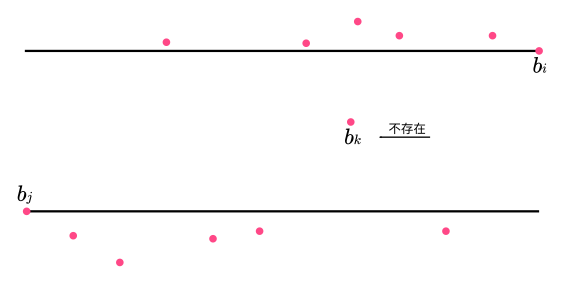
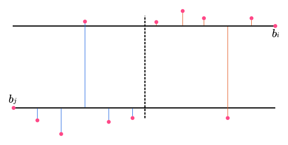

title: 「HAOI2006」数字序列 - DP
categories:
  - OI
tags:
  - BZOJ
  - DP
  - HAOI
permalink: haoi2006-sequence
date: '2016-12-07 08:35:00'
---

现在我们有一个长度为 $ n $ 的整数序列 $ \{ a_i \} $。我们希望把它变成一个单调严格上升的序列。但是不希望改变过多的数，也不希望改变的幅度太大。

<!-- more -->

### 链接

[BZOJ 1049](http://www.lydsy.com/JudgeOnline/problem.php?id=1049)

### 题解

为了方便处理边界，我们在序列最左侧添加一个 $ a_0 = \min\limits_{i = 1} ^ n\{ a_i \} $，最右侧添加一个 $ a_{n + 1} = \max\limits_{i = 1} ^ n\{ a_i \} $。

第一问，在一个单调上升序列中，对于每一个 $ a_i $，它至少要比它左边的第 $ k $ 个数大 $ k $，即 $ a_i \geq a_{i - k} + k $。如果我们确定了一个子序列满足该条件，则只需修改剩余的数，设 $ f(i) $ 表示前 $ i $ 个数中最长的满足该条件的序列，可以写出 DP 方程

$$ f(i) = \max\limits_{j = 0} ^ {i - 1} \{ f(j) + 1, a_i - a_j \geq i - j \} $$

第一问答案即为 $ n - f(n + 1) + 1 $。

第二问要求在第一问的前提下使修改幅度最小，即我们需要保证有一个最长的满足原单调上升条件的子序列不变。

考虑将每个数 $ a_i $ 减去 $ i $，即令 $ b_i = a_i - i $，显然如果 $ \{ b_i \} $ 为单调不下降序列，则 $ \{ a_i \} $ 为单调上升序列。问题转化为求在保证 $ b_i $ 的一个最长单调不下降子序列不变的前提下，使 $ b_i $ 单调不下降的最小修改幅度。

设 $ \mathrm{cost}(l, r) $ 表示**在 $ l $ 位置和 $ r $ 位置不变的前提下**，将 $ [l, r] $ 一段区间修改为单调不下降序列的最小修改幅度。设 $ g(i) $ 为保证 $ i $ 位置不变的前提下，将 $ [1, i] $ 修改为单调不下降序列的最小修改幅度。

$$ g(i) = \min\limits_{j = 0} ^ {i - 1} \{ g(j) + \mathrm{cost}(j, i), f(i) = f(j) + 1 \} $$

注意到对于方程中任意一对 $ (i, j) $，不可能存在一个 $ k \in (i, j) $ 满足 $ b_i \leq b_k \leq b_j $，即对于任意的 $ k \in (i, j) $，满足 $ b_k > b_i $ 或 $ b_k < b_j $，即



所以最优策略一定是令左边若干个改变为 $ b_j $，右边若干个改变为 $ b_i $，即



枚举中间这条扫描线，维护左边若干个改变为 $ b_j $，右边若干个改变为 $ b_i $ 的最小代价，更新 $ g(i) $。

时间复杂度（上界）为 $ O(n ^ 3) $，但实际上远远达不到这个上界。

### 代码

```cpp
#include <cstdio>
#include <cassert>
#include <climits>
#include <cstdlib>
#include <algorithm>

const int MAXN = 35000;

int main() {
    int n;
    scanf("%d", &n);

    static int a[MAXN + 1];
    for (int i = 1; i <= n; i++) scanf("%d", &a[i]);

    static int b[MAXN + 2];
    for (int i = 1; i <= n; i++) {
        b[i] = a[i] - i;

        b[0] = std::min(b[0], b[i]);
        b[n + 1] = std::max(b[n + 1], b[i]);
    }

    static int f[MAXN + 2];
    int maxLen = 1;
    for (int i = 1; i <= n + 1; i++) {
        for (int j = 0; j < i; j++) {
            if (b[j] <= b[i] && f[j] + 1 > f[i]) {
                f[i] = f[j] + 1;
                maxLen = std::max(maxLen, f[i]);
            }
        }
#ifdef DBG
        printf("b[%d] = %d, f[%d] = %d\n", i, b[i], i, f[i]);
#endif
    }

    printf("%d\n", n - f[n + 1] + 1);

    static int g[MAXN + 2];
    for (int i = 1; i <= n + 1; i++) {
        g[i] = INT_MAX;
        for (int j = 0; j < i; j++) {
            if (b[j] <= b[i] && f[j] + 1 == f[i]) {
                int w = 0;
                for (int k = i - 1; k > j; k--) w += abs(b[k] - b[j]);
                g[i] = std::min(g[i], g[j] + w);
                for (int k = i - 1; k > j; k--) {
                    w -= abs(b[k] - b[j]);
                    w += abs(b[k] - b[i]);
                    g[i] = std::min(g[i], g[j] + w);
                }
            }
        }
        assert(g[i] != INT_MAX);
#ifdef DBG
        printf("g[%d] = %d\n", i, g[i]);
#endif
    }

    printf("%d\n", g[n + 1]);

    return 0;
}
```