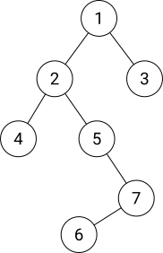

title: 点分治学习笔记
categories: OI
tags: 
  - 点分治
  - 学习笔记
  - 算法模板
  - 数据结构
permalink: node-devide-notes
date: 2016-06-17 16:36:00
---

点分治是用来解决树上路径问题的一种方法。

<!-- more -->

在解决树上路径问题时，我们可以选取一点为根，将树转化为有根树，然后考虑**经过根**的所有路径（有时将两条从根出发的路径连接为一条）。统计完这些路径的答案后，将根节点标记为删除，对剩下的若干棵树进行同样的操作。



如图，我们可以先考虑经过节点 $ 1 $ 的路径，之后将节点 $ 1 $ 标记为删除，此时可以认为考虑过的路径均已被删除。继续对其它子树做相同处理即可。

每次确认一个根节点后，共有 $ n $ 条需要考虑的路径（$ n $ 为当前子树大小）。上图中将 $ 1 $ 删除后，剩下左侧的子树较大，和原树大小相当，继续处理这棵子树时仍然需要与前一过程相当的时间。

最严重的情况，当整棵树是一条链时，每次需要考虑的路径数量是 $ O(n) $ 级别的，如果每条路径需要常数时间进行统计，则总时间复杂度为 $ O(n ^ 2) $。而对于形态随机的树，则远远小于这个级别。

如果我们选择 $ 5 $ 作为这棵树的根节点，情况会好很多 —— 删除 $ 5 $ 后剩余的最大一棵子树的大小比删除 $ 1 $ 时要小。这说明「科学地」选择点作为根节点可以有效的降低复杂度。

### 重心
我们定义一棵树的**重心**为以该点为根时**最大子树最小**的点。

> 性质：以重心为根，任意一棵子树的大小都不超过整棵树大小的一半。

证明：从树上任取一点，以它为根，如果最大的一棵子树大小不超过整棵树大小的一半，则它为重心。否则选择最大子树的根节点，继续这个过程，最终会得到一个点，它满足重心的性质，从这个点向任何方向走，最多有一个点同样满足重心的性质。  
注意不会出现来回走，两个点都不满足性质的情况。假设有，则删掉这两个点后，剩下的两棵树的大小都至少为 $ n \over 2 $，整棵树至少有 $ n + 2 $ 的点，不成立。

求重心可以用一次 DFS 完成 —— 任选一个点为根做 DFS，记录每个节点的大小 $ {\rm size}(i) = \sum\limits_{j \in {\rm child}(i)} {\rm size}(j) + 1 $，记录最大子节点子树的大小 $ {\rm max}(i) = \max\limits_{j \in {\rm child}(i)} \{ {\rm size}(j) \} $。因为要同时考虑某个点的祖先（以这个点为根时这些点为它的一棵子树），所以使 $ \max \{ \max(i),\ n - \max(i) \} $ 最小的 $ i $ 即为重心。

如果在点分治时每次使用重心为根，则最大的子树大小不会超过原树的二分之一，考虑到处理较小子树的代价原小于最大子树，若每个节点需要常数时间，根据主定理有

$$ T(n) = 2 T(\frac{n}{2}) + O(n) = O(n \log n) $$

如图，蓝色点为第一次选取的重心，删除蓝色点后，剩余几棵子树的重心为红色点，再向下一层的重心为黄色点，最后剩下一个白色点


### 模板
已处理过的根将被置为 `solved`，任何时候不要经过这些点，这保证了复杂度分析中的 $ n $ 是当前子树的大小，而不是整棵树的大小。

```c++
inline Node *center(Node *start) {
    std::stack<Node *> s;
    s.push(start);
    start->parent = NULL;
    start->visited = false;

    static Node *a[MAXN];
    int cnt = 0;
    while (!s.empty()) {
        Node *v = s.top();
        if (!v->visited) {
            v->visited = true;
            a[cnt++] = v;
            for (Edge *e = v->e; e; e = e->next) if (!e->t->solved && e->t != v->parent) {
                e->t->parent = v;
                e->t->visited = false;
                s.push(e->t);
            }
        } else {
            v->size = 1;
            v->max = 0;
            for (Edge *e = v->e; e; e = e->next) if (!e->t->solved && e->t->parent == v) {
                v->size += e->t->size;
                v->max = std::max(v->max, e->t->size);
            }
            s.pop();
        }
    }


    Node *res = NULL;
    for (int i = 0; i < cnt; i++) {
        a[i]->max = std::max(a[i]->max, cnt - a[i]->size);
        if (!res || res->max > a[i]->max) res = a[i];
    }

    return res;
}

inline int solve() {
    std::stack<Node *> s;
    s.push(&N[0]);

    int ans = 0;
    while (!s.empty()) {
        Node *v = s.top();
        s.pop();

        Node *root = center(v);
        root->solved = true;

        ans += calc(root);

        for (Edge *e = root->e; e; e = e->next) if (!e->t->solved) {
            s.push(e->t);
        }
    }

    return ans;
}
```
