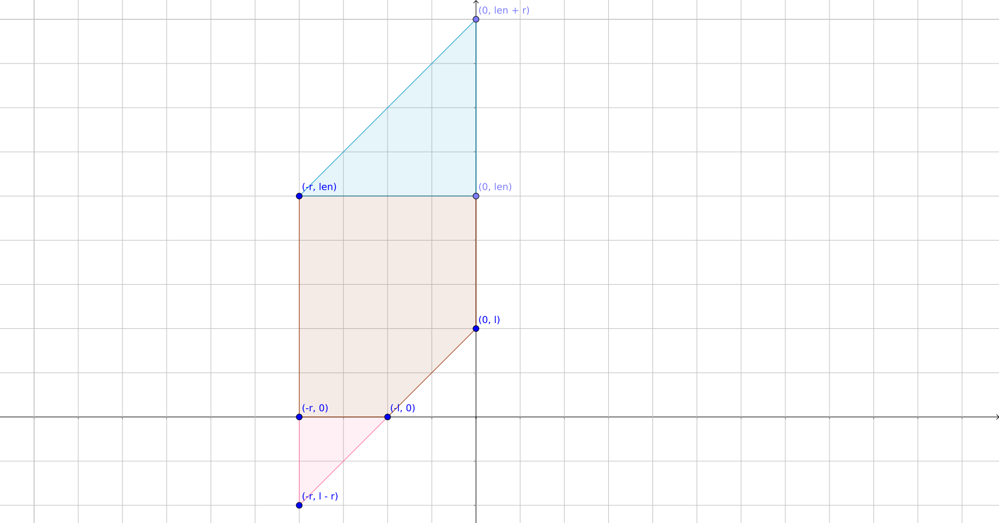
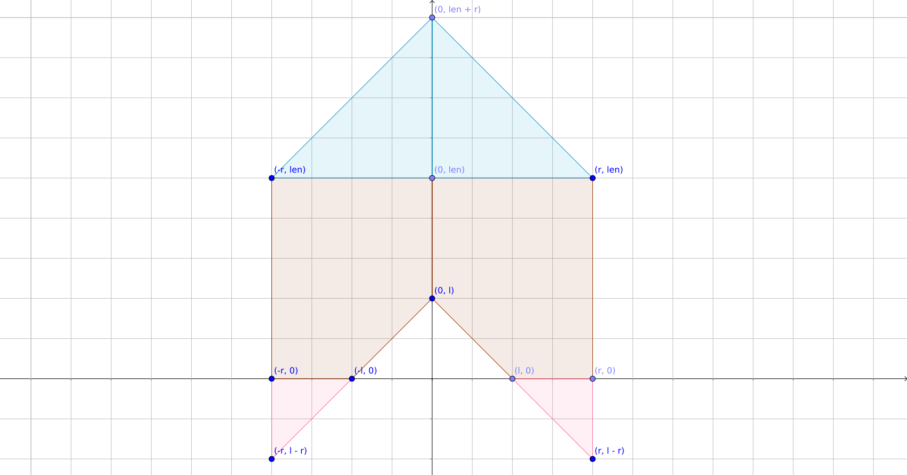
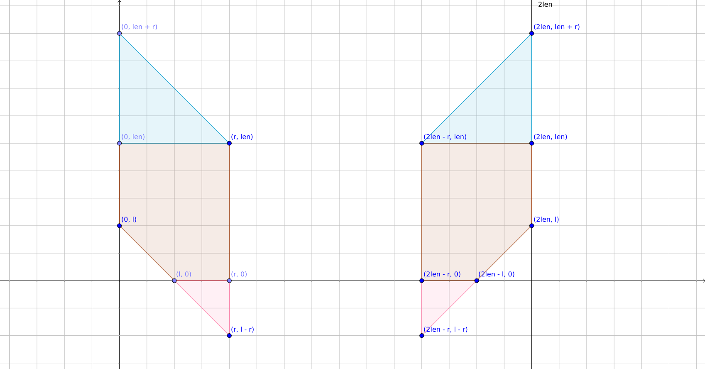
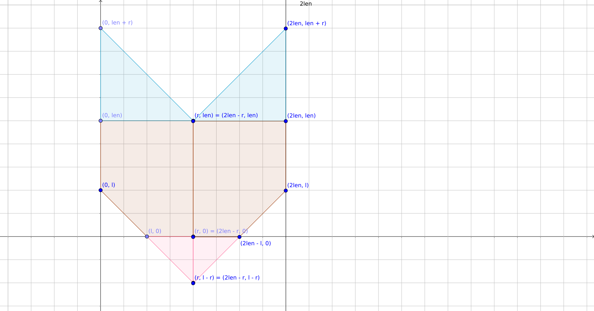
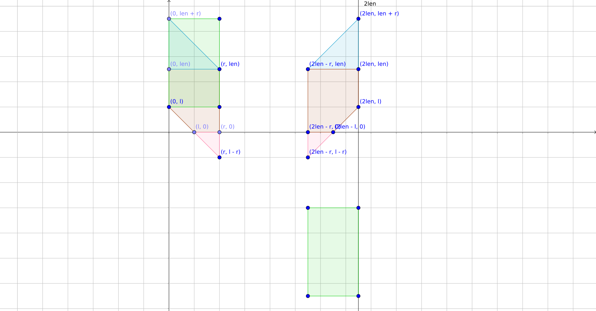
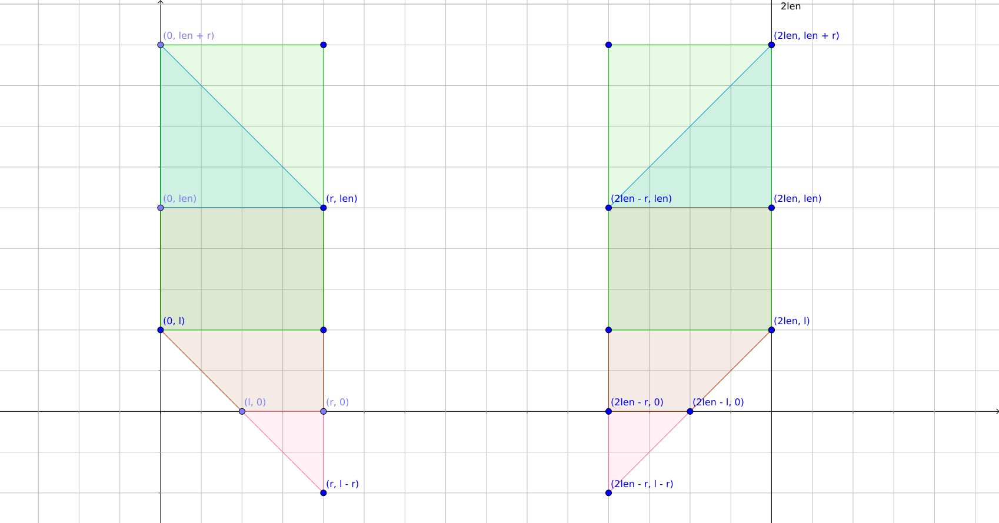

title: 「NOI2008」糖果雨 - 坐标变换 + 二维树状数组
categories: OI
tags: 
  - BZOJ
  - NOI
  - 坐标变换
  - 树状数组
  - 二维树状数组
permalink: noi2008-candy
date: 2016-12-23 18:00:00
---

在一个长度为 $ \mathrm{len} $ 的区间上，有以下操作：

1. 在 $ t $ 时刻，出现一条线段 $ [l, r] $，这条线段将要向左或向右移动；
2. 在 $ t $ 时刻查询与线段 $ [l, r] $ 有公共点的线段有多少；
3. 在 $ t $ 时刻某条线段消失。

每一时刻，每条线段都会移动，线段的左端点最小为 $ 0 $，当一条向左移动的线段**左端点**碰到 $ 0 $ 时，下一时刻它会改为向右移动；当一条向右移动的线段**左端点**碰到 $ \mathrm{len} $ 时，下一时刻它会改为向左移动。

<!-- more -->

### 链接
[BZOJ 1062](http://www.lydsy.com/JudgeOnline/problem.php?id=1062)

### 题解
首先，考虑将整个区间翻倍，变成 $ [0, 2\mathrm{len}] $。原本向右移动的线段，仍然在原来的位置上；原本移动到当线段左端点触碰右边界时改变移动方向，现在使这些线段继续向右移动，直到左端点触碰到 $ 2\mathrm{len} $，立即回到 $ 0 $ 位置。这样转化保证了以 $ 2\mathrm{len} $ 为周期的性质不变。


对于一条在 $ t $ 时刻出现的线段 $ [l, r] $，我们可以求出它到达 $ 0 $ 位置（在模 $ 2\mathrm{len} $ 的意义下）时的时刻，设它为 $ x $（$ x \in [0, 2\mathrm{len}) $）。如果线段向右移动，则 $ x \equiv t - l \pmod {2\mathrm{len}} $，否则 $ x \equiv t + l \pmod {2\mathrm{len}} $。设 $ y = r - l $，即线段长度。这样，所有线段均可化为 $ (x, y) $ 的形式。

考虑对每一次查询有贡献的点，在 $ t $ 时刻查询与 $ [l, r] $ 有公共点的线段数量，首先考虑当 $ t = 0 $ 时的简化问题，并且只考虑题意中在 $ 0 $ 时刻向右运动的线段（转化后左端点在 $ [0, \mathrm{len}] $ 内）：

* 如果一条线段在 $ 0 $ 时刻出现在 $ 0 $ 位置，那么它的长度至少需要至少 $ l $；
* 如果一条线段在 $ -1 $ 时刻出现在 $ 0 $ 位置，注意这里是模意义下的 $ -1 $ 时刻，实际上它可能是在整体时间的前一个周期的 $ 2 \mathrm{len} - 1 $ 时刻出现在 $ 0 $ 位置，这个周期的 $ 0 $ 时刻，它移动到 $ 1 $ 位置，所以只需要长度至少为 $ l - 1 $；
* 如果在 $ -2 $ 位置，以此类推，需要线段的长度至少为 $ l - 2 $。
* ……
* 如果在 $ -l $ 时刻出现，需要线段的长度至少为 $ 0 $；
* ……
* 如果在 $ -r $ 时刻出现，需要线段的长度至少为 $ 0 $；
* 如果在 $ -r - 1 $ 时刻出现，这个周期的 $ 0 $ 时刻，它移动到 $ r + 1 $ 位置，已经越过查询的区间，此时这条线段对答案没有贡献。

对答案有贡献的区域在平面上组成了一个五边形，它是由一个矩形去掉一个等腰三角形后得到的（图中的棕黄色部分）。在它的上边和下边分别补上一个三角形，得到一个如下的平行四边形：



继续考虑正时刻出现的线段，如果一条线段 $ A $ 在 $ 1 $ 时刻出现在 $ 0 $ 位置，并开始向右移动，那么考虑原题中对移动方向的描述，假设有另一条线段 $ B $ 在 $ 0 $ 时刻出现在 $ 0 $ 位置，那么最初向右移动时，$ A $ 总在 $ B $ 左边一个单位处（$ B $ 较早开始移动）。$ B $ 移动到右边界时，比 $ A $ 早一个单位时间开始变为向左移动，所以，在向左移动的过程中，$ A $ 总在 $ B $ 右边一个单位处。

线段 $ A $ 一定是在上一个周期或之前周期的 $ 1 $ 时刻出现的，在这个周期的 $ 0 $ 时刻，它移动了 $ 2\mathrm{len} - 1 $ 个单位，到达 $ 2\mathrm{len} - 1 $ 处，而这里恰好对应了原题中向左移动且左端点在 $ 1 $ 位置处。这时线段 $ A $ 的长度至少要 $ l - 1 $ 才能对答案有贡献。

以此类推：

* 如果一条线段在 $ 0 $ 时刻出现在 $ 2 $ 位置，那么它的长度至少需要 $ l - 2 $；
* ……
* 如果在 $ l $ 时刻出现，需要线段的长度为 $ 0 $；
* ……
* 如果在 $ r $ 时刻出现，需要线段的长度为 $ 0 $；
* 如果在 $ r + 1 $ 时刻出现，这个周期的 $ 0 $ 时刻，它移动到 $ r + 1 $ 位置，还没有到达查询的区间，此时这条线段对答案没有贡献。

对答案有贡献的区域在平面上组成了一个与之前的五边形对称的图形，使用类似的方法将其补为一个平行四边形：



现在考虑查询 $ t \neq 0 $ 的情况，显然在模意义下，$ t \in [0, 2\mathrm{len}) $。如果查询 $ 1 $ 时刻的某个区间，则相当于让所有线段多移动 $ 1 $ 个单位时间，然后查询 $ 0 $ 时刻的这个区间，即相当于所有线段的产生时间都早了一个单位时间，即把坐标系内所有点向左平移一个单位 —— 将查询的平行四边形向右平移一个单位即可。

在上图的坐标系中，横坐标表示线段出现在 $ 1 $ 位置的时刻，而时刻是关于 $ 2\mathrm{len} $ 取模的，所以我们可以把左边的平行四边形向右平移 $ 2\mathrm{len} $ 个单位，即：



**注意：**右边的平行四边形在 $ t \neq 0 $ 时，右边会有一部分不在 $ [0, 2\mathrm{len}) $ 内，但是在模的意义下，这一部分应该对应左边紧靠 $ 0 $ 的一部分，为了保证这一部分能计算出正确结果，我们把坐标系的 $ [0, 2\mathrm{len}) $ 复制到 $ [2\mathrm{len}, 4\mathrm{len}) $。

当查询的 $ r = \mathrm{len} $ 时，两个平行四边形在有一条公共边，如下图：



为了不重复统计，需要把右边的平行四边形的左边界 $ +1 $。

当查询的 $ l = r = 0 $ 时，两个平行四边形均退化成线段，并且重合，此时可以直接忽略掉右边的平行四边形。

现在问题转化为，在平面内，每次插入或删除一个点，查询两个平行四边形的并的点的数量。

平行四边形很难用数据结构来维护，所以考虑变换坐标，将平行四边形变成矩形 —— 因为两个平行四边形除与 $ y $ 轴平行的边以外，斜率均为 $ 1 $ 或 $ -1 $。所以将左边平行四边形的所有点纵座标加上横坐标，右边平行四边形上所有点的纵座标减去横坐标，得到两个矩形：



发现右边的矩形在第四象限内，为了使它的坐标全部为正，我们对其纵座标全部加上 $ 2\mathrm{len} $。



如果将原坐标系的内容复制一份接到右边，则需要加上 $ 4\mathrm{len} $ 才能使四个矩形的纵座标全部为正，此时整个坐标系的范围长宽均为 $ 4\mathrm{len} $。

因为两边的平行四边形坐标变换的方式不完全相同，所以需要两个坐标系，分别对所有插入的点做对应的坐标变换。

问题最终转化为，在平面内插入一个点，删除一个点，查询一个矩形范围内的点的数量 —— 使用二维树状数组解决即可。

时间复杂度为 $ O(n \log ^ 2 \mathrm{len}) $，空间复杂度为 $ O(\mathrm{len} ^ 2) $，空间大约带一个 $ 32 $ 倍的常数。

### 代码
无调试代码版：

```c++
#include <cstdio>
#include <cassert>
#include <cstring>

const int MAXLEN = 1000;
const int MAXC = 1000000;

struct BinaryIndexedTree {
	int a[MAXLEN * 4 + 10][MAXLEN * 4 + 10], n, m;

	static int lowbit(int x) {
		return x & -x;
	}

	void init(int n, int m) {
		this->n = n, this->m = m;
	}

	void update(int x, int y, int delta) {
		for (int i = x + 1; i <= n + 5; i += lowbit(i)) {
			for (int j = y + 1; j <= m + 5; j += lowbit(j)) {
				a[i - 1][j - 1] += delta;
			}
		}
	}

	int query(int x, int y) {
		int res = 0;
		for (int i = x + 1; i > 0; i -= lowbit(i)) {
			for (int j = y + 1; j > 0; j -= lowbit(j)) {
				res += a[i - 1][j - 1];
			}
		}
		return res;
	}

	int query(int x1, int y1, int x2, int y2) {
		int res = query(x2, y2) - query(x2, y1 - 1) - query(x1 - 1, y2) + query(x1 - 1, y1 - 1);
		return res;
	}
} bit1, bit2;

struct Cloud {
	int t, l, r, d;
} cloud[MAXC + 1];

int len;

inline void transform(int &x, int &y, int i) {
	if (i == 1) {
		y += x;
	} else {
		y += 4 * len - x;
	}
}

inline void add(int x, int y) {
	int newX, newY;

	newX = x, newY = y;
	transform(newX, newY, 1);
	bit1.update(newX, newY, 1);

	newX = x + len * 2, newY = y;
	transform(newX, newY, 1);
	bit1.update(newX, newY, 1);

	newX = x, newY = y;
	transform(newX, newY, 2);
	bit2.update(newX, newY, 1);

	newX = x + len * 2, newY = y;
	transform(newX, newY, 2);
	bit2.update(newX, newY, 1);
}

inline void add(int t, int c, int l, int r, int d) {
	int y = r - l;
	if (d == 1) {
		t -= l;
	} else {
		t += l;
	}
	t = (t % (len * 2) + (len * 2)) % (len * 2);

	cloud[c].t = t, cloud[c].l = l, cloud[c].r = r, cloud[c].d = d;

	add(t, y);
}

inline void del(int x, int y) {
	int newX, newY;

	newX = x, newY = y;
	transform(newX, newY, 1);
	bit1.update(newX, newY, -1);

	newX = x + len * 2, newY = y;
	transform(newX, newY, 1);
	bit1.update(newX, newY, -1);

	newX = x, newY = y;
	transform(newX, newY, 2);
	bit2.update(newX, newY, -1);

	newX = x + len * 2, newY = y;
	transform(newX, newY, 2);
	bit2.update(newX, newY, -1);
}

inline void del(int c) {
	del(cloud[c].t, cloud[c].r - cloud[c].l);
}

inline int query(int t, int l, int r) {
	t %= (len * 2);
	int ans = 0;

	int x1, x2, y1, y2;
	x1 = t, y1 = l, x2 = t + r, y2 = len;
	transform(x1, y1, 1), transform(x2, y2, 1);
	ans += bit1.query(x1, y1, x2, y2);

	if (r != 0) {
		x1 = 2 * len - r + t, y1 = l - r, x2 = 2 * len + t - 1, y2 = len + r;
		transform(x1, y1, 2), transform(x2, y2, 2);
		if (r == len) x1++;
		ans += bit2.query(x1, y1, x2, y2);
	}
	return ans;
}

int main() {
	int n;
	scanf("%d %d", &n, &len);
	bit1.init(len * 4 + 1, len * 4 + 1);
	bit2.init(len * 4 + 1, len * 4 + 1);
	while (n--) {
		int cmd;
		scanf("%d", &cmd);
		if (cmd == 1) {
			int t, c, l, r, d;
			scanf("%d %d %d %d %d", &t, &c, &l, &r, &d);
			add(t, c, l, r, d);
		} else if (cmd == 2) {
			int t, l, r;
			scanf("%d %d %d", &t, &l, &r);
			printf("%d\n", query(t, l, r));
		} else {
			int t, c;
			scanf("%d %d", &t, &c);
			del(c);
		}
	}

	return 0;
}
```

带调试代码版：

```c++
#include <cstdio>
#include <cassert>
#include <cstring>

const int MAXLEN = 1000;
const int MAXC = 1000000;

#ifndef FORCE
struct BinaryIndexedTree;
BinaryIndexedTree *_bit1, *_bit2;
struct BinaryIndexedTree {
	int a[MAXLEN * 4 + 10][MAXLEN * 4 + 10], n, m;

	static int lowbit(int x) {
		return x & -x;
	}

	void init(int n, int m) {
#ifdef DBG_BIT
		printf("init(%d, %d)\n", n, m);
#endif
		this->n = n, this->m = m;
	}

	void update(int x, int y, int delta) {
#ifdef DBG_BIT
		printf("update(%d, %d, %d, %d)\n", this == ::_bit1 ? 1 : 2, x, y, delta);
#endif
		assert(x >= 0);
		assert(y >= 0);
#ifdef FORCE_BIT
		a[x][y] += delta;
#else
		for (int i = x + 1; i <= n + 5; i += lowbit(i)) {
			for (int j = y + 1; j <= m + 5; j += lowbit(j)) {
				a[i - 1][j - 1] += delta;
			}
		}
#endif
	}

	int query(int x, int y) {
		int res = 0;
#ifdef FORCE_BIT
		for (int i = x; i >= 0; i--) {
			for (int j = y; j >= 0; j--) {
				res += a[i][j];
			}
		}
#else
		for (int i = x + 1; i > 0; i -= lowbit(i)) {
			for (int j = y + 1; j > 0; j -= lowbit(j)) {
				res += a[i - 1][j - 1];
			}
		}
#endif
		return res;
	}

	int query(int x1, int y1, int x2, int y2) {
#ifdef FORCE_BIT
		int res = 0;
		for (int i = x1; i <= x2; i++) {
			for (int j = y1; j <= y2; j++) {
				res += a[i][j];
			}
		}
#else
		int res = query(x2, y2) - query(x2, y1 - 1) - query(x1 - 1, y2) + query(x1 - 1, y1 - 1);
#endif
#ifdef DBG_BIT
		printf("query(%d, %d, %d, %d, %d) = %d\n", this == ::_bit1 ? 1 : 2, x1, y1, x2, y2, res);
#endif
		return res;
	}
} bit1, bit2;
#endif

struct Cloud {
	int t, l, r, d;
} cloud[MAXC + 1];

int len;
#ifdef FORCE
int a[MAXLEN * 4 + 5][MAXLEN * 2 + 5];
#endif

inline void transform(int &x, int &y, int i) {
#ifdef DBG
	printf("transform(%d, %d, %d) = ", x, y, i);
#endif
	if (i == 1) {
		y += x;
	} else {
		y += 4 * len - x;
	}
#ifdef DBG
	printf("(%d, %d)\n", x, y);
#endif
}

inline void add(int x, int y) {
	// printf("add(%d, %d)\n", x, y);
#ifdef FORCE
	a[x][y]++;
	// a[x + len * 2][y]++;
#else
#ifdef DBG
	printf("add(%d, %d)\n", x, y);
#endif
	int newX, newY;

	newX = x, newY = y;
	transform(newX, newY, 1);
	bit1.update(newX, newY, 1);

	newX = x + len * 2, newY = y;
	transform(newX, newY, 1);
	bit1.update(newX, newY, 1);

	newX = x, newY = y;
	transform(newX, newY, 2);
	bit2.update(newX, newY, 1);

	newX = x + len * 2, newY = y;
	transform(newX, newY, 2);
	bit2.update(newX, newY, 1);
	/*
	bit1.update(x, y + x, 1);
	bit2.update(x, y + (len * 2 - x), 1);

	bit1.update(x + len * 2, y + x, 1);
	bit2.update(x + len * 2, y + (len * 2 - x), 1);
	*/
#endif
}

inline void add(int t, int c, int l, int r, int d) {
	int y = r - l;
	if (d == 1) {
		t -= l;
	} else {
		t += l;
	}
	t = (t % (len * 2) + (len * 2)) % (len * 2);

	cloud[c].t = t, cloud[c].l = l, cloud[c].r = r, cloud[c].d = d;

	add(t, y);
}

inline void del(int x, int y) {
#ifdef FORCE
	a[x][y]--;
	// a[x + len * 2][y]--;
#else
	int newX, newY;

	newX = x, newY = y;
	transform(newX, newY, 1);
	bit1.update(newX, newY, -1);

	newX = x + len * 2, newY = y;
	transform(newX, newY, 1);
	bit1.update(newX, newY, -1);

	newX = x, newY = y;
	transform(newX, newY, 2);
	bit2.update(newX, newY, -1);

	newX = x + len * 2, newY = y;
	transform(newX, newY, 2);
	bit2.update(newX, newY, -1);
#endif
}

inline void del(int c) {
	del(cloud[c].t, cloud[c].r - cloud[c].l);
}

inline int query(int t, int l, int r) {
	t %= (len * 2);
#ifdef FORCE
	// printf("query(%d, %d, %d)\n", t, l, r);
	static bool added[MAXLEN * 2 + 5][MAXLEN + 5];
	memset(added, 0, sizeof(added));
	int ans = 0;
	for (int i = 0, start = l; i <= r; i++, start--) {
		for (int j = start; j <= start + (len + r - l); j++) {
			if (j >= 0) {
				// printf("[%d, %d]\n", (i + t) % (len * 2), j);
				int tmp = (i + t) % (len * 2);
				if (a[tmp][j] && !added[tmp][j]) {
					ans++;
					added[tmp][j] = true;
					// printf("query(%d, %d, %d) [%d, %d]\n", t, l, r, (i + t) % (len * 2), j);
				}
			}
		}
	}
	for (int i = len * 2, start = l; i >= len * 2 - r; i--, start--) {
		for (int j = start; j <= start + (len + r - l); j++) {
			if (j >= 0) {
				// printf("[%d, %d]\n", (i + t) % (len * 2), j);
				int tmp = (i + t) % (len * 2);
				if (a[tmp][j] && !added[tmp][j]) {
					ans++;
					added[tmp][j] = true;
					// printf("query(%d, %d, %d) [%d, %d]\n", t, l, r, (i + t) % (len * 2), j);
				}
			}
		}
	}
	return ans;
#else
#ifdef DBG
	printf("query([%d, %d], [%d, %d], [%d, %d], [%d, %d])\n", 0 + t,
															  len + r, //
															  0 + t,
															  l,       //
															  r + t,
															  len,     //
															  r + t,
															  l - r);  //
	printf("query([%d, %d], [%d, %d], [%d, %d], [%d, %d])\n", 2 * len - r + t,
															  len,     //
															  2 * len - r + t,
															  l - r,   //
															  2 * len + t,
															  l,       //
															  2 * len + t,
															  len + r);//
#endif

	int ans = 0;

	int x1, x2, y1, y2;
	x1 = t, y1 = l, x2 = t + r, y2 = len;
	transform(x1, y1, 1), transform(x2, y2, 1);
	ans += bit1.query(x1, y1, x2, y2);

	if (r != 0) {
		x1 = 2 * len - r + t, y1 = l - r, x2 = 2 * len + t - 1, y2 = len + r;
		transform(x1, y1, 2), transform(x2, y2, 2);
		if (r == len) x1++;
		ans += bit2.query(x1, y1, x2, y2);
	}
	return ans;
#endif
}

int main() {
	int n;
	scanf("%d %d", &n, &len);
#ifndef FORCE_BIT
	bit1.init(len * 4 + 1, len * 4 + 1);
	bit2.init(len * 4 + 1, len * 4 + 1);
	_bit1 = &bit1, _bit2 = &bit2;
#endif
	while (n--) {
		int cmd;
		scanf("%d", &cmd);
		if (cmd == 1) {
			int t, c, l, r, d;
			scanf("%d %d %d %d %d", &t, &c, &l, &r, &d);
			add(t, c, l, r, d);
		} else if (cmd == 2) {
			int t, l, r;
			scanf("%d %d %d", &t, &l, &r);
			printf("%d\n", query(t, l, r));
		} else {
			int t, c;
			scanf("%d %d", &t, &c);
			del(c);
		}
	}

	return 0;
}
```