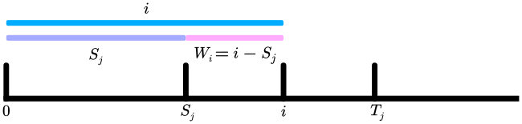
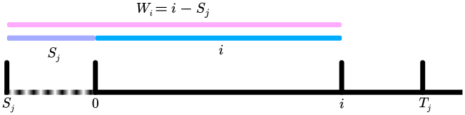
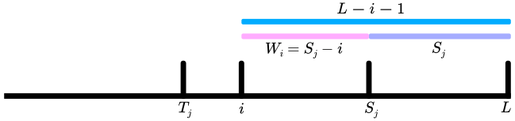

title: 「NOIP2016」天天爱跑步 - 树链剖分 + 前缀和
categories: OI
tags: 
  - NOIP
  - 前缀和
  - 树链剖分
permalink: noip2016-running
date: 2016-11-29 15:10:00
---

小 C 同学认为跑步非常有趣，于是决定制作一款叫做《天天爱跑步》的游戏。《天天爱跑步》是一个养成类游戏，需要玩家每天按时上线，完成打卡任务。

这个游戏的地图可以看作一棵包含 $ n $ 个结点和 $ n - 1 $ 条边的树，每条边连接两个结点，且任意两个结点存在一条路径互相可达。树上结点编号为从 $ 1 $ 到 $ n $ 的连续正整数。

现在有 $ m $ 个玩家，第 $ i $ 个玩家的起点为 $ S_i $，终点为 $ T_i $。每天打卡任务开始时，所有玩家在第 $ 0 $  秒同时从自己的起点出发，以每秒跑一条边的速度，不间断地沿着最短路径向着自己的终点跑去，跑到终点后该玩家就算完成了打卡任务。（由于地图是一棵树，所以每个人的路径是唯一的）

小 C 想知道游戏的活跃度，所以在每个结点上都放置了一个观察员。在结点 $ j $ 的观察员会选择在第 $ W_j $ 秒观察玩家，一个玩家能被这个观察员观察到当且仅当该玩家在第 $ W_j $ 秒也理到达了结点 $ j $。小 C 想知道每个观察员会观察到多少人？

注意：我们认为一个玩家到达自己的终点后该玩家就会结束游戏，他不能等待一段时间后再被观察员观察到。即对于把结点 $ j $ 作为终点的玩家：若他在第 $ W_j $ 秒前到达终点，则在结点 $ j $ 的观察员不能观察到该玩家；若他正好在第 $ W_j $ 秒到达终点，则在结点 $ j $ 的观察员可以观察到这个玩家。

<!-- more -->

### 链接
[Luogu 1600](https://www.luogu.org/problem/show?pid=1600)  
[LYOI #100](https://ly.men.ci/problem/100)

### 题解
考虑链的情况，在一个长度为 $ L $ 的链 $ [0, L) $ 上，有一个玩家从 $ S_j $ 走到 $ T_j $（$ S_j < T_j $），则第 $ i $ 个点能观测到该玩家的条件是 $ W_i = i - S_j $。



特别地，当 $ S_j < 0 $ 时，这个结论仍然成立。



对于 $ S_j > T_j $ 的情况，结论变为 $ W_i = S_j - i $。



同理，$ S_j > L $ 时结论仍然成立，图略。

将上面的结论式子移项，当 $ S_j < T_j $ 时，$ S_j = i - W_i $，对于一个确定的 $ i $，式子右边是一个常数。 设 $ X_i = i - W_i $，问题转化为：

1. 每次在 $ [S_j, T_j] $ 的每个位置加入一个数；
2. 询问对于每个 $ i $，其位置上共有多少数等于 $ X_i $。

同理，当 $ S_j > T_j $ 时，$ S_j = W_i + i $，设 $ X_i = i + W_i $ 即可。

这个问题可以通过差分前缀和来解决，在 $ S_j $ 加入一个添加标记，在 $ T_j $ 加入一个删除标记。维护一个数组表示当前每个数的出现次数，按顺序枚举 $ j $，对于每个 $ j $，将这个位置上所有添加标记添加的数的计数加一，统计答案后将这个位置上所有删除标记删除的数的计数减一。

序列上的情况可以在 $ O(n) $ 时间内解决，对于树上的情况，对树进行树链剖分，每个玩家的路线可以被分到最多 $ O(\log n) $ 条重链上，将每条重链看作一个上述序列，以链上深度最小的点为 $ 0 $。从最近公共祖先处将路径分成两半，一半相当于序列上 $ S_j < T_j $ 的情况，另一半相当于序列上 $ S_j > T_j $ 的情况。

### 代码
```c++
#include <cstdio>
#include <algorithm>
#include <queue>
#include <stack>

const int MAXN = 299998;

struct Tag {
#ifdef FORCE
	int s, t, x;

	Tag(int s, int t, int x) : s(s), t(t), x(x) {
#ifdef DBG
		printf("Tag(%d, %d, %d)\n", s, t, x);
#endif
	}
#else
	int x;
	bool remove;

	Tag(int x, bool remove) : x(x), remove(remove) {}
#endif
};

struct Node {
	struct Edge *e;
	Node *parent, *child;
	int depth, size, w, index, x, ans;
	bool visited;
	struct Chain *chain;
#ifndef FORCE
	std::vector<Tag> tagsForward, tagsBackward;
#endif
} N[MAXN + 1];

struct Edge {
	Node *s, *t;
	Edge *next;

	Edge(Node *s, Node *t) : s(s), t(t), next(s->e) {}
};

struct Chain {
	Node *top, *bottom;
	std::vector<Node *> nodes;
#ifdef FORCE
	std::vector<Tag> tagsForward, tagsBackward;
#endif
	int len;
} chains[MAXN + 1];

inline void addEdge(int s, int t) {
	N[s].e = new Edge(&N[s], &N[t]);
	N[t].e = new Edge(&N[t], &N[s]);
}

int n, chainCnt;

inline void split() {
	std::stack<Node *> s;
	N[1].depth = 1;
	s.push(&N[1]);

	while (!s.empty()) {
		Node *v = s.top();
		if (!v->visited) {
			v->visited = true;
			for (Edge *e = v->e; e; e = e->next) {
				if (!e->t->depth) {
					e->t->depth = v->depth + 1;
					e->t->parent = v;
					s.push(e->t);
				}
			}
		} else {
			v->size = 1;
			for (Edge *e = v->e; e; e = e->next) {
				v->size += e->t->size;
				if (!v->child || v->child->size < e->t->size) v->child = e->t;
			}
			s.pop();
		}
	}

	for (int i = 1; i <= n; i++) N[i].visited = false;

	N[1].depth = 1;
	s.push(&N[1]);
	while (!s.empty()) {
		Node *v = s.top();
		if (!v->visited) {
			v->visited = true;

			if (!v->parent || v != v->parent->child) {
				v->chain = &chains[++chainCnt];
				v->chain->top = v;
				v->index = 0;
			} else {
				v->chain = v->parent->chain;
				v->index = v->parent->index + 1;
			}
			v->chain->nodes.push_back(v);
			v->chain->bottom = v;

			for (Edge *e = v->e; e; e = e->next) {
				if (e->t->parent == v) {
					s.push(e->t);
				}
			}
		} else {
			s.pop();
		}
	}

	for (int i = 1; i <= chainCnt; i++) chains[i].len = chains[i].nodes.size();

#ifdef DBG
	for (int i = 1; i <= chainCnt; i++) {
		printf("chains[%d]: top = %lu, bottom = %lu, nodes = [", i, chains[i].top - N, chains[i].bottom - N);
		for (int j = 0; j < chains[i].len; j++) {
			printf("%lu%s", chains[i].nodes[j] - N, j == chains[i].len - 1 ? "]\n" : ", ");
		}
	}
#endif
}

inline Node *lca(Node *u, Node *v) {
	while (u->chain != v->chain) {
		if (u->chain->top->depth < v->chain->top->depth) std::swap(u, v);
		u = u->chain->top->parent;
	}
	if (u->depth > v->depth) return v;
	else return u;
}

inline int dist(Node *u, Node *v, Node *p) {
	return u->depth + v->depth - p->depth * 2;
}

inline void addTag(bool forward, Chain *chain, int s, int t, int x) {
#ifdef FORCE
	if (forward) {
		chain->tagsForward.push_back(Tag(s, t, x));
	} else {
		chain->tagsBackward.push_back(Tag(s, t, x));
	}
#else
	if (forward) {
		if (s > t) return;
		chain->nodes[s]->tagsForward.push_back(Tag(x, false));
		chain->nodes[t]->tagsForward.push_back(Tag(x, true));
	} else {
		if (t > s) return;
		chain->nodes[s]->tagsBackward.push_back(Tag(x, false));
		chain->nodes[t]->tagsBackward.push_back(Tag(x, true));
	}
#ifdef DBG
	printf("addTag(forward = %d, chain = %lu, s = %d, t = %d, x = %d)\n", forward, chain - chains, s, t, x);
#endif
#endif
}

inline void play(Node *s, Node *t) {
	if (s == t) {
		if (s->w == 0) s->ans++;
		return;
	}

	Node *p = lca(s, t), *u = s, *v = t;
	if (dist(s, p, p) == p->w) p->ans++;
#ifdef DBG
	printf("play(s = %lu, t = %lu, p = %lu)\n", s - N, t - N, p - N);
#endif

	if (p != s) {
#ifdef DBG
		puts("[backward]");
#endif
		// S -> P, backward on chain
		while (u->chain != p->chain) {
#ifdef DBG
			printf("chains[%lu]: ", u->chain - chains);
#endif
			addTag(false, u->chain, u->index, 0, s->depth - u->chain->bottom->depth);
			u = u->chain->top->parent;
		}
#ifdef DBG
		printf("chains[%lu]: ", u->chain - chains);
#endif
		addTag(false, u->chain, u->index, p->index + 1, s->depth - u->chain->bottom->depth);
	}

	if (p != t) {
#ifdef DBG
		puts("[forward]");
#endif
		// P -> T, forward on chain
		while (v->chain != p->chain) {
#ifdef DBG
			printf("chains[%lu]: ", v->chain - chains);
#endif
			addTag(true, v->chain, 0, v->index, (s->depth - p->depth) + (v->chain->top->depth - p->depth));
			v = v->chain->top->parent;
		}
#ifdef DBG
		printf("chains[%lu]: ", v->chain - chains);
#endif
		addTag(true, v->chain, p->index + 1, v->index, (s->depth - p->depth) + (v->chain->top->depth - p->depth));
	}
}

inline void solve() {
#ifdef FORCE
	for (int i = 1; i <= chainCnt; i++) {
		Chain &chain = chains[i];
#ifdef DBG
		printf("solve(): chains[%d]\n", i);
#endif

#ifdef DBG
		puts("[forward]");
#endif
		for (std::vector<Tag>::const_iterator it = chain.tagsForward.begin(); it != chain.tagsForward.end(); it++) {
			for (int j = it->s; j <= it->t; j++) {
				if (chain.nodes[j]->w - j == it->x) {
#ifdef DBG
					printf("ans(%lu)++\n", chain.nodes[j] - N);
#endif
					chain.nodes[j]->ans++;
				}
			}
		}

#ifdef DBG
		puts("[backward]");
#endif
		for (std::vector<Tag>::const_iterator it = chain.tagsBackward.begin(); it != chain.tagsBackward.end(); it++) {
			for (int j = it->s; j >= it->t; j--) {
				if (chain.nodes[j]->w - chain.len + j + 1 == it->x) {
#ifdef DBG
					printf("ans(%lu)++\n", chain.nodes[j] - N);
#endif
					chain.nodes[j]->ans++;
				}
			}
		}
	}
#else
	for (int i = 1; i <= chainCnt; i++) {
		Chain &chain = chains[i];
#ifdef DBG
		printf("solve(): chains[%d]\n", i);
#endif

		static int _cnt[MAXN * 2 + 1], *cnt = _cnt + MAXN;
		
		// forward
		for (int j = 0; j < chain.len; j++) {
			for (std::vector<Tag>::const_iterator it = chain.nodes[j]->tagsForward.begin(); it != chain.nodes[j]->tagsForward.end(); it++) {
				if (!it->remove) cnt[it->x]++;
			}

			chain.nodes[j]->ans += cnt[chain.nodes[j]->w - j];
#ifdef DBG
			printf("ans(%lu, i = %d, j = %d) += %d, x = %d\n", chain.nodes[j] - N, i, j, cnt[chain.nodes[j]->w - j], chain.nodes[j]->w - j);
#endif

			for (std::vector<Tag>::const_iterator it = chain.nodes[j]->tagsForward.begin(); it != chain.nodes[j]->tagsForward.end(); it++) {
				if (it->remove) cnt[it->x]--;
			}
		}

		// backward
		for (int j = chain.len - 1; j >= 0; j--) {
			for (std::vector<Tag>::const_iterator it = chain.nodes[j]->tagsBackward.begin(); it != chain.nodes[j]->tagsBackward.end(); it++) {
				if (!it->remove) cnt[it->x]++;
			}

			chain.nodes[j]->ans += cnt[chain.nodes[j]->w - chain.len + j + 1];
#ifdef DBG
			printf("ans(%lu, i = %d, j = %d) += %d, x = %d\n", chain.nodes[j] - N, i, j, cnt[chain.nodes[j]->w - chain.len + j + 1], chain.nodes[j]->w - chain.len + j + 1);
#endif

			for (std::vector<Tag>::const_iterator it = chain.nodes[j]->tagsBackward.begin(); it != chain.nodes[j]->tagsBackward.end(); it++) {
				if (it->remove) cnt[it->x]--;
			}
		}
	}
#endif
}

int main() {
	freopen("running.in", "r", stdin);
	freopen("running.out", "w", stdout);

	int m;
	scanf("%d %d", &n, &m);
	for (int i = 1; i <= n - 1; i++) {
		int u, v;
		scanf("%d %d", &u, &v);
		addEdge(u, v);
	}

	for (int i = 1; i <= n; i++) {
		scanf("%d", &N[i].w);
	}

	split();

	while (m--) {
		int s, t;
		scanf("%d %d", &s, &t);
		play(&N[s], &N[t]);
	}

	solve();

	for (int i = 1; i <= n; i++) printf("%d%c", N[i].ans, i == n ? '\n' : ' ');

	fclose(stdin);
	fclose(stdout);

	return 0;
}
```
