title: OS X 日常必备软件
categories: Geek
tags:
  - OS X
  - 软件
permalink: osx-softwares
date: 2016-03-13 23:00:14
---

这些「必备软件」是我日常必备的，不一定适合每一个人，需要者自取。有一部分是跨平台的，在 GNU/Linux 或 Windows 下也可用。

<!-- more -->

## 系统类
### Karabiner
Website：[https://pqrs.org/osx/karabiner/](https://pqrs.org/osx/karabiner/)  
Github：[https://github.com/tekezo/Karabiner](https://github.com/tekezo/Karabiner)  
Homebrew：`brew cask install karabiner`  
License：Public Domain  
Platform：OS X

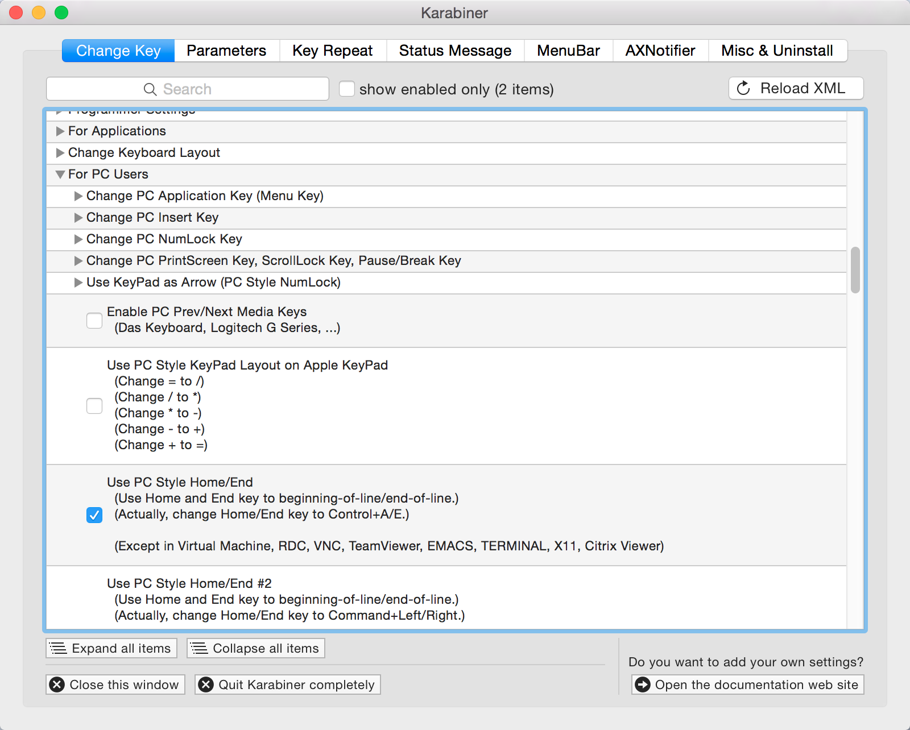

一个用来增强键盘的小工具，对黑苹果很有用，可以把键盘左上角的那个键「§」「±」映射为「`」「~」，还可以把 Home、End 键映射为到行首、行尾，满足之前在 Linux 上的使用习惯。

### Virtualbox
Website：[https://www.virtualbox.org/](https://www.virtualbox.org/)  
Homebrew：`brew cask install virtualbox`  
License：GNU GPL v2  
Platform：OS X、GNU/Linux、Windows

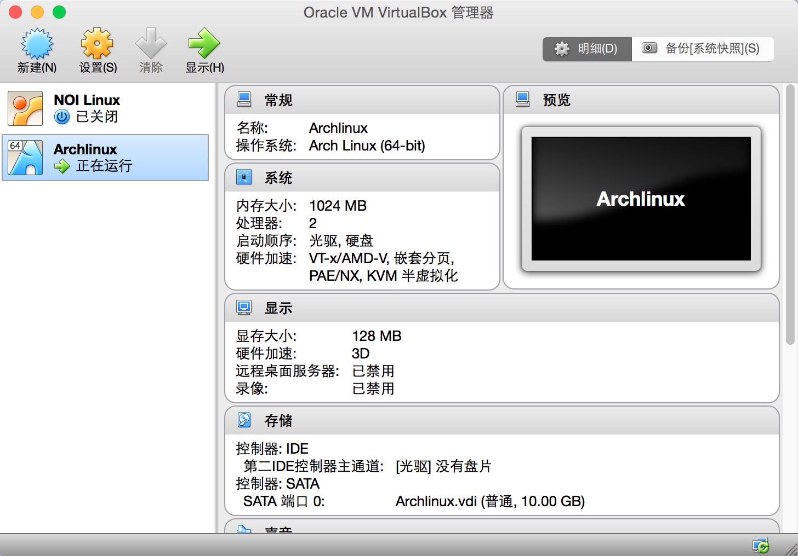

一款跨平台虚拟机软件，体积比较小，平常用这个开着 Archlinux，需要的时候 SSH 连进去。感觉比 Parallels Desktop 好用一些，上手起来也比较容易吧。

## 工具类
### Flashlight
Website：[http://flashlight.nateparrott.com/](http://flashlight.nateparrott.com/)  
Github：[https://github.com/nate-parrott/Flashlight](https://github.com/nate-parrott/Flashlight)  
Homebrew：`brew cask install flashlight`  
License：MIT && GNU GPL v2  
Platform：OS X

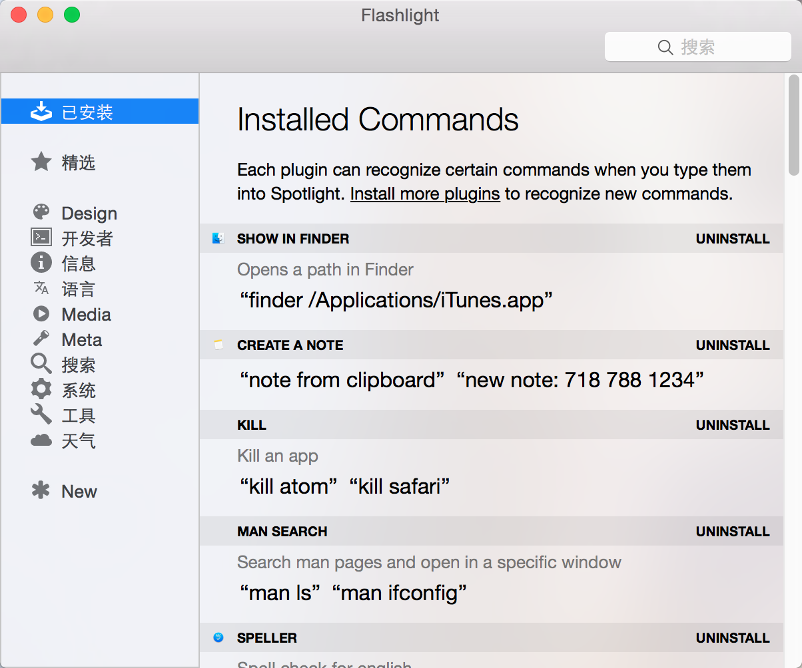

Spotlight 的增强工具，有很多便捷的命令可以安装，在 OS X Yosemite 10.10.5 下需要手动配置 SIMBL 注入，比较麻烦，好像到了 El Captian 就用不了了 ……

### ShadowSocksX
Github：[https://github.com/shadowsocks/shadowsocks-iOS](https://github.com/shadowsocks/shadowsocks-iOS)  
Homebrew：`brew cask install shadowsocksx`  
License：GNU GPL v3  
Platform：OS X

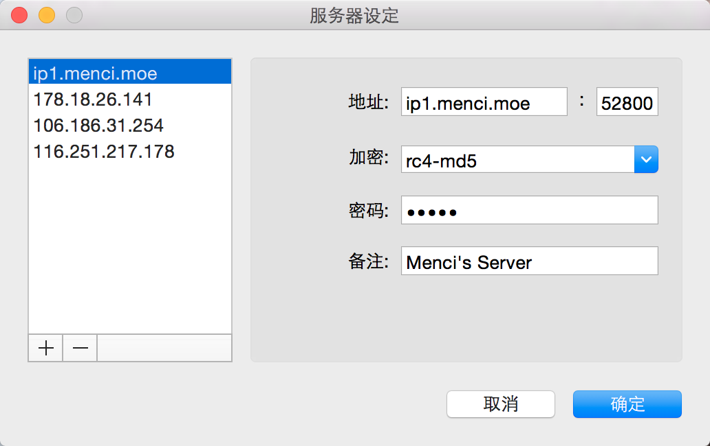

OS X 的图形界面 ShadowSocks 客户端，可以方便的配置、切换服务器。

### File Roller
Website：[http://fileroller.xx51.net/fileroller/index_zh_CN.html](http://fileroller.xx51.net/fileroller/index_zh_CN.html)  
Github：[https://github.com/wkt/file-roller-osx](https://github.com/wkt/file-roller-osx)  
License：GNU GPL v2  
Platform：OS X、GNU/Linux

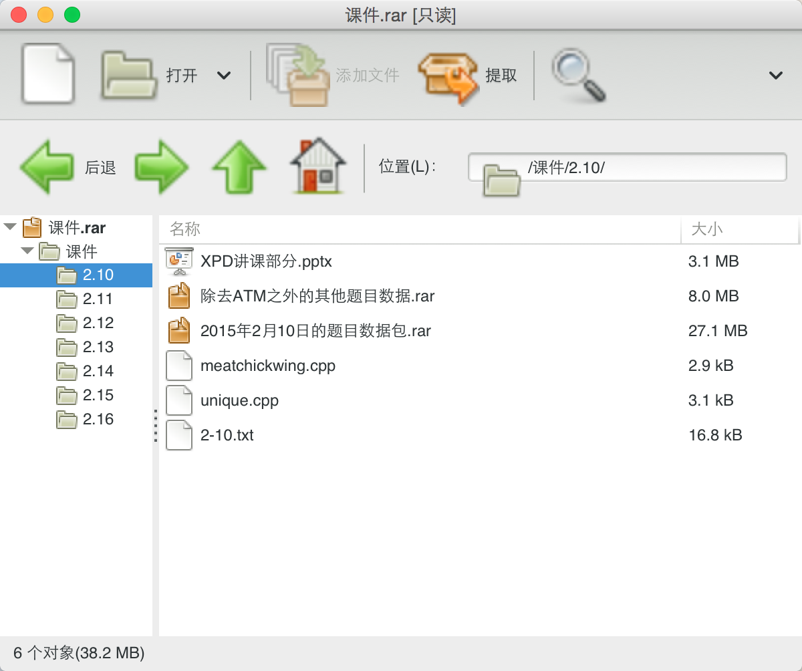

Linux 下 GNOME 的归档管理器，被人强行移植到 OS X 上来 …… 无奈 OS X 连个归档管理器都不自带 …… 原来是不资磁 Retina 的，强行开了 Retina 图标就这样了 …… 嗯，能用就行对吧，拖拽什么的还是资磁的。

### Go2Shell
Website：[http://zipzapmac.com/Go2Shell](http://zipzapmac.com/Go2Shell)  
Homebrew：`brew cask install go2shell`  
License：Free  
Platform：OS X

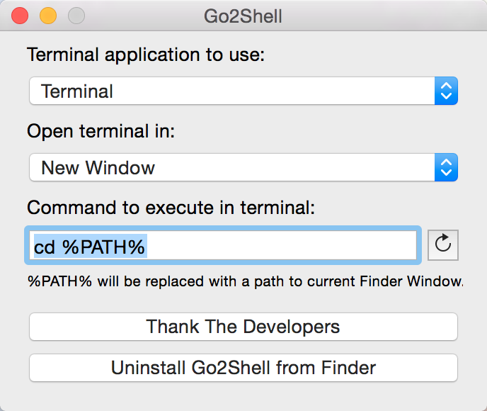

一个按钮在 Finder 中打开命令行，而且图标 >_< 很萌！

### TeamViewer
Website：[http://www.teamviewer.com/](http://www.teamviewer.com/)  
Homebrew：`brew cask install teamviewer`  
License：Free  
Platform：OS X、GNU/Linux、Windows

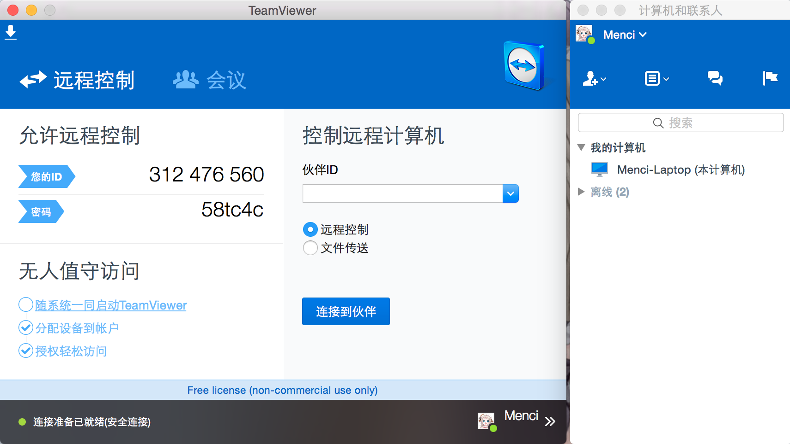

最好用的远程控制软件没有之一。

## 常用类
### MacVim
Website：[https://macvim-dev.github.io/macvim/](https://macvim-dev.github.io/macvim/)  
Github：[https://github.com/macvim-dev/macvim](https://github.com/macvim-dev/macvim)  
Homebrew：`brew cask install macvim`  
License：Vim License  
Platform：OS X

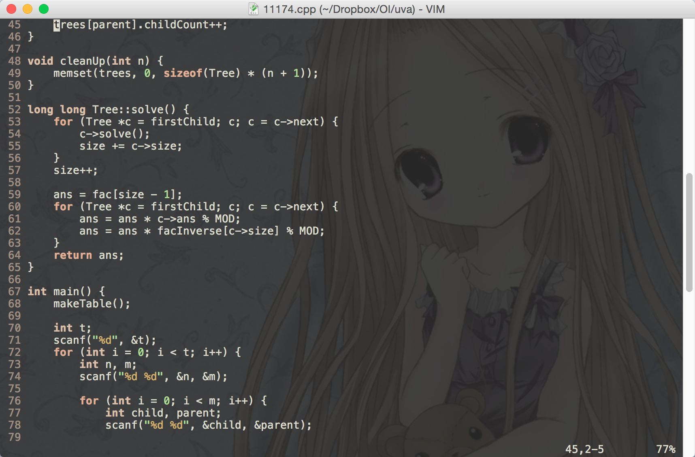

OS X 下的 Vim 图形界面，相对 GVim 的好处是背景可以透明、支持多标签页。

### MacDown
Website：[http://macdown.uranusjr.com/](http://macdown.uranusjr.com/)  
Github：[https://github.com/uranusjr/macdown](https://github.com/uranusjr/macdown)  
Homebrew：`brew cask install macdown`  
License：MIT  
Platform：OS X

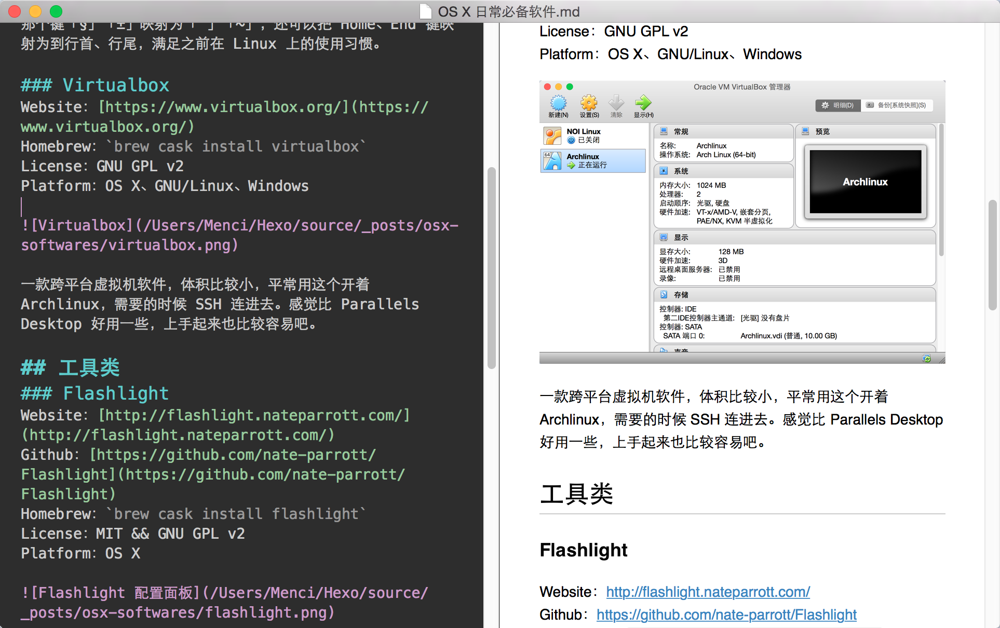

一款 Markdown 编辑器，比那些在线的 Web App 好用，界面比较萌、比较简洁，兼容性也不错。

### FeelUOwn
Github：[https://github.com/cosven/FeelUOwn](https://github.com/cosven/FeelUOwn)  
License：GNU GPL v3  
Platform：OS X、GNU/Linux

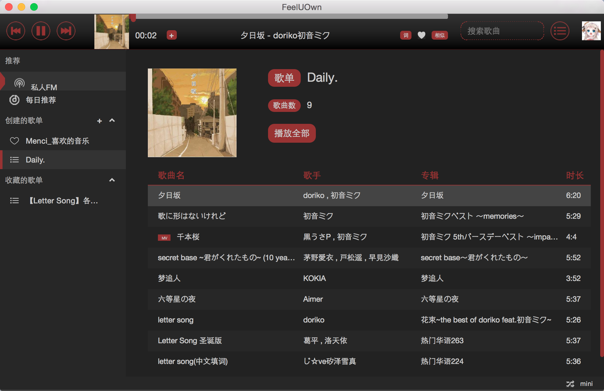

网易云音乐客户端，比较轻量，能听歌但好像也只能听歌 ……

### GIMP
Website：[https://www.gimp.org/](https://www.gimp.org/)  
Github：[https://github.com/GNOME/gimp](https://github.com/GNOME/gimp)  
Homebrew：`brew cask install gimp`  
License：GNU GPL v3  
Platform：OS X、GNU/Linux、Windows

专业的图像处理软件，虽然我不那么专业，平常用来剪剪图搞搞模糊还是挺资磁的。只是 Gtk+ 的图形界面在 OS X 下表现不是很好，非原生界面感觉怪怪的 ……

### LibreOffice
Website：[https://www.libreoffice.org/](https://www.libreoffice.org/)  
Github：[https://github.com/LibreOffice](https://github.com/LibreOffice)  
Homebrew：`brew cask install libreoffice`  
License：Mozilla Public License v2.0  
Platform：OS X、GNU/Linux、Windows

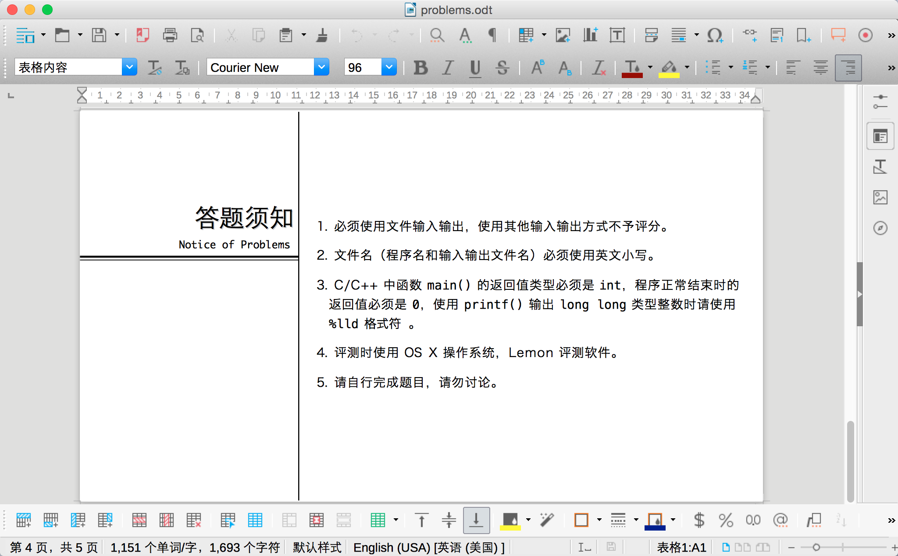

文档处理软件，它的 Writer 和 Calc 比较好用，Impress 不如 PowerPoint 好用。一般除了做幻灯片之外不需要开 MS Office。

### VLC
Website：[http://www.videolan.org/vlc/](http://www.videolan.org/vlc/)  
Github：[https://github.com/videolan/vlc](https://github.com/videolan/vlc)  
Homebrew：`brew cask install vlc`  
License：GNU GPL v2  
Platform：OS X、GNU/Linux、Windows

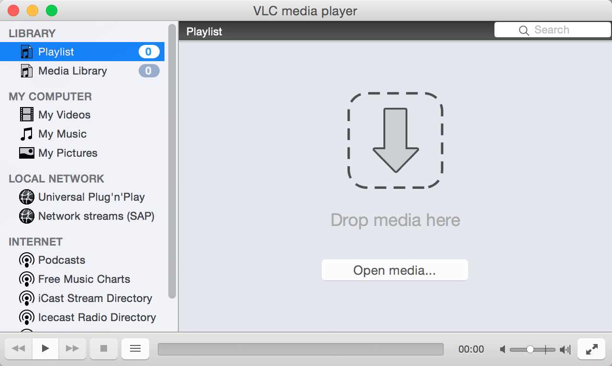

用过最好用的视频播放器，基本上常见不常见的格式都能打开。
