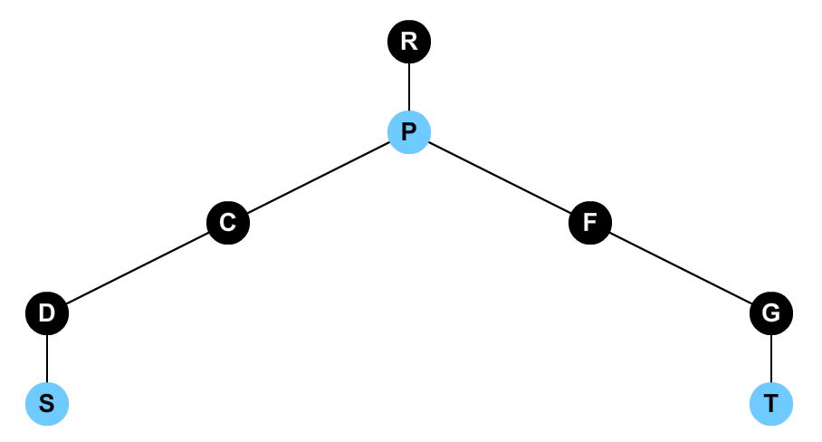
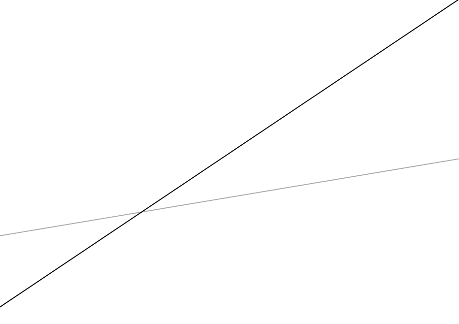

title: 「SDOI2016」游戏 - 树链剖分
categories:
  - OI
tags:
  - BZOJ
  - COGS
  - SDOI
  - 数学
  - 数据结构
  - 最近公共祖先
  - 李超树
  - 树链剖分
  - 线段树
permalink: sdoi2016-game
date: '2016-04-15 22:25:55'
---

Alice 和 Bob 在玩一个游戏。
游戏在一棵有 $ n $ 个点的树上进行。最初，每个点上都只有一个数字，那个数字是 $ 123456789123456789 $。
有时，Alice 会选择一条从 $ s $ 到 $ t $ 的路径，在这条路径上的每一个点上都添加一个数字。对于路径上的一个点 $ r $，若 $ r $ 与 $ s $ 的距离是 $ dis $，那么 Alice 在点 $ r $ 上添加的数字是 $ a \times dis + b $。
有时，Bob 会选择一条从 $ s $ 到 $ t $ 的路径。他需要先从这条路径上选择一个点，再从那个点上选择一个数字。
Bob 选择的数字越小越好，但大量的数字让 Bob 眼花缭乱。Bob 需要你帮他找出他能够选择的最小的数字。

<!-- more -->

### 链接

[BZOJ 4515](http://www.lydsy.com/JudgeOnline/problem.php?id=4515)  
[COGS 2222](http://cogs.top/cogs/problem/problem.php?pid=2222)

### 题解

首先，树链剖分，转化成链上的操作，使用线段树维护。

对一条路径上的每个点添加一个数字，设 $ p = {\rm LCA}(s, t) $，可以把这条路径分为两条链，即 $ s \rightarrow p $、$ p \rightarrow t $。



设 $ {\rm dist}(u, v) $ 为 u、v 两点间距离，则左边一条路径上每一个点被赋的值为

$$ \begin{align} & {\rm dist}(u, s) \times a + b \\ = & ({\rm dist}(s, root) - {\rm dist}(u, root)) \times a + b \\ = & a \times {\rm dist}(s, root) - a \times {\rm dist}(u, root) + b \\ = & -a \times {\rm dist}(u, root) + a \times {\rm dist}(s, root) + b \end{align} $$

注意到，后面的 $ a \times {\rm dist}(s, root) + b $ 是一个常数。

右边的一条路径上每个点被赋的值为

$$ \begin{align} & {\rm dist}(u, s) \times a + b \\ = & ({\rm dist}(s, root) + {\rm dist}(u, root) - 2 \times {\rm dist}(p, root)) \times a + b \\ = & {\rm dist}(s, root) \times a + {\rm dist}(u, root) \times a - 2 \times {\rm dist}(p, root) \times a + b \\ = & {\rm dist}(u, root) \times a + {\rm dist}(s, root) \times a - 2 \times {\rm dist}(p, root) \times a + b \\ \end{align} $$

同理，后面的 $ {\rm dist}(s, root) \times a - 2 \times {\rm dist}(p, root) \times a + b $ 也是一个常数。

这样，我们得到了两个直线的斜截式方程，问题转化为：在序列上给一段区间添加一条直线；求一段区间内所有直线方程带入 $ x $ 值后的最小 $ y $ 值。

这个问题可以使用线段树解决，每个节点维护：

1. 区间最小值；
2. 在当前节点 `mid`（区间中点）处取得值最小的一条直线。

因为所有叶子节点的 `mid` 构成了整条线段，所以这样维护一定可以取得最小值。

注意到直线的方程这种标记是不能合并的，所以每当添加一条直线的时候，判断这条直线在区间左端点、区间中点、区间右端点处带入得到的值是否比原有直线更优。

如果左右端点都取**不**到更优值，则中点一定取不到更优值，且子节点的中点（整个区间）都取不到更优值，因为一次函数的图像是单调的。此时直接舍弃新的直线即可。

如果左右端点都能取到更优值，同理，中点一定能取到更优值，且子节点的中点（整个区间）都能取到更优值。此时直接更新舍弃旧的直线即可。

其他的情况，均为左右端点之一能取到更优值。如果中点能取到更优值，可以将新旧直线互换，并将左右端点能否取到更优值取反。即转化为，只有左右端点之一能取到更优值。

此时的两条直线图像是这样的（因为带入的横坐标是离散的，所以真实的情况并不一定是直线，此处便于理解画成直线）：



旧直线为浅色，新直线为深色。可以看出在左端点处，新直线取得更优值，因为新直线已经不可能对当前节点（的中点处）有贡献，而只**可能**对左半个区间（的中点）有贡献，所以直接在线段树上向左子树下放即可。这是一个递归的过程。

这样有一个问题，当前区间的新直线可能对两个子节点所控制的区间的中点的值有贡献，而查询时有可能查询到两个子节点而忽略当前节点。为了解决此问题，在查询子节点时，先尝试将自身记录的直线下放下去。

树链剖分会产生最多 $ O(\log n) $ 条重链，线段树上一次查询或修改操作会访问最多 $ O(\log n) $ 个节点，每个标记最多被下传 $ O(\log n) $ 次，所以该算法的时间复杂度为 $ O(n \log ^ 3 n) $。

### 代码

```cpp
#include <cstdio>
#include <climits>
#include <stack>

const int MAXN = 100000;
const int MAXM = 100000;

struct Node;
struct Edge;
struct SegmentTree;

struct Node {
    Edge *e;
    int d, s, i, id;
    long long dist;
    bool v;
    Node *p, *c, *t;
} N[MAXN], *dfs[MAXN];

struct Edge {
    Node *s, *t;
    long long w;
    Edge *next;

    Edge(Node *s, Node *t, const long long w) : s(s), t(t), w(w), next(s->e) {}
};

struct Line {
    long long k, b;

    Line() : k(0), b(LLONG_MAX) {}
    Line(const long long k, const long long b) : k(k), b(b) { /* printf("    Line(%lld, %lld)\n", k, b); */}

    long long operator()(const int i) const { return k * dfs[i]->dist + b; }

    long long operator()(const int i, const int j, const int k) {
        long long ans = LLONG_MAX;
        ans = std::min(ans, this->operator()(i));
        ans = std::min(ans, this->operator()(j));
        ans = std::min(ans, this->operator()(k));
        return ans;
    }

    operator bool() const { return k != 0 || b != LLONG_MAX; }
};

struct SegmentTree {
    int l, r, m;
    SegmentTree *lc, *rc;
    Line f;
    long long val;
    bool covered;

    SegmentTree(const int l, const int r, SegmentTree *lc, SegmentTree *rc) : l(l), r(r), m(l + ((r - l) >> 1)), lc(lc), rc(rc), val(123456789123456789LL) {}

    ~SegmentTree() {
        if (lc) delete lc;
        if (rc) delete rc;
    }

    /*
    bool test(const Line &f) {
        return f(l) <= this->f(l) && f(m) <= this->f(m) && f(r) <= this->f(r);
    }
    */

    void pushDown() {
        if (lc && f) lc->update(lc->l, lc->r, this->f);
        if (rc && f) rc->update(rc->l, rc->r, this->f);
        /*
        if (lc && f && (!lc->f || lc->test(f))) lc->f = f, lc->val = std::min(lc->val, lc->f(lc->l, lc->m, lc->r));
        if (rc && f && (!rc->f || rc->test(f))) rc->f = f, rc->val = std::min(rc->val, rc->f(rc->l, rc->m, rc->r));
        */
    }

    void cover(Line f) {
        // pushDown();

        bool L = (f(l) < this->f(l)), R = (f(r) < this->f(r)), M = (f(m) < this->f(m));
        if (!L && !R) return;
        if (L && R) {
            this->f = f;
            val = std::min(val, this->f(l, m, r));
            return;
        }

        if (M) {
            std::swap(f, this->f);
            L ^= 1, R ^= 1;
        }

        if (L) lc->cover(f);
        if (R) rc->cover(f);

        val = std::min(val, this->f(l, m, r));
        val = std::min(val, lc->val);
        val = std::min(val, rc->val);
        // printf("val[%d, %d] = %lld\n", l, r, val);
    }

    void update(const int l, const int r, const Line &f) {
        if (l > this->r || r < this->l) return;
        else if (l <= this->l && r >= this->r) cover(f);
        else {
            // pushDown();
            lc->update(l, r, f);
            rc->update(l, r, f);
            // val = std::min(val, this->f(this->l, this->m, this->r));
            val = std::min(val, lc->val);
            val = std::min(val, rc->val);
        }
    }

    long long query(const int l, const int r) {
        // printf("val[%d, %d] (with m = %d) = %lld\n", this->l, this->r, m, val);
        if (l > this->r || r < this->l) return LLONG_MAX;
        else if (l <= this->l && r >= this->r) {
            long long ans = LLONG_MAX;
            ans = std::min(ans, val);
            // ans = std::min(ans, f(std::max(l, this->l)));
            // ans = std::min(ans, f(std::min(r, this->r)));
            // printf("query(%d, %d) in [%d, %d] = %lld\n", l, r, this->l, this->r, ans);
            return ans;
        }
        else {
            pushDown();
            long long ans = LLONG_MAX;
            // if (l <= this->m && r >= this->m) ans = std::min(ans, f(m));
            /*if (covered) {
                ans = std::min(ans, f(std::max(l, this->l)));
                ans = std::min(ans, f(std::min(r, this->r)));
            }*/
            ans = std::min(ans, lc->query(l, r));
            ans = std::min(ans, rc->query(l, r));
            // printf("query(%d, %d) in [%d, %d] = %lld\n", l, r, this->l, this->r, ans);
            return ans;
        }
    }
} *segment;

int n, m;

SegmentTree *buildSegment(const int l, const int r) {
    if (l > r) return NULL;
    else if (l == r) return new SegmentTree(l, r, NULL, NULL);
    else return new SegmentTree(l, r, buildSegment(l, l + ((r - l) >> 1)), buildSegment(l + ((r - l) >> 1) + 1, r));
}

inline void addEdge(const int u, const int v, const long long w) {
    N[u].e = new Edge(&N[u], &N[v], w);
    N[v].e = new Edge(&N[v], &N[u], w);
}

inline void cut() {
    std::stack<Node *> s;
    s.push(&N[0]);
    N[0].d = 1;

    while (!s.empty()) {
        Node *v = s.top();
        if (!v->v) {
            v->v = true;
            for (Edge *e = v->e; e; e = e->next) if (!e->t->d) {
                e->t->d = v->d + 1;
                e->t->dist = v->dist + e->w;
                e->t->p = v;
                s.push(e->t);
            }
        } else {
            v->s = 1;
            for (Edge *e = v->e; e; e = e->next) if (e->t->p == v) {
                v->s += e->t->s;
                if (v->c == NULL || v->c->s < e->t->s) v->c = e->t;
            }
            s.pop();
        }
    }

    for (int i = 0; i < n; i++) N[i].v = false;

    int time = -1;
    s.push(&N[0]);
    while (!s.empty()) {
        Node *v = s.top();
        if (!v->v) {
            v->v = true;
            v->i = ++time;
            dfs[v->i] = v;
            if (!v->p || v != v->p->c) v->t = v;
            else v->t = v->p->t;
            for (Edge *e = v->e; e; e = e->next) if (e->t->p == v && e->t != v->c) s.push(e->t);
            if (v->c) s.push(v->c);
        } else s.pop();
    }

    segment = buildSegment(0, n - 1);
}

inline int lca(const int u, const int v) {
    Node *a = &N[u], *b = &N[v];
    while (a->t != b->t) {
        if (a->t->d < b->t->d) std::swap(a, b);
        a = a->t->p;
    }

    return a->d < b->d ? a->id : b->id;
}

inline void update(const int u, const int v, const Line &f) {
    Node *a = &N[u], *b = &N[v];
    while (a->t != b->t) {
        if (a->t->d < b->t->d) std::swap(a, b);
        segment->update(a->t->i, a->i, f);
        a = a->t->p;
    }

    if (a->i > b->i) std::swap(a, b);
    segment->update(a->i, b->i, f);
}

inline long long query(const int u, const int v) {
    long long ans = LLONG_MAX;
    Node *a = &N[u], *b = &N[v];
    while (a->t != b->t) {
        if (a->t->d < b->t->d) std::swap(a, b);
        ans = std::min(ans, segment->query(a->t->i, a->i));
        // printf("ans = %lld\n", ans);
        a = a->t->p;
    }

    if (a->i > b->i) std::swap(a, b);
    ans = std::min(ans, segment->query(a->i, b->i));
    // printf("ans = %lld\n", ans);
    return ans;
}

int main() {
    freopen("menci_game.in", "r", stdin);
    freopen("menci_game.out", "w", stdout);

    scanf("%d %d", &n, &m);

    for (int i = 0; i < n; i++) N[i].id = i;

    for (int i = 0; i < n - 1; i++) {
        int u, v;
        long long w;
        scanf("%d %d %lld", &u, &v, &w), u--, v--;

        addEdge(u, v, w);
    }

    cut();

    // for (int i = 0; i < n; i++) printf("order(%d) = %d\n", i + 1, N[i].i);

    for (int i = 0; i < m; i++) {
        int x, s, t;
        scanf("%d %d %d", &x, &s, &t), s--, t--;
        if (x == 1) {
            long long a, b;
            scanf("%lld %lld", &a, &b);
            int p = lca(s, t);
            // printf("(%lld, %lld)\n", -a, a * N[s].dist + b);
            // printf("(%lld, %lld)\n", a, (N[s].dist - 2 * N[p].dist) * a + b);
            if (p != s) update(s, p, Line(-a, a * N[s].dist + b));
            if (p != t || (p == s && p == t)) update(p, t, Line(a, (N[s].dist - 2 * N[p].dist) * a + b));
        } else {
            printf("%lld\n", query(s, t));
        }
    }

    fclose(stdin);
    fclose(stdout);

    return 0;
}
```