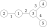

title: 「Sekai CTF 2022」Pafs - 树形 DP
categories:
  - OI
tags:
  - 树形 DP
  - 组合数学
permalink: sekaictf-2022-pafs
date: '2022-10-04 13:50:00'
---

给定一棵有 $N$ 个节点的无根树，对每条无向边编号（$(a,b)$ 和 $(b,a)$ 被认为是同一条边），定义一种新的路径 Pafs：一条 Pafs 路径是若干条不重复的边组成的序列，序列中两个相邻的边之间必须有且仅有一个公共端点。Pafs 路径是有向的，且相邻的边不需要首尾相连，如下图：



求给定的树上共有多少条 Pafs 路径，答案 $\mathop{\text{mod}} ~ 10^9+7$。

<!-- more -->

### 链接

[Project SEKAI Online Judge](http://algo-server.ctf.sekai.team/)

### 题解

考虑每条 Pafs 路径的形态：一定是以一条普通的路径作为主要部分，外加其中每个点都可以额外引入若干条分叉边。所以从主路径入手考虑这个问题。

对无根树进行 DFS，转化为有根树。在树上进行树形 DP，为每个节点 $i$ 维护两个值：

* $g(i)$ 表示，主路径在该节点的子树（外加该节点的父节点）内，主路径从下向上以该节点的父节点结束，最后一条边为该节点与其父节点相连的边，的 Pafs 路径数量；
    * 仅对非根节点有定义
    * 根据定义最后一条边也可以算作分叉边，但为了解题这里将其算作主路径；
    * 仅统计从下向上一个方向，其中除单条边组成的以外，每个对应一个反转的路径；
* $s(i)$ 表示，主路径在该节点的子树内，主路径经过的深度最小的点为该节点，的 Pafs 路径数量。

最终答案为所有 $s(i)$ 之和。

#### g(i)

对于每个节点，其每个子节点 $j$ 的 $g(j)$ 中的每个 Pafs 路径均对 $g(i)$ 有贡献。从每个子节点 $j$ 引入的 Pafs 路径，在到达当前节点 $i$ 之后，由于最后一条边属于主路径，所以可以再加入若干条分叉边，这些可供选择分叉边即为 $i$ 与其他子节点 $k$ 相连的边。

设 $i$ 共有 $c(i)$ 个子节点，此时一共有 $c(i)-1$ 条边可供选择。由于 Pafs 路径是有序的，所以分叉边的选择方案也是有序的，所以此时的方案数为：从 $n=c(i)-1$ 条边中任选一条或多条边，并组成全排列，的方案数，即

$$
\begin{aligned}
a(n)&=\sum\limits_{m=0}^{n}A(n,m)\\
&=\sum\limits_{m=0}^{n}\frac{n!}{(n-m)!}\\
\end{aligned}
$$

> 由于 $n=c(i)-1$ 的最大值为 $O(N)$ 级别（考虑菊花图），所以不能使用时间复杂度为 $O(n)$ 的算法来计算单个 $a(n)$。将 $a(n)$ 的前 10 项输出，可得 
>
> $$1,2,5,16,65,326,1957,13700,109601,986410$$
>
> 在 OEIS 上搜索，得到数列 [A000522](https://oeis.org/A000522)，并获得线性递推式
>
> $$a(n)=na(n-1)+1$$
>
> 使用该递推式可在 $O(n)$ 的时间内预处理所有 $a(n)$ 值。

所以，对非根节点 $i$

$$
g(i)=\sum\limits_{j\in\mathop{\text{child}}(i)}g(j)a(c(i)-1)+1
$$

#### s(i)

每个节点的 $s(i)$ 分为两个个部分：

1. $s_1(i)$，表示以该节点的父节点作为最后一条边，且这条边作为主路径，且主路径上每个点深度递减的 Pafs 路径（以及其相反的路径）数量，显然 $s_1(i)=g(i)\times2-1$（减 $1$ 以去除单条边组成的路径被重复计算两次的情况）；
2. $s_2(i)$，表示主路径可分为在 $i$ 的不同子树内的两部分，且主路径所有节点的最近公共祖先为 $i$，的 Pafs 路径数量。

对于第二部分，考虑主路径从一个子节点 $j$ 向上到达当前节点，再向下到另一个子节点 $j$。由于在 $g(j)$ 的定义中，每条 Pafs 路径均以 $j-i$ 的边作为主路径结束，所以 $j-i-k$ 之间可以引入若干条分叉边，这些分叉边可以包含与其他 $c(i)-2$ 个子节点相连的边，也可以包含与父节点相连的边，所以共有 $c(i)-1$ 种选择。所以

$$
s_2(i)=\sum\limits_{j\in\mathop{\text{child}}(i)}\sum\limits_{k\in\mathop{\text{child},k\neq j}(i)}g(j)g(k)a(c(i)-1)
$$

所以

$$
s(i)=\begin{cases}
\sum\limits_{j\in\mathop{\text{child}}(i)}g(j)\left(\sum\limits_{k\in\mathop{\text{child}}(i),k\neq j}g(k)\right)a(c(i)-1)+2g(i)-1&i\text{ is NOT root}\\
\sum\limits_{j\in\mathop{\text{child}}(i)}g(j)\left(\sum\limits_{k\in\mathop{\text{child}}(i),k\neq j}g(k)\right)a(c(i)-1)&i\text{ is root}
\end{cases}
$$

其中 $\sum\limits_{k\in\mathop{\text{child},k\neq j}(i)}g(k)$ 可以通过预处理所有子节点的 $g(k)$ 之和并减去 $g(j)$ 的方法来简化计算，不需要两层循环枚举分别所有子节点。

时间复杂度为 $O(n)$。

### 代码

```cpp
#include <cstdio>
#include <cstdint>
#include <vector>

const int64_t MOD = 1e9 + 7;

struct Node {
    int id;
    std::vector<Node *> adj;
    bool visited;

    std::vector<Node *> children;
    int64_t g, s;
};

inline void addEdge(Node *u, Node *v) {
    u->adj.push_back(v);
    v->adj.push_back(u);
}

std::vector<int64_t> p0Cache;

// inline void exgcd(int64_t a, int64_t b, int64_t &g, int64_t &x, int64_t &y) {
//     if (!b) g = a, x = 1, y = 0;
//     else exgcd(b, a % b, g, y, x), y -= x * (a / b);
// }

// inline int64_t inv(int64_t num) {
//     int64_t g, x, y;
//     exgcd(num, MOD, g, x, y);
//     return ((x % MOD) + MOD) % MOD;
// }

inline void preprocess(int n) {
    // std::vector<int64_t> frac(n + 1);
    // frac[0] = 1;
    // for (int i = 1; i <= n; i++) frac[i] = frac[i - 1] * i % MOD;

    // p0Cache.resize(n + 1);
    // for (int i = 0; i <= n; i++) {
    //     for (int j = 0; j <= i; j++) {
    //         (p0Cache[i] += frac[i] * inv(frac[i - j]) % MOD) %= MOD;
    //     }
    //     printf("P0(%d) = %llu\n", i, p0Cache[i]);
    // }

    p0Cache.resize(n + 1);
    p0Cache[0] = 1;
    for (int i = 1; i <= n; i++) {
        p0Cache[i] = (p0Cache[i - 1] * i + 1) % MOD;
        // printf("P0(%d) = %llu\n", i, p0Cache[i]);
    }
}

inline void dfs(Node *u) {
    u->visited = true;
    for (Node *v : u->adj) {
        if (!v->visited) {
            dfs(v);
            u->children.push_back(v);
        }
    }

    int64_t p0 = u->adj.size() < 2 ? 0 : p0Cache[u->adj.size() - 2];

    bool notRoot = u->adj.size() != u->children.size();
    u->g = u->s = notRoot ? 1 : 0;
    int64_t sumOfG = 0;
    for (Node *ci : u->children) (sumOfG += ci->g) %= MOD;
    for (Node *ci : u->children) {
        (u->s += ci->g * p0 % MOD * ((sumOfG - ci->g + MOD + (notRoot ? 2 : 0)) % MOD) % MOD) %= MOD;
        (u->g += ci->g * p0 % MOD) %= MOD;
    }

    // printf("g(%d) = %llu\n", u->id, u->g);
    // printf("s(%d) = %llu\n", u->id, u->s);
}

int main() {
    int n;
    scanf("%d", &n);

    preprocess(n);

    std::vector<Node> nodes(n);
    for (int i = 0; i < n - 1; i++) {
        int u, v;
        scanf("%d %d", &u, &v);
        addEdge(&nodes[u - 1], &nodes[v - 1]);
    }

    for (int i = 0; i < n; i++) {
        nodes[i].id = i + 1;
        nodes[i].visited = false;
    }
    dfs(&nodes[0]);

    int64_t answer = 0;
    for (int i = 0; i < n; i++) (answer += nodes[i].s) %= MOD;
    printf("%llu\n", answer);

    return 0;
}
```
