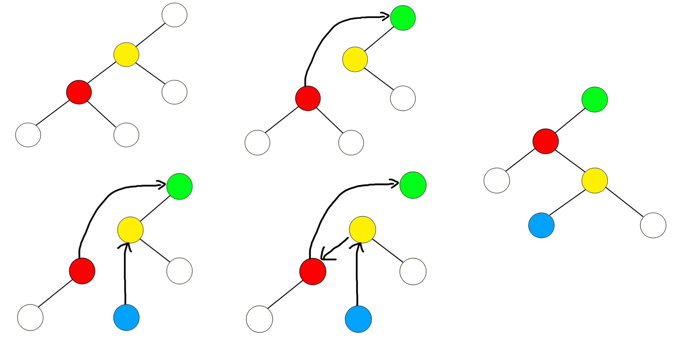

title: Splay 学习笔记（一）
categories:
  - OI
tags:
  - BZOJ
  - Splay
  - 学习笔记
  - 数据结构
  - 高级数据结构
permalink: splay-notes-1
date: '2015-12-20 05:36:24'
---

上周周四开始学 Splay，一边看《高级数据结构》，一边看 FireStorm 的《[Splay学习笔记](http://blog.csdn.net/farestorm/article/details/49153565)》，现在终于弄明白最基础的一部分了。

模板请见[《Splay 模板 + 详细注释》](/splay-template)。

<!-- more -->

### Splay 是什么?

Splay Tree（伸展树）是一种自平衡二叉排序树，可以在均摊$O({\log} n)$的时间内完成基于 Splay（伸展）操作的修改与查询。

### 基本结构

根据定义，Splay 是一棵二叉树，它的左子树和右子树分别是一棵 Splay，并且存储的值满足左子树 < 根 < 右子树，以下为每个 Splay 节点的定义。

```cpp
struct node_t {
    T value;
    node_t *lchild, *rchild, *parent, **root;
    uint size;
};
```

其中 `root` 表示指向**指向根节点的指针**的指针，这样做可以方便从任意一个节点找到整棵 Splay 的根节点，并修改它。`size` 表示以当前节点为根的 Splay 共有多少个节点（包括自身），有了 `size`，就可以轻松地实现选择和排名操作。

### 准备

为了方便各种复杂的操作，我们先为节点类 `node_t` 编写几个短小的方法，代码如下：

```cpp
node_t(const T &value, node_t *parent, node_t **root) : value(value), parent(parent), lchild(NULL), rchild(NULL), size(1), root(root) {}

~node_t() {
    if (lchild) {
        delete lchild;
    }

    if (rchild) {
        delete rchild;
    }
}

node_t *grandparent() {
    return !parent ? NULL : parent->parent;
}

node_t *&child(uint x) {
    return !x ? lchild : rchild;
}

uint relation() {
    return this == parent->lchild ? 0 : 1;
}

uint maintain() {
    size = lsize() + rsize() + 1;
}

uint lsize() {
    return lchild ? lchild->size : 0;
}

uint rsize() {
    return rchild ? rchild->size : 0;
}
```

这里在 `node_t` 的析构函数中递归释放所有内存，这在区间删除中可能耗时较长，如果内存不紧张，可以考虑不释放内存。

为了旋转操作的方便，我们给每个节点设置一个“关系”属性，表示该节点与其父节点的关系，若该节点为左孩子，则“关系”为 `0`，反之则为 `1`。`relation()` 方法用来计算这个“关系”，而 `child()` 方法返回与该节点“关系”为 `x` 的子节点的**引用**。

`maintain()` 方法则用来重新计算以该节点为根的 Splay 的大小，注意，为免去不必要的计算，假设两个子节点的大小是**已经计算好**的，不会再将其重新计算。

### 旋转

为了调换 Splay 中父节点与子节点的位置，我们实现 `rotate()` 方法，该方法在**保证以下三点**的情况下，将该节点向上移动一个位置：

1. 整棵 Splay 的中序遍历不变；
2. 受影响节点的 `size` 仍然有效；
3. `*root` 总是指向整棵 Splay 的根。

以左旋（若当前节点为父节点的左孩子）为例，旋转分为四个步骤：

1. 将**祖父**节点与自身连接；
2. 将自己的**右孩子**接到自己的父节点的**左孩子**的位置（替代自己）；
3. 将父节点接到自己的**右孩子**的位置；
4. 检查如果此时自身节点为根，则更新 `*root`。

如图（图片来自 FireStorm 的《[Splay学习笔记](http://blog.csdn.net/farestorm/article/details/49153565)》）：

代码：

```cpp
void rotate() {
    node_t *old = parent;
    uint x = relation();

    if (grandparent()) {
        grandparent()->child(old->relation()) = this;
    }
    parent = grandparent();

    old->child(x) = child(x ^ 1);
    if (child(x ^ 1)) {
        child(x ^ 1)->parent = old;
    }

    child(x ^ 1) = old;
    old->parent = this;

    old->maintain();
    maintain();

    if (!parent) {
        *root = this;
    }
}
```

### Splay 操作

Splay 规定，每访问一个节点后，都要强制将该节点旋转到根的位置，于是我们很容易想到使用一个循环，判断是否已经到达目标，若不是则旋转，但这种方法的出现的问题在于，一条单链在旋转后仍然是单链，而且每次操作的时间复杂度无法得到保证！

所以我们需要 `Splay` 操作来进行更加“智能化”的旋转，`Splay` 操作的每一次循环分为三步：

1. 如果父节点为目标位置，则向上旋转；
2. 如果**当前节点与父节点的“关系”**和**父节点与祖父节点的“关系”相同**，则先旋转父节点，再旋转自身；
3. 如果不满足以上条件，则将自身连续旋转两次。

代码（省略旋转目标的旋转到根）：

```cpp
node_t *splay(node_t **target = NULL) {
    if (!target) {
        target = root;
    }

    while (this != *target) {
        if (parent == *target) {
            rotate();
        } else if (relation() == parent->relation()) {
            parent->rotate(), rotate();
        } else {
            rotate(), rotate();
        }
    }

    return *target;    
}
```

### 插入

一棵二叉排序树最基础的操作就是插入。

首先，设置一个变量 `target`，表示要插入到的位置，它被初始化为指向根节点，每次循环判断要插入的值大于或小于当前的 `target` 的值，并修改 `target` 为指向某个孩子，循环直到 `target` 指向一个 `NULL`，即可在此位置创建新节点。

插入完成后，需要将新节点 `Splay` 到根的位置。

代码：

```cpp
node_t *insert(const T &value) {
    node_t **target = &root, *parent = NULL;

    while (*target) {
        parent = *target;
        parent->size++;

        if (value < (*target)->value) {
            target = &(*target)->lchild;
        } else {
            target = &(*target)->rchild;
        }
    }

    *target = new node_t(value, parent, &root);
    return (*target)->splay();
}
```

为了下文**删除**操作的方便，我们在每棵 Splay 构造时为其插入两个节点，分别表示无穷大和无穷小，树中其他节点的值都应该在这两个节点的值构成的**开区间**内。

```cpp
splay_t() : root(NULL) {
    insert(MIN);
    insert(MAX);
}
```

### 查找

根据二叉排序树的有序性，我们可以很轻松的根据值查找到对应的节点，即从根开始查找，根据当前节点的值与要查找节点的值的大小关系，迭代到对应的子节点上，当当前节点的值等于要查找的值时即找到，若当前节点为 `NULL`，则说明查找失败。

注意，当有多个相同值时，查找过程应该返回相同值中排名最靠前的，在此我们使用求找到节点的**前趋**，然后求其**后继**的方法（前趋和后继的求法见下文）。

查找过程结束后，需要将找到的节点 `Splay` 到根。

代码：

```cpp
node_t *find(const T &value) {
    node_t *node = root;
    while (node && value != node->value) {
        if (value < node->value) {
            node = node->lchild;
        } else {
            node = node->rchild;
        }
    }

    if (node) {
        return node->pred()->succ()->splay();
    } else {
        return NULL;
    }
}
```

### 排名

一个值在二叉排序树中的排名，即为该值在此二叉排序树的**中序遍历**中第一次出现的位置。

在 Splay 中求排名非常简单，只要找到对应的节点，将其 `Splay` 到根，此时其左子树的 `size + 1` 即为所求的排名，而因为我们在初始化时多插入了一个“无穷小”节点，所以还要将 `1` 减去。

一个有效数值的排名从 `1` 开始，因为表示“无穷小”的节点的排名为 `0`。

代码：

```cpp
uint rank(const T &value) {
    return find(value)->lsize();
}
```

### 选择

对应“排名”操作，二叉排序树有“选择”操作——返回此二叉排序树的**中序遍历**中的第 `k` 个元素。

选择比排名要复杂一些，Splay 的选择过程和其他二叉排序树是相同的，我们通过以下几个步骤来实现：

1. 初始化“当前节点”为根；
2. 每次循环判断**以当前节点为根的 Splay 中**比该节点小的元素数量是否为 `k - 1`，如果是，则该节点即为要选择的节点；
3. 如果 `k` 小于当前节点的排名，则迭代到左子树，否则，将 `k` 的值减小**当前节点的排名**后迭代到右子树（因为我们跳过的节点数等于**当前节点排名**）。

选择过程结束后，将得到的节点 `Splay` 到根。

代码：

```cpp
const T &select(uint k) {
    k++;
    node_t *node = root;
    while (node->lsize() != k - 1) {
        if (k < node->lsize() + 1) {
            node = node->lchild;
        } else {
            k -= node->lsize() + 1;
            node = node->rchild;
        }
    }

    return node->splay()->value;
}
```

### 节点的前趋 / 后继

我们定义二叉排序树中一个节点的前趋为在此二叉排序树的中序遍历中最后一个数值**小于**该节点数值的节点，同理，一个节点的后继为在此二叉排序树的中序遍历中第一个数值**大于**该节点数值的节点。

以节点的前趋为例，其在 Splay 中的实现为：

1. 将欲求其前趋的节点 `Splay` 到根；
2. 找到根节点**左子树**的**最右链**的**最下端**（后继则相反），该节点即为此二叉排序树的中序遍历中最后一个数值**小于等于**根节点数值的节点；
3. 如果该节点的数值与欲求其前趋的节点的数值相等，则转到步骤 1，否则该节点即为所求的前趋。

求出节点的前趋或后继后，将得到的节点 `Splay` 到根。

代码：

```cpp
node_t *pred() {
    node_t *pred = this;

    while (pred->value == this->value) {
        pred->splay();
        pred = pred->lchild;

        while (pred->rchild) {
            pred = pred->rchild;
        }
    }

    return pred->splay();
}

node_t *succ() {
    node_t *succ = this;

    while (succ->value == this->value) {
        succ->splay();
        succ = succ->rchild;

        while (succ->lchild) {
            succ = succ->lchild;
        }
    }

    return succ->splay();
}
```

### 值的前趋 / 后继

我们定义一个数 `x` 在一棵二叉排序树中的前趋为此二叉排序树中小于 `x` 的数中最大的数，同理，一个数 `x` 在一棵二叉排序树中的后继为此二叉排序树中大于 `x` 的数中最小的数。

以值的前趋为例，其实现分为两种情况：

1. 欲求前趋的值在此二叉排序树中，则找到该值对应的节点并求其前趋即可；
2. 欲求前趋的值不在此二叉排序树中，我们将该值作为一个新节点插入此二叉排序树，用情况 1 的方法求得其前趋，然后将插入的节点删除即可（删除的方法见下文）。

代码：

```cpp
const T &pred(const T &value) {
    node_t *node = find(value);

    if (node) {
        return node->pred()->value;
    } else {
        node = insert(value);
        const T &result = node->pred()->value;
        erase(node);
        return result;
    }
}

const T &succ(const T &value) {
    node_t *node = find(value);

    if (node) {
        return node->succ()->value;
    } else {
        node = insert(value);
        const T &result = node->succ()->value;
        erase(node);
        return result;
    }
}
```

### 删除（单点 / 区间）

Splay 支持两种删除操作：单点删除和区间删除。因为单点删除即为左右端点相同的区间删除，所以我们在此主要讨论区间删除。

Splay 的区间删除实现并不难，但方法非常的巧妙（下文中提到的前趋、后继均为节点的前趋、后继）：

1. 将左端点的前趋 `Splay` 到根；
2. 将右端点的后继 `Splay` 到**根的右子树**；
3. 删除**右端点的后继的左子树**；
4. 分别重新计算右端点的后继、左端点的前趋的 `size`。

代码：

```cpp
void erase(const T &value) {
    node_t *node = find(value);
    erase(node);
}

void erase(const T &l, const T &r) {
    erase(find(l), find(r));
}

void erase(node_t *l, node_t *r = NULL) {
    if (!r) {
        r = l;
    }

    node_t *pred = l->pred();
    node_t *succ = r->succ();

    pred->splay();
    succ->splay(&pred->rchild);

    delete succ->lchild;
    succ->lchild = NULL;

    succ->maintain();
    pred->maintain();
}
```

### 完整代码（Tyvj / BZOJ / CodeVS 普通平衡树）

```cpp
#include <cstdio>
#include <climits>

typedef unsigned int uint;

const uint MAXN = 100000;

void print(void *node);

template <typename T, T MIN, T MAX>
struct splay_t {
    struct node_t {
        T value;
        node_t *lchild, *rchild, *parent, **root;
        uint size;

        node_t(const T &value, node_t *parent, node_t **root) : value(value), parent(parent), lchild(NULL), rchild(NULL), size(1), root(root) {}

        ~node_t() {
            if (lchild) {
                delete lchild;
            }

            if (rchild) {
                delete rchild;
            }
        }

        node_t *grandparent() {
            return !parent ? NULL : parent->parent;
        }

        node_t *&child(uint x) {
            return !x ? lchild : rchild;
        }

        uint relation() {
            return this == parent->lchild ? 0 : 1;
        }

        void maintain() {
            size = lsize() + rsize() + 1;
        }

        uint lsize() {
            return lchild ? lchild->size : 0;
        }

        uint rsize() {
            return rchild ? rchild->size : 0;
        }

        void rotate() {
            node_t *old = parent;
            uint x = relation();

            if (grandparent()) {
                grandparent()->child(old->relation()) = this;
            }
            parent = grandparent();

            old->child(x) = child(x ^ 1);
            if (child(x ^ 1)) {
                child(x ^ 1)->parent = old;
            }

            child(x ^ 1) = old;
            old->parent = this;

            old->maintain();
            maintain();

            if (!parent) {
                *root = this;
            }
        }

        node_t *splay(node_t **target = NULL) {
            if (!target) {
                target = root;
            }

            while (this != *target) {
                if (parent == *target) {
                    rotate();
                } else if (relation() == parent->relation()) {
                    parent->rotate(), rotate();
                } else {
                    rotate(), rotate();
                }
            }

            return *target;
        }

            node_t *pred() {
                node_t *pred = this;

                while (pred->value == this->value) {
                    pred->splay();
                    pred = pred->lchild;

                    while (pred->rchild) {
                        pred = pred->rchild;
                    }
                }

                return pred->splay();
            }

            node_t *succ() {
                node_t *succ = this;

                while (succ->value == this->value) {
                    succ->splay();
                    succ = succ->rchild;

                    while (succ->lchild) {
                        succ = succ->lchild;
                    }
                }

                return succ->splay();
            }
    } *root;

    splay_t() : root(NULL) {
        insert(MIN);
        insert(MAX);
    }

    ~splay_t() {
        delete root;
    }

    node_t *insert(const T &value) {
        node_t **target = &root, *parent = NULL;

        while (*target) {
            parent = *target;
            parent->size++;

            if (value < (*target)->value) {
                target = &(*target)->lchild;
            } else {
                target = &(*target)->rchild;
            }
        }

        *target = new node_t(value, parent, &root);
        return (*target)->splay();
    }

    node_t *find(const T &value) {
        node_t *node = root;
        while (node && value != node->value) {
            if (value < node->value) {
                node = node->lchild;
            } else {
                node = node->rchild;
            }
        }

        if (node) {
            return node->pred()->succ()->splay();
        } else {
            return NULL;
        }
    }

    uint rank(const T &value) {
        return find(value)->lsize();
    }

    const T &select(uint k) {
        k++;
        node_t *node = root;
        while (node->lsize() != k - 1) {
            if (k < node->lsize() + 1) {
                node = node->lchild;
            } else {
                k -= node->lsize() + 1;
                node = node->rchild;
            }
        }

        return node->splay()->value;
    }

    const T &pred(const T &value) {
        node_t *node = find(value);

        if (node) {
            return node->pred()->value;
        } else {
            node = insert(value);
            const T &result = node->pred()->value;
            erase(node);
            return result;
        }
    }

    const T &succ(const T &value) {
        node_t *node = find(value);

        if (node) {
            return node->succ()->value;
        } else {
            node = insert(value);
            const T &result = node->succ()->value;
            erase(node);
            return result;
        }
    }

    void erase(const T &value) {
        node_t *node = find(value);
        erase(node);
    }

    void erase(const T &l, const T &r) {
        erase(find(l), find(r));
    }

    void erase(node_t *l, node_t *r = NULL) {
        if (!r) {
            r = l;
        }

        node_t *pred = l->pred();
        node_t *succ = r->succ();

        pred->splay();
        succ->splay(&pred->rchild);

        delete succ->lchild;
        succ->lchild = NULL;

        succ->maintain();
        pred->maintain();
    }
};

void dfs(splay_t<int, INT_MIN, INT_MAX>::node_t *node, uint depth = 0) {
    if (node) {
        dfs(node->rchild, depth + 1);

        for (uint i = 0; i < depth; i++) {
            putchar(' ');
        }
        printf("%d : %u\n", node->value, node->size);

        dfs(node->lchild, depth + 1);
    }
}

void print(void *node) {
    puts("------------------------------------------");
    dfs((splay_t<int, INT_MIN, INT_MAX>::node_t *)node);
    puts("------------------------------------------");
}

uint n;
splay_t<int, INT_MIN, INT_MAX> splay;

int main() {
    scanf("%u", &n);

    for (uint i = 0; i < n; i++) {
        uint command;
        int x;
        scanf("%u %d", &command, &x);

        switch (command) {
        case 1:
            splay.insert(x);
            break;
        case 2:
            splay.erase(x);
            break;
        case 3:
            printf("%u\n", splay.rank(x));
            break;
        case 4:
            printf("%d\n", splay.select(x));
            break;
        case 5:
            printf("%d\n", splay.pred(x));
            break;
        case 6:
            printf("%d\n", splay.succ(x));
            break;
        default:
            break;
        }
    }

    return 0;
}
```