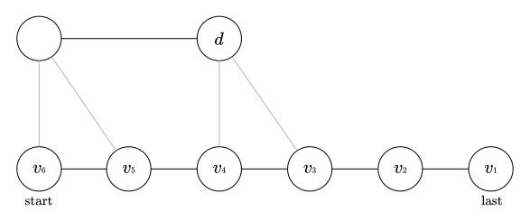
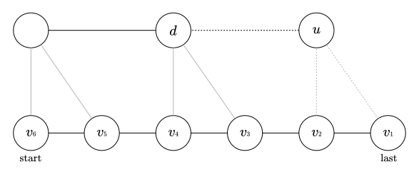
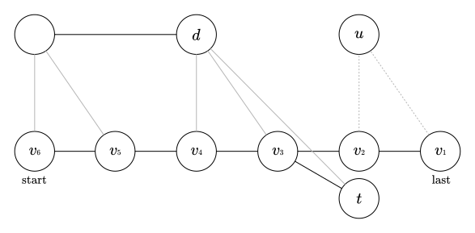
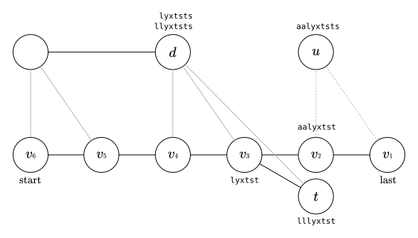
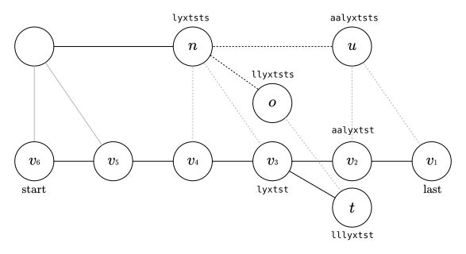
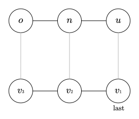

title: 后缀自动机学习笔记
categories: OI
tags: 
  - 后缀自动机
  - 字符串
  - 学习笔记
  - 算法模板
permalink: suffix-automaton-notes
date: 2017-03-30 18:18:00
---

后缀自动机是一种有限状态自动机，它可以（且仅可以）接受一个字符串的所有**后缀**。

<!-- more -->

### 定义
后缀自动机（suffix automaton，以下简称 SAM）的结构包含两部分，有向无环单词图（directed acyclic word graph，以下简称 DAWG）和前缀树（prefix tree）。**SAM 中的每个节点都同时存在于这两个结构中。**

我们对一个字符串 $ S $ 构造其 SAM，称 $ S $ 是该 SAM 的**母串**；下文中提到的「子串」、「前缀」与「后缀」，如非特殊说明，均指母串的「子串」、「前缀」与「后缀」。

记 $ |S| $ 为字符串 $ S $ 的长度。

#### DAWG
顾名思义，DAWG 是一个 DAG（有向无环图）。

DAWG 中，除**起始节点**外，每个**节点**表示一个或多个子串。

节点之间通过转移边相连，每条转移边上有一个**字符**。

从起始节点沿着转移边走，每条**路径**都对应着**一个子串**，即将走过的边上的字符首尾相连得到的子串（显然多条路径会到达同一个节点上）。

我们称在 SAM 上运行一个字符串 $ S $，即为从 DAWG 的起始节点开始，第 $ i $ 次沿着字符 $ S_i $ 的转移边走，走完 $ |S| $ 次；如果 $ S $ 是母串的一个后缀，则称到达的节点为**可接受**的节点。

#### 节点
> 每个节点所表示的所有字符串，一定是（母串的）某个前缀的若干个长度只相差 $ 1 $ 的后缀。

**例**：母串为 $ \texttt{lyxyxyxtststst} $，它的一个前缀为 $ \texttt{lyxyxyx} $，某个节点 $ v $ 所表示的子串可能为 $ \texttt{yx} $、$ \texttt{xyx} $ 和 $ \texttt{yxyx} $。

> 定义节点 $ v $ 中长度最小和最大的子串分别为 $ \min(v) $ 和 $ \max(v) $。

**例**：母串为 $ \texttt{lyxyxyxtststst} $，它的一个前缀为 $ \texttt{lyxyxyx} $，假设存在某个节点 $ v $ 所表示的子串为 $ \texttt{yx} $、$ \texttt{xyx} $ 和 $ \texttt{yxyx} $，那么 $ \min(v) = \texttt{yx} $，$ \max(v) = \texttt{yxyx} $。

> 定义节点 $ v $ 中长度最大的子串在母串中所有出现的结束位置的集合为 $ \text{end-pos}(v) $。

**例**：母串为 $ \texttt{lyxyxyxtststst} $，它的一个前缀为 $ \texttt{lyxyxyx} $，假设存在某个节点 $ v $ 所表示的子串为 $ \texttt{yx} $、$ \texttt{xyx} $ 和 $ \texttt{yxyx} $，其中最长的为 $ \texttt{yxyx} $，它在母串中出现过两次，结束位置分别为 $ 5 $ 和 $ 7 $，所以 $ \text{end-pos}(v) = \{ 5, 7 \} $。

> **性质**：任意两个节点的 $ \text{end-pos} $ 集合不同。

**证明**：如果两个节点的 $ \text{end-pos} $ 集合相同，则说明这两个节点的出边是等价的（因为它们加上每个字符后得到的那些子串，其结束位置也是分别相同的），可以合并这两个节点。

只有从「表示整个母串的节点」到根的一条路径上的节点的 $ \text{end-pos} $ 集合包含母串的末尾，所以只有这些节点是接受节点；并且从起始节点沿着转移边走到这些节点的路径上，将所有转移边上的字符首尾相连，得到的一定是一个后缀（即使它可能在母串的其它位置也出现过多次）。

#### 转移边
$ u $ 到 $ v $ 有一条字符为 $ c $ 的转移边，表示 $ u $ 所表示的所有子串加上一个字符后，得到的子串，都可以由 $ v $ 表示。**但不一定 $ v $ 所表示的所有字串都是由 $ u $ 的转移而来。**

#### 后缀链接与前缀树
> 定义 $ u $ 的**后缀链接**指向 $ v $，当且仅当 $ |\min(u)| = |\max(v)| + 1 $ 且 $ v $ 中的子串均为 $ u $ 子串的后缀，记为 $ \text{next}(u) = v $。

**例**：母串为 $ \texttt{lyxyxyxtststst} $，它的一个前缀为 $ \texttt{lyxyxyx} $，假设存在某个节点 $ v $ 所表示的子串为 $ \texttt{x} $、$ \texttt{yx} $ 和 $ \texttt{xyx} $；另一个节点 $ u $ 所表示的子串为 $ \texttt{yxyx} $ 和 $ \texttt{lyxyx} $，则 $ \text{next}(u) = v $。

> 任意节点沿着后缀链接走，最终都会走到 DAWG 的起始节点。以后缀链接为边，所有的节点组成了一棵树，即**前缀树**。DAWG 的起始节点即为前缀树的根。

**性质**：前缀树中，子节点的 $ \text{end-pos} $ 集合一定是其父节点的真子集，即 $ \text{end-pos}(v) \subsetneq \text{end-pos}(\text{next}(v))$。

**证明**：因为 $ \max(\text{next}(v)) $ 一定是 $ \max(v) $ 的后缀，所以 $ \max(v) $ 出现的位置，$ \max(\text{next}(v)) $ 一定也出现了，所以 $ \text{end-pos}(v) \subseteq \text{end-pos}(\text{next}(v))$。  
如果 $ \text{end-pos}(v) = \text{end-pos}(\text{next}(v)) $，那么 $ v $ 和 $ \text{next}(v) $ 应该被合并为一个点，所以 $ \text{end-pos}(v) \subsetneq \text{end-pos}(\text{next}(v))$。

显然，一个节点的 $ \text{end-pos} $ 集合包含其所有子节点 $ \text{end-pos} $ 集合的并，如果这个节点表示了母串的一个前缀，则加上这个前缀的位置。

### 构造
在字符集为常数的情况下，SAM 的构造算法时空复杂度均为 $ O(n) $，稍后将证明这一结论。

SAM 的构造是一个增量算法，假设我们已有字符串 $ S $ 的 SAM，只需要考虑如何对其修改得到串 $ S + c $（$ c $ 为一个字符）的 SAM 即可。这里将用一个例子来说明这个过程，注意下图中的 $ v_1 $ 和 $ v_2 $、$ v_3 $ 和 $ v_4 $、$ v_5 $ 和 $ v_6 $ 这三组节点在实际情况下均可能是零个或多个节点，为了方便这里画出两个。

设之前表示整个串的节点为 $ \text{last} $，从 $ \text{last} $ 到起始节点 $ \text{start} $ 的路径为 $ v_i $（$ v_1 = \text{last}, v_2 = \text{next}(\text{last}), \ldots, v_k = \text{start} $）。则一定存在一个 $ i $，使得 $ v_1 \sim v_i $ 没有字符 $ c $ 的出转移边，如（黑色边为后缀链接，灰色边为字符 $ c $ 的转移边）：



例子中 $ v_4 \sim v_6 $ 表示的字符串一定是 $ v_3 $ 所表示字符串的后缀，所以如果 $ v_3 $ 中的字符串添加一个字符后得到的字符串存在于原母串中，则 $ v_4 \sim v_6 $ 中的字符串添加一个字符后得到的字符串一定也存在于原母串中。而 $ v_2 $ 中的字符串都是 $ \max(v_3) $ 在前面添加若干个字符得到的，所以 $ v_2 $ 中的子串添加一个字符后得到的字符串会**不存在**于母串中。

现在加入了新的字符 $ c $，所以 $ v_1 \sim v_2 $ 添加了字符 $ c $ 后得到的字符串出现了，而且它们是新母串的后缀。我们设这些新的字符串被新节点 $ u $ 所表示，显然 $ \max(u) = \max(v_1) + c, \min(u) = \min(v_2) + c $。


注意到，新加入的字符 $ c $ 导致新出现了 $ |S| + 1 $（新母串长度）个后缀，这些后缀都需要新的节点来表示。首先，节点 $ u $ 表示了 $ \min(u) + c $ 及更长的后缀，而更短的后缀已经可以由 $ d $ 及其后缀链接的路径上的节点来表示。所以，DAWG 的性质已经被满足。接下来考虑前缀树。

首先，如果不存在这样的 $ v_3 $，满足 $ v_3 $ 有字符 $ c $ 的出边，则需要将 $ u $ 的后缀链接连向起始节点 $ \text{start} $，因为新出现的 $ |S| + 1 $ 个后缀都需要节点 $ u $ 来表示，即 $ |\min(u)| = 1 $，而为了满足前缀树是一棵树，需要将 $ u $ 的父节点置为树根。

如果 $ \max(d) = \max(v_3) + c $，即，$ d $ 中最长的字符串为 $ v_3 $ 中的最长字符串加上字符 $ c $ 后得到的。因为 $ |\max(d)| = |\max(v_3)| + 1, |\min(u)| = |\min(v_2)| + 1, |\max(v_3)| = |\min(v_2)| + 1 $，所以 $ |\max(d)| = |\min(v_2)| + 1 + 1 = |\min(u)| + 1 $，所以 $ u $ 的后缀链接连向 $ d $。



如果 $ \max(d) \neq \max(v_3) + c $，此时一定有 $ |\max(d)| > |\max(v_3)| + 1 $，因为字符串 $ \max(v_3) + c $ 一定存在于 $ d $ 中，并且存在另一个异于 $ v_i $ 的节点 $ t $，满足 $ \text{next}(t) = v_3 $ 且 $ t $ 有连向 $ d $ 的转移边。



此时我们不能将 $ u $ 的后缀链接连向 $ d $，因为 $ d $ 中的字符串不全是 $ u $ 的后缀。举个例子，$ v_3 $ 中有子串 $ \texttt{lyxtst} $，$ v_2 $ 中有子串 $ \texttt{aalyxtst} $，$ t $ 中有子串 $ \texttt{lllyxtst} $，$ u $ 中有子串 $ \texttt{aalyxtsts} $，$ d $ 中有子串 $ \texttt{lyxtsts} $ 和 $ \texttt{llyxtsts} $，因为 $ \texttt{llyxtsts} $ 不是 $ \texttt{aalyxtsts} $ 的后缀，所以 $ u $ 的后缀链接不能连向 $ d $。



我们需要将 $ d $ 拆成两个点，一个点 $ n $ 表示长度小于等于 $ |\max(v_3)| + 1 $ 的子串（例子中的 $ \texttt{lyxtsts} $），另一个点 $ o $ 表示长度更大的子串（例子中的 $ \texttt{llyxtsts} $）。



原有的 $ d $ 中，仅有长度小于等于 $ |\max(v_3)| + 1 $ 的子串是 $ v_3 $ 与 $ v_4 $ 中的字符串加上一个字符转移而来的，所以 $ v_3 $ 与 $ v_4 $ 的字符 $ c $ 的转移边应该连向 $ n $，而其它子串均为其它节点转移而来的，所以其它节点的转移边应该连向 $ o $，并且 $ \text{next}(n) $ 应为原有的 $ \text{next}(d) $，并且 $ \text{next}(o) = n $，然后新节点 $ u $ 的后缀链接 $ \text{next}(u) = n $。

注意到，在构造的过程中，每个子串都有对应的节点来表示，并且每个节点的 $ \text{end-pos} $ 集合不会相同（根据对前缀树结构的改变，容易证明这一结论），所以构造算法是正确的。

#### 实现
实现中要注意的是，节点只需要记录 $ \max $，而不需要记录 $ \min $，因为 $ \min(v) = \max(\text{next}(v)) + 1 $。在将 $ d $ 拆成两个点时，因为要将「其它的点」连向 $ o $ 点，所以直接将原来的 $ d $ 点作为 $ o $ 点，修改其 $ \max $ 属性，并新建一个 $ n $ 点，将需要连向 $ n $ 点的连过去即可 —— new 和 old 正是此处命名 $ n $ 与 $ o $ 的用意。

```cpp
const int CHARSET_SIZE = 26; // 字符集大小为常数

struct SuffixAutomaton
{
	struct Node
	{
		// ch 表示转移边，next 表示后缀链接
		Node *ch[CHARSET_SIZE], *next;
		int max;

		Node(int max = 0) : ch(), next(NULL), max(max) {}

		// v->min = v->next->max + 1
		int getMin()
		{
			return next->max + 1;
		}
	} *start, *last; // start 为起始节点，last 为表示整个母串的节点

	// 注意先调用初始化
	void init()
	{
		start = last = new Node;
	}

	// 加入一个新的字符，将 SAM 扩展
	Node *extend(int c)
	{
		// 节点 u 表示新的整个母串
		Node *u = new Node(last->max + 1), *v = last;

		// 将 last 的后缀链接路径上没有字符 c 出边的 v 全部连向 u
		// 注意判断 v 跳到 NULL 上
		for (; v && !v->ch[c]; v = v->next) v->ch[c] = u;

		// 如果 v 跳到了 NULL，则需要让 v 的后缀链接指向起始节点（也就是前缀树的根）
		if (!v)
		{
			u->next = start;
		}
		else if (v->ch[c]->max == v->max + 1)
		{
			// 直接将 u 的后缀链接连向 v 经过 c 的边转移后的点
			u->next = v->ch[c];
		}
		else
		{
			// 拆点，n 为新节点，o 为旧节点
			Node *n = new Node(v->max + 1), *o = v->ch[c];
			// 复制原有节点的出边到新节点 n 的出边
			std::copy(o->ch, o->ch + CHARSET_SIZE, n->ch);
			// 新节点 n 的后缀链接指向原有节点的后缀链接目标
			n->next = o->next;
			// 旧节点和新节点 u 的后缀链接指向新节点 n
			o->next = u->next = n;
			// 将路径上原有转移边指向 o 的节点改为指向 n
			for (; v && v->ch[c] == o; v = v->next) v->ch[c] = n;
		}

		last = u; // 更新「表示整个母串的节点」
		return u;
	}
};
```

### 复杂度证明
接下来我们证明这个算法的时空复杂度，它可以达到线性的空间复杂度，并在字符集为常数的情况下，达到线性的时间复杂度。

#### 空间复杂度
整个结构包含两部分 —— DAWG 和前缀树，我们需要分别证明节点数和 DAWG 的边数是线性的，并且与字符集无关。

首先，每次加入节点时，最多新建两个节点，所以显然节点数的上界是 $ 2|S| $，这一部分的复杂度得证。

对于 DAWG 的转移边，我们可以再将其分为两部分 —— 我们以起始节点为根，对 DAWG 建立一棵生成树，树边的数量一定是线性的，接下来只需要考虑非树边的数量。

我们定义集合 $ E $ 表示所有非树边，集合 $ S $ 表示串的所有后缀。如果我们能找到一个映射 $ f: E \rightarrow S $，使得对于任意的 $ a, b \in E $，若 $ f(a) = f(b) $，一定有 $ a = b $（即 $ f $ 为单射），即可证明 $ |E| \leq |S| $。

对于两个节点 $ u, v $，显然只可能存在一条非树边 $ u \rightarrow v $ 或 $ v \rightarrow u $，假设存在 $ u \rightarrow v $，那么我们找到下面三段字符串：

1. 从生成树的根沿着树边走到 $ u $，将经过的所有转移边上的字符按顺序首尾相接（因为是沿着树边，所以这个串是唯一的）；
2. $ u \rightarrow v $ 这条转移边上的字符；
3. 从 $ v $ 开始，沿着**字符字典序最小**的转移边（可以是树边或非树边）走，直到走到一个**可接受**的节点 $ w $，将经过的所有转移边上的字符按顺序首尾相接。

设这三段拼接得到得到的字符串为 $ s $，因为这三段都是唯一的，所以 $ s $ 是唯一的，记 $ f(u \rightarrow v) = s $；又因为整条路径是从起始节点走到一个可接受的节点，所以 $ s $ 一定是母串的一个后缀，并且，这条非树边 $ u \rightarrow v $ 是运行字符串 $ s $ 时经过的**第一条非树边**。

* 每条非树边 $ u \rightarrow v $ 都能对应到一个 $ s $；
* 每个被对应到的 $ s $ 都能对应到唯一一个 $ u \rightarrow v $。

所以，如果有两条边 $ u \rightarrow v $ 和 $ u' \rightarrow v' $ 满足 $ f(u \rightarrow v) = f(u' \rightarrow v') = s $，则一定有 $ (u \rightarrow v) = (u' \rightarrow v') $ —— 所以非树边的数量一定小于等于后缀的数量，即线性。

综上所述，SAM 中的节点数及其 DAWG 上的转移边数均为线性，即 SAM 的空间复杂度为线性，且与字符集大小无关。

#### 时间复杂度
代码中时间复杂度并不显然的地方有以下两处：

```cpp
Node *u = new Node(last->max + 1), *v = last;
// 将 last 的后缀链接路径上没有字符 c 出边的 v 全部连向 u
for (; v && !v->ch[c]; v = v->next) v->ch[c] = u;
```

如果 `last` 等于 `start`，则 `last->next` 为空，此时显然只会经过常数时间；否则，我们关注 `last->next->max` 这个量的变化：

* 循环一定会执行第一次（`v` 一定会被赋值为 `last->next`），也就是说，循环终止时 `v->max` 最大为 `last->next->max`，并且，`v->max` 经过常数时间即可从更大的值变为 `last->next->max`；
* 之后**循环每进行一次**，都会使 `v->max` **至少减少 1**（因为 `v->next->max` 一定小于 `v->max`）；
* 循环结束后，`u->next` 被赋值为一个 `max` 为 `v->max + 1` 的节点，而 `last` 被赋值为 `u`，**也就是说，`last->next->max` 的值变为 `v->max + 1`**。

除每次调用 `extend` 的第一次循环外，每次循环 `v->max` 至少减少 $ 1 $，而循环结束后，在下一次调用 `extend` 的第一次循环后（不计接下来将要分析的另一个 `for` 语句，这之间经历了常数时间），`v->max` 增加了 $ 1 $ —— 所以 $ n $ 次调用 `extend` 后，这条 `for` 语句的总时间复杂度为 $ O(n) $。

下面的另一个 `for`：

```cpp
// 将路径上原有转移边指向 o 的节点改为指向 n
for (; v && v->ch[c] == o; v = v->next) v->ch[c] = n;
```

我们考虑 `o->max` 的变化。首先，考虑下图中的这种情况，前三个 `v` 每个所转移到的节点都不同，这样 `o->max` 最多比 `v3->max` 多 $ 1 $，而其它的情况，如果每个 `v` 转移到了多个节点，则转移到 `o` 的节点会离 `v3` 更远，其 `max` 会更小，即 `o->max` 会更小。注意，**这里没有要求进入了新建节点 `n` 的分支**，也就是说，**即使没有新建节点 `n`，这一段也是成立的**。



即，每一次 `extend` 调用后，`o->max` 最多会增加 $ 1 $，这种情况下循环只进行第一次。

这条循环语句必第执行一次，之后每执行一次，都会使一个像 `v2` 这样的节点引出一条连向 `n` 的转移边，而每多进行一次循环，转移边连向 `o` 的节点就会少一个，每一次减少的节点都是给 `o` 贡献了最大的 `max` 的节点，所以每次 `o->max` 都会至少减小 $ 1 $ —— 所以 $ n $ 次调用 `extend` 后，这条 `for` 语句的总时间复杂度也为 $ O(n) $。

另外，和字符集相关的语句只有复制出边的这一行：

```cpp
// 复制原有节点的出边到新节点 n 的出边
std::copy(o->ch, o->ch + CHARSET_SIZE, n->ch);
```

显然，在字符集大小为常数的情况下，这条语句耗费常数时间。

综上所述，在字符集大小为常数的情况下，该构造算法的总时间复杂度为线性。

### 大字符集的处理
在字符集较大（如，在 C++ 的 `int` 范围内）的情况下，我们无法使用一个数组来保存所有字符的出边。比较简便的解决方法是使用 STL 容器 `map` —— 建立一个从字符到目标节点的映射。

显然，这样做，构造的时间复杂度不会超过 $ O(n \log \min(n, \Sigma)) $（$ n $ 为字符串长度，$ \Sigma $ 为字符集大小），而空间复杂度不会改变。

```cpp
struct SuffixAutomaton
{
	struct Node
	{
		std::map<int, Node *> ch; // 用 std::map 保存转移边
		Node *next;
		int max;

		Node(int max = 0) : next(NULL), max(max) {}
	} *start, *last;

	void init()
	{
		start = last = new Node;
	}

	Node *extend(int c)
	{
		Node *u = new Node(last->max + 1), *v = last;
		for (; v && !v->ch[c]; v = v->next) v->ch[c] = u;

		if (!v)
		{
			u->next = start;
		}
		else if (v->ch[c]->max == v->max + 1)
		{
			u->next = v->ch[c];
		}
		else
		{
			Node *o = v->ch[c], *n = new Node(v->max + 1);
			n->ch = o->ch; // 复制出边
			n->next = o->next;
			o->next = u->next = n;
			for (; v && v->ch[c] == o; v = v->next) v->ch[c] = n;
		}

		last = u;

		return u;
	}
} sam;
```

### 拓扑序
SAM 中的 DAWG 满足一个性质，如果有一条转移边 $ u \rightarrow v $，则一定有 $ |\max(u)| < |\max(v)| $。类似的，如果 $ \text{next}(v) = u $，也有 $ |\max(u)| < |\max(v)| $。所以，按照每个节点记录的 `max` 长度排序，可以同时得到 DAWG 和前缀树的拓扑序。

使用计数排序可以做到线性的时空复杂度。

### 结束位置集合
我们可以在构造完 SAM 后，求出其拓扑序，然后递推求出每个节点的 $ \text{end-pos} $ 集合的大小（一般只需要求出其大小，如果需要确切求出集合的元素，需要使用可持久化数据结构维护）。

```cpp
struct SuffixAutomaton
{
	struct Node
	{
		Node *ch[CHARSET_SIZE], *next;
		int max, posCnt; // posCnt 表示其 end-pos 集合的大小

		// 对于一个新的节点，如果它表示了一个新的后缀，则它的 end-pos 集合中多一个位置
		// 否则它的 end-pos 集合仅仅是前缀树上所有子节点的 end-pos 集合的并
		Node(int max = 0, bool newSuffix = false) : ch(), next(NULL), max(max), posCnt(newSuffix) {}
	} *start, *last, _pool[MAXN * 2 + 1], *_curr;
	// 为了方便枚举所有节点，我们将节点放在内存池中，_curr 指向当前最后一个节点之后

	std::vector<Node *> topo; // 存储拓扑序（按照 max 从小到大排序）

	void init()
	{
		_curr = _pool;
		start = last = new (_curr++) Node;
	}

	Node *extend(int c)
	{
		// 节点 u 表示了一个新的后缀
		Node *u = new (_curr++) Node(last->max + 1, true), *v = last;
		for (; v && !v->ch[c]; v = v->next) v->ch[c] = u;

		if (!v)
		{
			u->next = start;
		}
		else if (v->ch[c]->max == v->max + 1)
		{
			u->next = v->ch[c];
		}
		else
		{
			// 节点 n 并没有表示一个新的后缀，所以它对 pos-end 集合的大小没有贡献
			Node *n = new (_curr++) Node(v->max + 1, false), *o = v->ch[c];
			std::copy(o->ch, o->ch + CHARSET_SIZE, n->ch);
			n->next = o->next;
			o->next = u->next = n;
			for (; v && v->ch[c] == o; v = v->next) v->ch[c] = n;
		}

		last = u;
		return u;
	}

	// 拓扑排序
	std::vector<Node *> &toposort()
	{
		static int buc[MAXN * 2 + 1];
		int max = 0; // 记录最大值，方便清空 buc 数组
		// 普通的计数排序
		for (Node *p = _pool; p != _curr; p++)
		{
			max = std::max(max, p->max);
			buc[p->max]++;
		}
		for (int i = 1; i <= max; i++) buc[i] += buc[i - 1];
		
		topo.resize(_curr - _pool);
		for (Node *p = _pool; p != _curr; p++)
		{
			topo[--buc[p->max]] = p;
		}

		// 清空 buc 数组以便下一次使用
		std::fill(buc, buc + max + 1, 0);

		return topo;
	}

	void calc()
	{
		toposort();

		// 按照拓扑序，从子节点向父节点递推
		for (int i = topo.size() - 1; i > 0; i--) // i > 0 
		{
			Node *v = topo[i];
			v->next->posCnt += v->posCnt;
		}
	}
} sam;
```

如果需要动态维护 $ |\text{end-pos}| $，则需要一种数据结构，支持在有根树上加入一条边、删除一条边、求子树和 —— 将子树和转化为链加、单点查询即可用 Link-Cut Tree 维护。

### 应用
#### 求本质不同的子串数量
每个节点 $ u $ 表示的子串长度在 $ [|\min(u)|, |\max(u)|] $ 范围内，所以对 $ \max(u) - \min(u) + 1 $ 求和即可。这个过程可以在线维护。

```cpp
sam.init();
int ans = 0;
for (int i = 1; i <= n; i++)
{
	char ch = s[i] - 'a';
	SuffixAutomaton::Node *v = sam.extend(ch);
	ans += v->max - v->min + 1;
}
```

#### 求字符串的最小表示
设 $ S $ 为一字符串，$ S_i $（$ i \in [0, |S|) $）表示将 $ S $ 的前 $ i $ 位剪切并拼接在 $ S $ 的最后得到的字符串，所有 $ S_i $ 中字典序最小的一个，称为 $ S $ 的**最小表示**。

求一个字符串 $ S $ 的最小表示，先对 $ S + S $ 建立 SAM，并从起始节点开始，每次找存在的字符最小的出边向后走，并记录这个字符，走 $ |S| $ 步后，记录下的字符首位连成的字符串即为 $ S $ 的最小表示。

因为所有的 $ S_i $ 都是 $ S + S $ 的子串，并且 SAM 上从起始节点开始沿着转移边走的每一条路径都对应着 $ S + S $ 的一个子串，所以这个算法是正确的。

#### 求两个字符串的最长公共子串
对一个字符串建立 SAM，记录一个当前匹配的长度 $ L $，和当前节点 $ v $，枚举另一个字符串的每个字符 $ c $：

* 如果 $ v $ 有字符 $ c $ 的转移边出边，则使 $ L $ 加一，并使 $ v $ 转移到出边指向的节点上；
* 如果 $ v $ 没有字符 $ c $ 的转移边出边，则使 $ v $ 转移到 $ \text{next}(v) $，并且使 $ L $ 等于 $ \max(\text{next}(v)) $，因为 $ v $ 中的字符串加入字符 $ c $ 后在母串中都不存在了，所以要舍弃一些前缀，而转移到 $\text{next}(v) $ 可以使舍弃的前缀最少，留下的串长度最长，而留下的已匹配的串的长度为 $ \max(\text{next}(v)) $，这时候继续检查节点 $ v $ 有没有字符 $ c $ 的转移边出边，直到有或者 $ v $ 转移到起始节点。

### 参考资料
* [Suffix Automaton Tutorial](https://huntzhan.org/suffix-automaton-tutorial/)，Hunt Zhan
* [WC2012 后缀自动机课件](https://pan.baidu.com/s/1dFh6olr)，陈立杰
* [2015 年信息学奥林匹克中国国家队论文集 - 后缀自动机及其应用](https://pan.baidu.com/s/1c2mXYU0)，张天扬
* [震惊！SAM复杂度竟如此显然！](https://zhuanlan.zhihu.com/p/25948077)，张晴川
* [A short guide to suffix automata](http://codeforces.com/blog/entry/20861)，quasisphere
