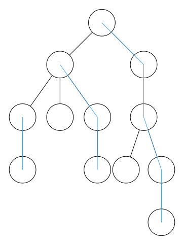

title: 树链剖分学习笔记
categories: OI
tags: 
  - BZOJ
  - CodeVS
  - 数据结构
  - 树链剖分
  - 高级数据结构
  - 算法模板  
permalink: tree-chain-split-notes
date: 2015-12-27 22:48:11
---

更新于 2016 年 12 月 28 日。

树链剖分是一种维护树上路径信息的算法，它将一棵树剖分成一些不相交的链，保证每个点在且仅在一条链上。并通过线段树、树状数组等数据结构维护每一条链上的信息。


<!-- more -->

### 题目：树的统计
[CodeVS 2460](http://codevs.cn/problem/2460/)  
[BZOJ 1036](http://www.lydsy.com/JudgeOnline/problem.php?id=1036)  

给出一棵树，每个点有一个可修改的点权，每次查询两点之间**所有点**的点权和或点权最大值。

### 基本思想


把整棵树划分成许多条**链**，使每个节点都在唯一的链上，对每一条链维护一棵**线段树**，把在树上的操作转移到线段树上。

树链剖分的策略是**轻重边路径剖分**，这种策略可以保证整棵树上的轻边和链的数量都不超过  $ O(\log n) $。

### 定义
```c++
struct Node
{
	struct Edge *firstEdge;
	struct Chain *chain;  // 所在的链
    // maxChild 最大的子树
	Node *fa, *maxChild; 
    // size 以当前节点为根的子树大小
    // pos 当前节点在链上的编号
	int size, dfn, pos, depth;
	bool vis;
} N[MAXN + 1];

struct Edge
{
	Node *from, *to;
	Edge *next;

	Edge(Node *from, Node *to) : from(from), to(to), next(from->firstEdge) {}
};

struct Chain
{
	Node *top; // 链的顶端
    // 这里还可以维护更多的信息，比如链的长度
    int len;

	Chain(Node *top) : top(top), len(0) {}
};
```

对于每个节点 $ v $，$ \text{depth}(v) $ 表示这个节点的深度（即到整棵树的根的距离），$ \text{size}(v) $ 表示以这个节点为根的树的大小（即节点总数），$ \text{max-child}(v) $ 表示该节点的最大子树。

每个节点都在一条链上，每条链 $ c $ 上深度最小的点称为链顶节点 $ \text{top}(c) $。$ \text{pos}(v) $ 表示当前节点 $ v $ 是链上的第几个点（链顶节点的 $ \text{pos} $ 为 $ 1 $，即 $ \text{pos}(\text{top}(c)) = 1 $）。

### 剖分
```c++
inline void split()
{
	N[1].depth = 1; // 注意先赋值根的深度为 1
	dfs1(&N[1]);
	dfs2(&N[1]);
}
```

剖分的过程主要由两次 DFS 组成，第一遍 DFS 求出每个节点 $ v $ 的 $ \text{size}(v) $ 和 $ \text{max-child}(v) $。

```c++
inline void dfs1(Node *v)
{
	v->vis = true;
	v->size = 1; // 统计子节点之前，整棵树的大小为 1

	for (Edge *e = v->firstEdge; e; e = e->next)
    {
		if (!e->to->vis)
        {
			e->to->fa = v;
			e->to->depth = v->depth + 1;
            
			dfs1(e->to);
            
            // 递归回溯时统计子树大小
			v->size += e->to->size;
            
            // 求最大子树，如果最大子树为空，
            // 或者当前子树比最大子树更大，则更新最大子树
			if (!v->maxChild || v->maxChild->size < e->to->size) v->maxChild = e->to;
		}
	}
}
```

第二遍 DFS，求出每个点所在的链。

对于每个节点，如果它是根（没有父节点）或它不是父节点的「最大子树（$ \text{max-child} $）」，则创建一条以该节点为链顶节点的链，否则该节点与其父节点在同一条链上（实现了链的延伸）。

为了维护树上路径信息，我们记录每个点的 DFS 序 $ \text{dfn}(v) $，为了使同一条链上的点在 DFS 序中是相邻的，我们在 DFS 时优先递归处理最大子树 $ \text{max-child} $。

```c++
inline void dfs2(Node *v)
{
	static int ts = 0; // 时间戳
	v->dfn = ++ts;     // 记录 DFS 序

	// 创建一条新链
	if (!v->fa || v != v->fa->maxChild) v->chain = new Chain(v);
	else v->chain = v->fa->chain; // 与父节点在同一条链上

	// 优先递归处理最大子树，
    // 保证一条链在 DFS 序中是连续的
	if (v->maxChild) dfs2(v->maxChild); 
	for (Edge *e = v->firstEdge; e; e = e->next)
    {
    	// // 最大子树已经处理过，不要重复处理
		if (e->to->fa == v && e->to != v->maxChild)
        {
			dfs2(e->to);
		}
	}
}
```

### 线段树
我们使用线段树维护每一条链的信息，以 DFS 序建树，保证每条链上的节点在线段树中是连续的。

```c++
segt = SegmentTree::build(1, n);
```

### 修改
修改某个点的权值，只需要在线段树上该点 DFS 序的位置上更新即可。

注意修改时一定要以 DFS 序作为修改位置。

```cpp
inline void update(int u, int x) {
	segt->update(N[u].dfn, x);
}
```

### 查询路径信息
查询两个点 $ u $ 与 $ v $ 之间的点权和（或点权极值）的方法：

1. 如果 $ u $ 与 $ v $ 不在同一条链上，不妨设 $ u $ **所在链链顶节点深度较大**，在线段树上查询 $ u $ 所在链链顶节点（$ \text{top}(\text{chain}(u)) $）到 $ u $ 的路径，并将 $ u $ 跳到其**所在链链顶节点**；
2. 如果 $ u $ 与 $ v $ 在同一条链上，则直接在线段树中查询。

注意查询时一定要以 DFS 序作为区间端点查询。

```cpp
inline int querySum(int a, int b)
{
	Node *u = &N[a], *v = &N[b];
	int res = 0;
	while (u->chain != v->chain)
    {
    	// 令 u 链顶节点的深度较大
		if (u->chain->top->depth < v->chain->top->depth) std::swap(u, v);
		res += segt->querySum(u->chain->top->dfn, u->dfn);
		u = u->chain->top->fa;
	}

	if (u->depth > v->depth) std::swap(u, v);
	res += segt->querySum(u->dfn, v->dfn);

	return res;
}

inline int queryMax(int a, int b)
{
	Node *u = &N[a], *v = &N[b];
	int res = INT_MIN; // 答案初始化负无穷
	while (u->chain != v->chain)
    {
		if (u->chain->top->depth < v->chain->top->depth) std::swap(u, v);
		res = std::max(res, segt->queryMax(u->chain->top->dfn, u->dfn));
		u = u->chain->top->fa;
	}

	if (u->depth > v->depth) std::swap(u, v);
	res = std::max(res, segt->queryMax(u->dfn, v->dfn));

	return res;
}
```

### 最近公共祖先
用类似查询路径信息的方法，当两个点跳到同一条链上时，深度较小的即为原两点的 LCA。

```c++
inline Node *lca(Node *u, Node *v)
{
	while (u->chain != v->chain)
	{
		if (u->chain->top->depth < v->chain->top->depth) std::swap(u, v);
		u = u->chain->top->fa;
	}
	
	if (u->depth > v->depth) std::swap(u, v);
	return u;
}
```

### 完整代码
```c++
#include <cstdio>
#include <climits>
#include <algorithm>

const int MAXN = 30000;

struct Node
{
	struct Edge *firstEdge;
	struct Chain *chain;
	Node *fa, *maxChild;
	int size, dfn, depth;
	bool vis;
} N[MAXN + 1];

struct Edge
{
	Node *from, *to;
	Edge *next;

	Edge(Node *from, Node *to) : from(from), to(to), next(from->firstEdge) {}
};

struct Chain
{
	Node *top;

	Chain(Node *top) : top(top) {}
};

inline void addEdge(int from, int to)
{
	N[from].firstEdge = new Edge(&N[from], &N[to]);
	N[to].firstEdge = new Edge(&N[to], &N[from]);
}

inline void dfs1(Node *v)
{
	v->vis = true;
	v->size = 1;

	for (Edge *e = v->firstEdge; e; e = e->next)
	{
		if (!e->to->vis)
		{
			e->to->fa = v;
			e->to->depth = v->depth + 1;
			dfs1(e->to);
			v->size += e->to->size;
			if (!v->maxChild || v->maxChild->size < e->to->size) v->maxChild = e->to;
		}
	}
}

inline void dfs2(Node *v)
{
	static int ts = 0;
	v->dfn = ++ts;

	if (!v->fa || v != v->fa->maxChild) v->chain = new Chain(v);
	else v->chain = v->fa->chain;

	if (v->maxChild) dfs2(v->maxChild);
	for (Edge *e = v->firstEdge; e; e = e->next)
	{
		if (e->to->fa == v && e->to != v->maxChild)
		{
			dfs2(e->to);
		}
	}
}

inline void split()
{
	N[1].depth = 1;
	dfs1(&N[1]);
	dfs2(&N[1]);
}

struct SegmentTree
{
	int l, r, mid;
	SegmentTree *lc, *rc;
	int sum, max;

	SegmentTree(int l, int r, SegmentTree *lc, SegmentTree *rc) : l(l), r(r), mid(l + (r - l) / 2), lc(lc), rc(rc), sum(0), max(INT_MIN) {}

	void maintain()
	{
		sum = lc->sum + rc->sum;
		max = std::max(lc->max, rc->max);
	}

	void update(int pos, int x)
	{
		if (l == r) sum = max = x;
		else
		{
			if (pos <= mid) lc->update(pos, x);
			else rc->update(pos, x);

			maintain();
		}
	}

	int querySum(int l, int r)
	{
		if (l > this->r || r < this->l) return 0;
		else if (l <= this->l && r >= this->r) return sum;
		else return lc->querySum(l, r) + rc->querySum(l, r);
	}

	int queryMax(int l, int r)
	{
		if (l > this->r || r < this->l) return INT_MIN;
		else if (l <= this->l && r >= this->r) return max;
		else return std::max(lc->queryMax(l, r), rc->queryMax(l, r));
	}

	static SegmentTree *build(int l, int r)
	{
		if (l == r) return new SegmentTree(l, r, NULL, NULL);
		else
		{
			int mid = l + (r - l) / 2;
			return new SegmentTree(l, r, build(l, mid), build(mid + 1, r));
		}
	}
} *segt;

inline void update(int u, int x)
{
	segt->update(N[u].dfn, x);
}

inline int querySum(int a, int b)
{
	Node *u = &N[a], *v = &N[b];
	int res = 0;
	while (u->chain != v->chain)
	{
		if (u->chain->top->depth < v->chain->top->depth) std::swap(u, v);
		res += segt->querySum(u->chain->top->dfn, u->dfn);
		u = u->chain->top->fa;
	}

	if (u->depth > v->depth) std::swap(u, v);
	res += segt->querySum(u->dfn, v->dfn);

	return res;
}

inline int queryMax(int a, int b)
{
	Node *u = &N[a], *v = &N[b];
	int res = INT_MIN;
	while (u->chain != v->chain)
	{
		if (u->chain->top->depth < v->chain->top->depth) std::swap(u, v);
		res = std::max(res, segt->queryMax(u->chain->top->dfn, u->dfn));
		u = u->chain->top->fa;
	}

	if (u->depth > v->depth) std::swap(u, v);
	res = std::max(res, segt->queryMax(u->dfn, v->dfn));

	return res;
}

int main() {
	int n;
	scanf("%d", &n);
	for (int i = 1; i <= n - 1; i++)
	{
		int u, v;
		scanf("%d %d", &u, &v);
		addEdge(u, v);
	}

	split();

	segt = SegmentTree::build(1, n);
	for (int i = 1; i <= n; i++)
	{
		int x;
		scanf("%d", &x);
		update(i, x);
	}

	int q;
	scanf("%d", &q);
	while (q--)
	{
		char cmd[sizeof("CHANGE")];
		int a, b;
		scanf("%s %d %d", cmd, &a, &b);

		if (cmd[1] == 'H')
		{
			update(a, b);
		}
		else if (cmd[1] == 'S')
		{
			printf("%d\n", querySum(a, b));
		}
		else if (cmd[1] == 'M')
		{
			printf("%d\n", queryMax(a, b));
		}
	}

	return 0;
}
```
