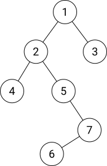
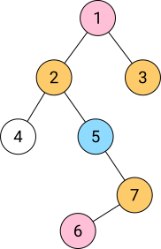

title: 点分治学习笔记
categories:
  - OI
tags:
  - 学习笔记
  - 数据结构
  - 点分治
  - 算法模板
permalink: tree-divide-notes
date: '2016-06-17 16:36:00'
---

点分治是用来解决树上路径问题的一种方法。

<!-- more -->

在解决树上路径问题时，我们可以选取一点为根，将树转化为有根树，然后考虑**经过根**的所有路径（有时将两条从根出发的路径连接为一条）。统计完这些路径的答案后，将根节点标记为删除，对剩下的若干棵树进行同样的操作。



如图，我们可以先考虑经过节点 $ 1 $ 的路径，之后将节点 $ 1 $ 标记为删除，此时可以认为考虑过的路径均已被删除。继续对其它子树做相同处理即可。

每次确认一个根节点后，共有 $ n $ 条需要考虑的路径（$ n $ 为当前子树大小）。上图中将 $ 1 $ 删除后，剩下左侧的子树较大，和原树大小相当，继续处理这棵子树时仍然需要与前一过程相当的时间。

最严重的情况，当整棵树是一条链时，每次需要考虑的路径数量是 $ O(n) $ 级别的，如果每条路径需要常数时间进行统计，则总时间复杂度为 $ O(n ^ 2) $。而对于形态随机的树，则远远小于这个级别。

如果我们选择 $ 5 $ 作为这棵树的根节点，情况会好很多 —— 删除 $ 5 $ 后剩余的最大一棵子树的大小比删除 $ 1 $ 时要小。这说明「科学地」选择点作为根节点可以有效的降低复杂度。

### 重心

我们定义一棵树的**重心**为以该点为根时**最大子树最小**的点。

> 性质：以重心为根，任意一棵子树的大小都不超过整棵树大小的一半。

证明：从树上任取一点，以它为根，如果最大的一棵子树大小不超过整棵树大小的一半，则它为重心。否则选择最大子树的根节点，继续这个过程，最终会得到一个点，它满足重心的性质，从这个点向任何方向走，最多有一个点同样满足重心的性质。
注意不会出现来回走，两个点都不满足性质的情况。假设有，则删掉这两个点后，剩下的两棵树的大小都至少为 $ n \over 2 $，整棵树至少有 $ n + 2 $ 个点，不成立。

求重心可以用一次 DFS 完成 —— 任选一个点为根做 DFS，记录每个节点的大小 $ {\rm size}(i) = \sum\limits_{j \in {\rm child}(i)} {\rm size}(j) + 1 $，记录最大子节点子树的大小 $ {\rm max}(i) = \max\limits_{j \in {\rm child}(i)} \{ {\rm size}(j) \} $。因为要同时考虑某个点的祖先（以这个点为根时这些点为它的一棵子树），所以使 $ \max \{ \max(i),\ n - \max(i) \} $ 最小的 $ i $ 即为重心。

如果在点分治时每次使用重心为根，则最大的子树大小不会超过原树的二分之一，考虑到处理较小子树的代价原小于最大子树，若每个节点需要常数时间，根据主定理有

$$ T(n) = 2 T(\frac{n}{2}) + O(n) = O(n \log n) $$

如图，蓝色点为第一次选取的重心，删除蓝色点后，剩余几棵子树的重心为红色点，再向下一层的重心为黄色点，最后剩下一个白色点



### 模板

已处理过的根将被置为 `solved`，任何时候不要经过这些点，这保证了复杂度分析中的 $ n $ 是当前子树的大小，而不是整棵树的大小。


```cpp
struct Node
{
    struct Edge *firstEdge;
    // solved 表示该节点是否已被解决
    // 在点分治中，标记 solved 的节点被认为不存在
    //
    // vis 表示在当前 DFS / BFS 中是否访问过
    bool solved, vis;
    // size 表示子树大小（和树剖中相同）
    // max 表示最大子节点大小
    int size, max;
    Node *fa; // 父节点
} N[MAXN + 1];

// 找以 start 为根的子树的重心
// 非递归 DFS
inline Node *center(Node *start)
{
    std::stack<Node *> s;
    s.push(start);
    start->vis = false;
    start->fa = NULL;

    static Node *a[MAXN + 1]; // 储存所有 DFS 到的节点
    int cnt = 0;
    while (!s.empty())
    {
        Node *v = s.top();

        // 如果是第一次出栈，则不将 v 从栈中删除
        // 将所有子节点入栈
        if (!v->vis)
        {
            a[++cnt] = v; // 记录节点

            v->vis = true;
            for (Edge *e = v->firstEdge; e; e = e->next)
            {
                // 判断不走回父节点，不走到已经 solved 的节点
                if (e->to != v->fa && !e->to->solved)
                {
                    e->to->fa = v;
                    e->to->vis = false;
                    // 子节点入栈
                    s.push(e->to);
                }
            }
        }
        else
        {
            // 第二次出栈，表示回溯到 v
            v->size = 1;
            v->max = 0;
            for (Edge *e = v->firstEdge; e; e = e->next)
            {
                if (e->to->fa == v)
                {
                    // 维护 size 和 max
                    v->size += e->to->size;
                    v->max = std::max(v->max, e->to->size);
                }
            }

            // 将 v 从栈中删除
            s.pop();
        }
    }

    // 统计重心
    Node *res = NULL;
    for (int i = 1; i <= cnt; i++)
    {
        // v->max 表示在整棵子树中，删掉 v 后剩余的最大子树
        // 如果把 v 作为根，则原有的除 v 的子树以外的部分会成为 v 的一棵子树
        // 这部分的大小为 总节点数量 - v->size
        // 因为是以 start 作为根进行的 BFS，总节点数量即为 start->size
        a[i]->max = std::max(a[i]->max, start->size - a[i]->size);

        // 更新答案
        if (!res || res->max > a[i]->max) res = a[i];
    }

    return res;
}

// 主求解过程
inline int solve()
{
    std::stack<Node *> s;
    s.push(&N[1]);

    int ans = 0; // 答案
    while (!s.empty())
    {
        // 这里的 DFS 不需要回溯，所以每次出栈即可
        Node *v = s.top();
        s.pop();

        // 求重心
        Node *root = center(v);

        // 为防止后续的 BFS、DFS 走回根，先将根置为 solved
        root->solved = true;

        ans += calc(root);
    }

    return ans;
}
```