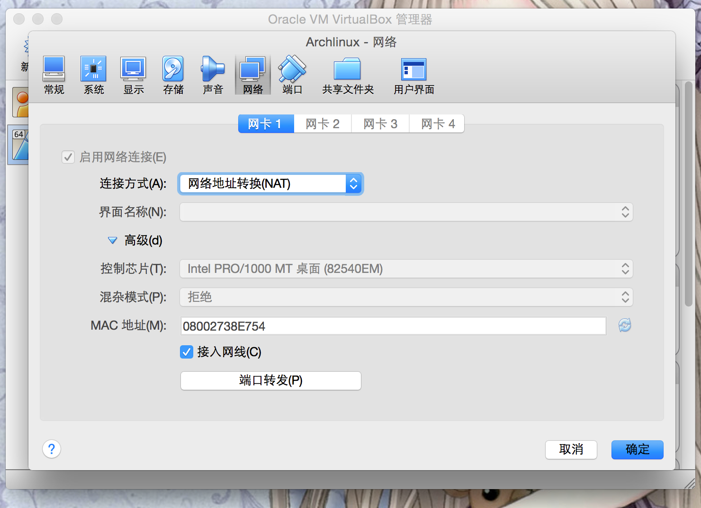
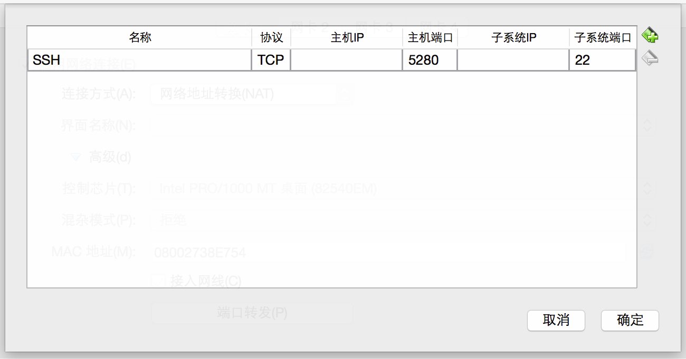
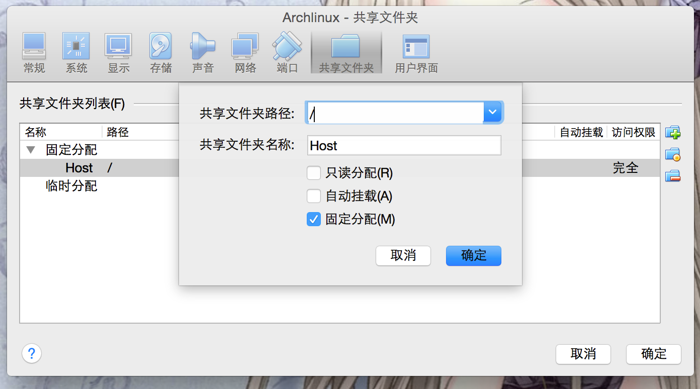
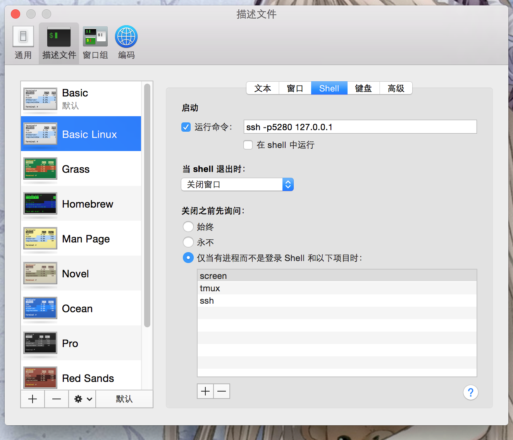
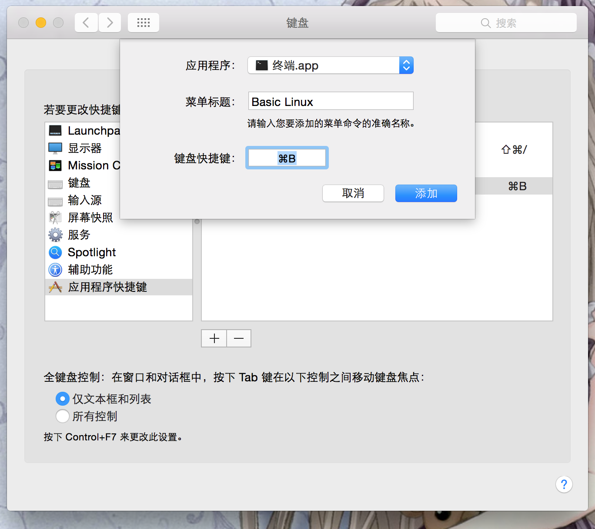
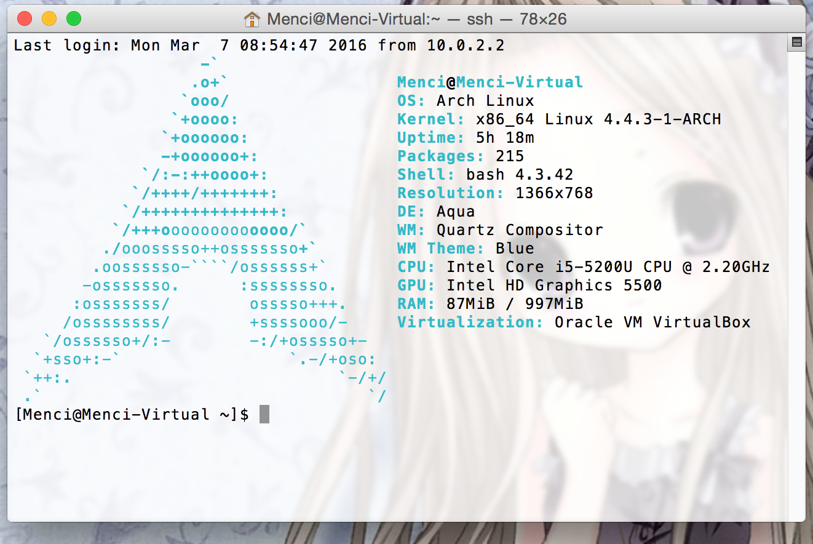

title: OS X 与虚拟机中 Linux 无缝整合
categories:
  - Geek
tags:
  - Archlinux
  - Linux
  - OS X
  - SSH
  - VirtualBox
  - 虚拟机
permalink: virtualbox-archlinux
date: '2016-03-07 09:04:27'
---

OS X 中有很多与 GNU/Linux 相似的地方，但也有很大的差异，很多时候 GNU/Linux 系统比 OS X 好用一些，而 OS X 的图形界面比 GNU/Linux 不知要高到哪里去了 …… 二者兼得的方法，就是使用虚拟机。

下面以最好用的虚拟机软件 `VirtualBox` 为例，演示配置 Archlinux 虚拟机与 OS X 主机无缝整合的步骤。

<!-- more -->

## 安装 OpenSSH

首先，在虚拟机中安装好 Arch Linux 系统，并安装好增强工具。

安装 OpenSSH：

```bash
sudo pacman -S openssh
sudo systemctl enable sshd
sudo systemctl start sshd
```

## 配置端口转发

打开「设置」→「网络」，选择「网络地址转换「NAT」连接方式。



点击「端口转发」。



子系统端口填写 `22`，主机端口填一个大于 `1000` 的值，因为在 OS X 下，非 `root` 用户的进程是无法绑定 `1000` 以下的端口的。

确定后，在主机的 Terminal 中尝试连接。

```plain
ssh -p5280 127.0.0.1
```

## 共享文件夹

在 Virtualbox 的「设置」→「共享文件夹」中设置共享根目录。



为了解决权限问题，不要选择「自动挂载」，而是手动配置自动挂载。

### `rc.local` 服务

Archlinux 的 systemd 原生不支持开机自动执行 `rc.local` 文件，所以我们需要先添加一个服务。

```plain
sudo nano /usr/lib/systemd/system/rc-local.service
```

输入以下内容：

```ini
[Unit]
Description="/etc/rc.local Compatibility"
After=vboxadd.service vboxadd-service.service

[Service]
Type=forking
ExecStart=/etc/rc.local start
TimeoutSec=0
StandardInput=tty
RemainAfterExit=yes
SysVStartPriority=999

[Install]
WantedBy=multi-user.target
```

保存后启用服务，并创建 `rc.local` 文件：

```bash
sudo systemctl enable rc-local
```

### 自动挂载脚本

```plain
sudo touch /etc/rc.local
sudo chmod +x /etc/rc.local
sudo nano /etc/rc.local
```
```bash
#!/bin/bash

/usr/bin/mount -t vboxsf Host /media/Host -o uid=1000,gid=1000
/usr/bin/mount --bind /media/Host/Users/Menci /home/Menci

exit 0
```

重启后，虚拟机中的主目录就和主机上的主目录共享啦。

## SSH 免密码登录

进行完以上步骤后，已经可以在主机通过 SSH 连接到虚拟机了，但需要输入密码。我们可以使用私钥认证的方式免去输入密码。

```bash
ssh-keygen -b 1024 -t rsa
```

一路回车后，会在 `~/.ssh` 目录下生成私钥和公钥。

```plain
cat ~/.ssh/id_rsa.pub >> ~/.ssh/authorized_keys
```

因为主机和虚拟机的主目录是共享的，所以在主机里设置后，虚拟机里也会生效。

现在试试 SSH 连接到虚拟机，应该不需要密码了。

## 配置 Terminal 快捷键

众所周知，Terminal 中以默认设置打开新窗口的快捷键是 `Command + N`。我们也可以设置打开新窗口并 SSH 连接到虚拟机的快捷键。

### 添加描述文件

在 Terminal 的偏好设置中，选择「描述文件」，把「Basic」配置复制一份，命名为「Basic Linux」，并在 `Shell` 一栏中填写「运行命令」为 SSH，不勾选下方的「在 Shell 中运行」。



这样就已经可以在菜单中打开连接虚拟机的新窗口了。

### 添加快捷键

在系统偏好设置中添加快捷键：

「系统偏好设置」→「键盘」→「快捷键」→「应用程序快捷键」→「添加」



点击「添加」后，就可以使用快捷键啦！

## 成果

在 Terminal 中，按下 `Command + B`：



为了比较好的效果，可以改一下 `screenfetch`。